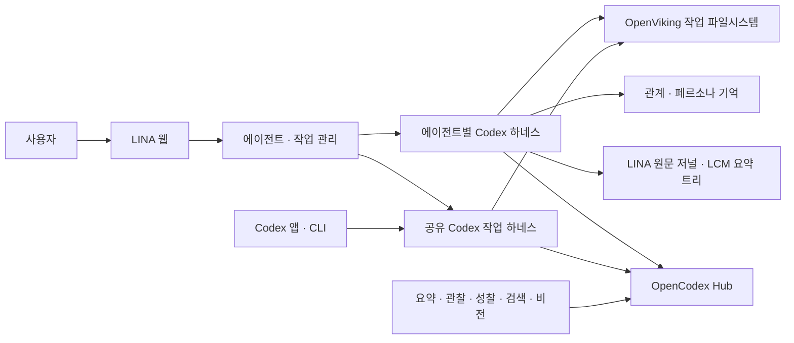

# Codex 실행 구조

LINA는 에이전트마다 하나의 장기 대화를 유지한다. 긴 개발 작업은 별도 Codex 작업에 맡기고, 담당 에이전트가 진행 상황과 결과를 관리한다. 프로바이더 계정과 모델 연결은 OpenCodex가 관리한다.

이 소스는 기존 운영본을 자동으로 교체하지 않는다. 이전 senpi 상태와 Codex 상태는 별도로 보관하며, 설치 경로나 연결 방식을 바꿀 때는 저장된 세션 바인딩을 먼저 확인한다. 이번 소스의 검증 범위는 [검증 기록](VALIDATION.md)에 남긴다.



## 실행

모델 실행에는 설치된 Codex CLI와 OpenCodex Hub가 필요하다. 새 CLI 설치는 전용 작업 프로세스를 사용하고, 공유 데몬 연결은 `LINA_CODEX_TASK_MODE=shared`로 선택한다. 기존 상태 경로를 명시한 설치는 공유 연결을 기본으로 유지한다.

```sh
bun install --frozen-lockfile --ignore-scripts
bun run start
bun run web
```

`start`는 Codex 하네스를 사용한다. Senpi 실행과 OmO 작업 실행은 지원을 종료했다. 기존 데이터와 운영 상태는 자동으로 이전하거나 삭제하지 않는다.

새 설치는 `LINA_HOME`(기본 `~/.lina`) 아래 `state/`를 사용한다. `LINA_STATE_DIR`는 기존 설치 호환용으로 우선 적용한다. 저장된 세션의 작업 경로는 유지하며, 암묵적인 예전 상태가 발견되면 경로를 명시하도록 안내한다. 예전 senpi 저널을 Codex 세션으로 채택하지 않으며, `LINA_IMPORT_SESSION`도 Codex 모드에서는 거부한다. 서로 다른 하네스의 세션 파일을 바꿔 끼우는 방식으로 이전하지 않는다.

컨트롤러는 `127.0.0.1:7979`, 웹은 `127.0.0.1:7980`이 기본이다. 기존 `LINA_INTERVENTION_PORT`, `LINA_WEB_PORT`, `LINA_INTERVENTION_URL`, `LINA_WEB_ORIGIN` 설정과 웹의 Origin 검사는 유지한다. Tailscale 공개 경로는 운영자가 별도로 연결하며, 시작 명령이 Tailscale Serve 설정을 변경하지 않는다.

## 프로바이더 연결

설정은 **일반 · 프로바이더 연결 · 역할별 모델**로 나눈다. 프로바이더 연결 탭에는 OpenCodex 상태, 모델 목록 새로 고침, Tailscale HTTPS GUI 링크가 있다. 계정 로그인과 프로바이더 등록은 OpenCodex에서 한다. LINA는 개별 프로바이더 자격 증명을 저장하지 않는다.

로컬 설치에서는 OpenCodex의 설정 파일에서 루프백 모델 API와 `hub.managementPublicOrigin`을 읽는다. 원격 Hub에는 서버 환경 변수로 API 주소와 Hub 입장용 토큰을 지정한다. 이는 개별 모델 프로바이더의 API 키가 아니다. 지원 변수의 정확한 이름과 검증은 `packages/lina-opencodex/src/config.ts`가 기준이다.

- `LINA_OPENCODEX_BASE_URL`: Hub 모델 API 주소.
- `LINA_OPENCODEX_GUI_URL`: GUI용 Tailscale HTTPS 주소.
- `LINA_OPENCODEX_API_KEY` 또는 `LINA_OPENCODEX_TOKEN_FILE`: 원격 Hub 접근용 토큰. 브라우저 응답이나 생성한 Codex 설정 파일에 노출하지 않는다.
- 역할별 모델 선택은 기존 `models.sqlite`에 저장한다. 모델 ID는 Hub가 노출한 값을 그대로 사용한다.

네이티브 카탈로그는 Hub의 `/v1/catalog`, 로컬 `~/.codex/opencodex-catalog.json`, `/v1/models` 메타데이터로 만든 카탈로그 순서로 구한다. 어느 경로든 현재 Hub 목록을 기준으로 합쳐 새 모델과 `/`·`--`가 들어간 ID를 보존하고, 연결이 해제된 모델은 제외한다. Codex 하네스에는 Responses 호환 모델이 필요하며, Chat Completions만 지원하는 모델은 보조 작업에 사용할 수 있다.

추론 수준의 **모델 기본값**은 프로바이더가 정한 기본 추론을 사용한다. 저장 형식의 기존 `off` 값은 이 선택에 대응하며 추론을 강제로 끈다는 뜻이 아니다.

에이전트를 열기 전에 대화 모델을 선택한다. 연결 실패 시에도 설정과 작업 목록은 열 수 있다. 선택한 모델이 사라지거나 Codex `model/list`에서 지원되지 않으면 다른 모델로 몰래 바꾸지 않는다. 이미 열린 하네스의 카탈로그·Hub 주소·입장 토큰은 실행 시작 시 설정이다. 새로 추가한 모델이 네이티브 목록에 없거나 Hub 주소·토큰을 바꿨다면 LINA 프로세스를 재시작해야 한다. 기존 에이전트의 논리 세션과 네이티브 세션 ID는 그대로 복원한다. 기존 목록 안의 대화 모델 선택은 다음 턴에 적용한다.

## 두 종류의 Codex 실행 환경

에이전트 대화는 LINA 상태 경로 아래의 전용 `codex-home/`을 사용한다. Hub 라우팅과 모델 메타데이터만 생성하며, 사용자의 전역 Codex 설정이나 계정 파일을 덮지 않는다. Hub 접근 토큰은 자식 프로세스 환경 변수로만 전달한다.

작업은 기존 Codex 공유 데몬의 Unix 소켓에 WebSocket으로 연결한다. `app-server proxy`는 바이트 터널이므로 JSONL 메시지를 그대로 넣지 않는다. `LINA_CODEX_SOCKET`으로 소켓을 지정할 수 있다. 기본은 기존 `CODEX_HOME` 아래 `app-server-control/app-server-control.sock`이다. LINA가 공유 데몬을 재시작하거나 종료하지 않는다. `LINA_CODEX_COMMAND`는 실행할 Codex 바이너리 경로다.

작업 메타데이터에는 원래 `threadId`, 담당 에이전트, 상태, 수정 번호를 저장한다. LINA의 메시지 전송·중단·담당자 변경은 같은 ID에 작용한다. Codex에서 직접 보낸 입력은 원래 작업을 다시 읽어 반영한다. 에이전트 도구는 담당자와 수정 번호를 모두 확인한다. 네이티브 클라이언트까지 잠그는 전역 독점권을 주장하지 않는다.

생성이나 전송 중 연결이 끊기면 저장한 요청 상태로 중복 실행을 막는다. 존재 여부가 불명확한 작업을 자동으로 새로 만들거나 fork하지 않는다. 보관되거나 삭제된 원래 작업은 Codex에서 복구해야 한다. 승인은 현재 연결이 받은 원래 요청에만 답하며, 지난 연결의 승인 ID를 재사용하지 않는다.

## 장기 대화와 압축

사용자 소개는 첫 실행 때 한 번만 진행한다. 완료된 소개의 재시작 요청은 거부하고,
이전 URL은 일반 대화로 보낸다. 미완료 대화는 같은 방에서 이어간다. 새 에이전트는
리나가 진행하는 별도 생성 대화에서 만든다. 생성 턴과 모델 설정은 Lina를 사용하고,
초안과 확인한 페르소나는 생성 대상의 ID에만 저장한다. `introductions.sqlite`가 원문·후보·재시도 이력을 보관하고, 확인한 내용은
기존 사용자/에이전트 저장소에 적용한다. 모델이 미설정이거나 Hub가 꺼져 있어도
소개 화면과 모델 설정에 접근할 수 있다. 에이전트를 고르거나 만드는 동작은
일반 Codex 세션을 미리 만들지 않는다. 평소 대화에 들어갈 때 해당 세션을 연다.

현재 페르소나와 확인한 사용자 소개는 매 턴 다시 조립한다. 내용이 바뀌면
`thread/inject_items`로 온전한 developer 메시지를 전달한 뒤 사용자 턴을 시작한다.
변경 없는 지침은 중복 삽입하지 않으며, 재시작·압축 후에는 다시 전달한다.
새 스냅샷이 과거 Lina 스냅샷을 대체한다는 지침을 함께 넣는다. 첫 일반 답변
안내는 영속 저널에 이전 답변이 없는 경우에만 현재 스냅샷에 포함한다.

`collaborationMode`의 설정 값 저장만으로 사용자 지정 지침이 실제 모델 입력에
반영됐다고 판정하지 않는다. `additionalContext`는 긴 내용을 자르므로 핵심 정체성에는
쓰지 않고 참고용 기억·작업 맥락에만 사용한다. Codex 버전을 바꿀 때는
`thread/inject_items` 지원, 실제 developer 메시지 전문, 모델의 응답을 함께 검증한다.
지침 전달이 실패하면 해당 사용자 턴은 시작하지 않는다. 네이티브 기록에 남은 과거
스냅샷의 물리적 삭제를 뜻하지 않으며, 권한·도구 승인 범위도 바꾸지 않는다.

Codex 자체 압축과 LINA의 LCM 요약은 별개다.

- Codex는 모델에 넣을 실행 컨텍스트를 압축한다.
- LINA는 대화 원문을 보존하고, 원문 ID에 연결된 요약 트리를 만든다. 이전 요약과 새 원문을 함께 요약하므로 과거 결정을 따라갈 수 있다.
- 새 턴에는 활성 LCM 요약을 참고 자료로 넣는다. `lina_history_search`와 `lina_context_expand`는 원문과 요약의 근거를 찾아 펼친다.
- 외부 LCM 체크포인트를 Codex의 네이티브 압축 영수증으로 위장하지 않는다. 요약 실패 시 직전 체크포인트와 원문을 유지하고 복구 필요 상태를 표시하면서 대화는 계속한다.
- 재시작 후 네이티브 조회가 메시지 ID를 `item-1`처럼 바꾸더라도, 턴 ID와 같은 역할 메시지의 순서를 사용해 동일한 원문을 중복 저장하지 않는다.

이 저널은 사용자·에이전트 대화의 텍스트 투영을 보존한다. 네이티브 도구의 상세 실행 로그와 사고 과정 전체를 LCM 원문으로 노출하는 경로는 포함하지 않는다.

요약은 원문 저장과 함께 쓰는 검색용 표현이다. 원문을 보존한다고 모든 장기 기억을 매번 완벽하게 떠올린다는 뜻은 아니다. 검증에서는 반복 압축과 재시작 뒤 결정 변경을 구분하고, 기존 원문 ID를 유지하는지 확인한다.

## 관계 기억과 업무 기억

현재 페르소나 계층의 `native` 기억과 선택적 Honcho HTTP 연결을 유지한다. `LINA_MEMORY_BACKEND=honcho`로 외부 Honcho를 사용할 수 있다. 기존 Honcho 설정·관찰·성찰·사용자 교정 규칙을 재사용하며 모델 요청은 OpenCodex 역할 설정을 따른다. 외부 Honcho 서버 자체가 쓰는 모델 구성은 그 서비스 운영 범위다.

OpenViking은 작업용 파일시스템으로 연결한다. 이 변경은 OpenViking 서버를 직접 이식하지 않는다. 기존 서비스를 얇은 HTTP 클라이언트로 사용하면 파일 경로, 검색, 원문 읽기, 비동기 색인의 의미를 유지할 수 있다.

`LINA_OPENVIKING_URL`, `LINA_OPENVIKING_API_KEY` 또는 `LINA_OPENVIKING_TOKEN_FILE`, `LINA_OPENVIKING_ROOT_URI`를 함께 설정한다. 루트는 `viking://resources/...` 아래의 업무 범위다. 에이전트와 작업에 같은 `lina_work_list/read/search/write` 도구를 연결한다. 프로젝트 밖 경로로 벗어나는 요청을 거부한다. 연결 실패를 빈 검색 결과로 속이지 않는다. 파일 쓰기 성공과 검색 색인 완료는 별도로 표시한다.

## CXC와 paperthin

작업 하네스는 기존 Codex의 설치된 스킬과 플러그인을 사용한다. 에이전트 하네스는 기본적으로 `~/.agents/skills`와 `~/.codex/skills`를 네이티브 추가 스킬 루트로 읽는다. `LINA_CODEX_SKILL_ROOTS`에 운영체제 경로 구분자로 루트를 지정하면 CXC 등 설치된 스킬도 명시적으로 연결할 수 있다. 스킬 파일을 복제하거나 에이전트마다 동일한 메모리 캡처 훅을 다시 설치하지 않는다.

CXC가 작업 흐름을 관리할 때 paperthin은 필요한 사고·검토·편집 도구로 선택한다. 사용자 직접 호출이 필요한 스킬을 자동 실행하지 않으며, 한 작업의 흐름 소유자는 하나로 유지한다. Codex 하네스가 제공하지 않는 역할별 모델 라우팅까지 LINA가 구현했다고 주장하지 않는다.

## 검증과 라이선스

검증 방법과 필요한 증거는 [검증 범위](VALIDATION.md)에 있으며 재현 스크립트는 `scripts/qa/`에 있다. 단위·계약 테스트, 실제 Hub 응답, 전용 Codex 프로세스 재시작과 반복 압축, 공유 데몬의 다중 클라이언트, 브라우저 동작을 구분해 기록한다. 브라우저 작업 화면 검증에는 합성 네이티브 작업을 사용한 경우를 명시한다.

직접 가져온 코드와 외부 서비스 호출을 구분한 라이선스 검토는 [THIRD_PARTY_NOTICES.md](../THIRD_PARTY_NOTICES.md)를 참고한다. OpenViking 및 Honcho 서버의 AGPL, Honcho SDK의 Apache-2.0, lossless-claw의 MIT를 동일한 조건으로 취급하지 않는다.
