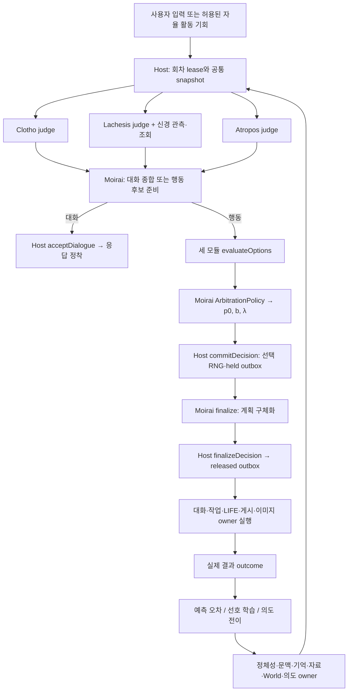

# LINA 모이라이 엔진

상태: 2026-09-12 확정 설계. 이 문서는 모이라이 엔진의 정의·세 판단 모듈·회차 실행 형태·기존 모듈 배치·확정된 결정의 정본이다. 타입·포트·저장·복구의 세부 규칙은 [016 계약](plans/platform/016_neural_preference_contract.md), 구현 순서는 [017 로드맵](plans/platform/017_moirai_module_composition.md), 과학적 근거와 출처는 [015 근거](plans/platform/015_neural_preference_engine_research.md), 채널·모델 프리셋 운영은 [030 운영](plans/context-engines/030_moirai_refactor_plan.md)이 소유한다. 이 설계는 아직 구현되지 않았다. 문서 확정은 판단 효용·회로 학습·운영 성능의 증거가 아니며, 그 검증은 [017의 F1–F4](plans/platform/017_moirai_module_composition.md#후속-설계와-구현의-의존-순서)에서 실제 입력·계산 receipt·결과로 수행한다.

## 한눈에 보기

모이라이 엔진은 **경험으로 자기 관점을 형성하고 그 관점에 따라 행동하는 AI 개인**을 유지하는 LINA의 코어다. 한 개인 안에는 같은 사실·기억·현재 상황·권한을 공유하지만 **원하는 것이 다른 세 판단 모듈**이 있다.

| 모듈 | 우선하는 목표 | 던지는 질문 |
| --- | --- | --- |
| 클로토 (Clotho) | 미래의 성과·성장 가능성 | 무엇을 골라야 앞으로 더 나은 결과와 가능성이 생기는가? |
| 라케시스 (Lachesis) | 자신의 욕구·학습된 선호 충족 | 내 경험과 지금 상태에서 무엇을 원하는가? |
| 아트로포스 (Atropos) | 채택한 목표·약속·정체성의 연속성 | 무엇을 골라야 내가 이어가기로 한 것을 지키는가? |

셋은 같은 상황을 보고 각자 완결된 답을 낸다. 답이 갈리는 것은 정상이고, 같은 것도 정상이다. **모이라이(Moirai)**가 세 답을 선언된 조정 정책으로 종합하고, **Host**가 권한·현재성을 확인해 기록하고 기존 실행 owner에게 넘긴다. 실제 결과가 돌아오면 세 모듈은 같은 결과를 각자의 목표로 다르게 배운다. 세 모듈은 세 부서나 세 인격이 아니라, 한 사람이 가진 세 가지 우선순위다.

## 엔진의 정의와 범위

LINA는 이 엔진을 사용하는 제품이다. 엔진은 개인 대화, 약속과 목표의 채택, 자율 활동 선택, LIFE 세계 안의 행동, 실제 결과에서의 학습, 재시작 뒤의 연속성, 여러 개인의 동시 운영을 담당한다. UI, 설치, 채널 전송, 세계 규칙, 이미지 생성, 개발 작업 실행은 기존 owner가 계속 소유한다.

| 엔진이 소유하는 것 | 엔진이 소유하지 않는 것 |
| --- | --- |
| 세 판단·종합·선택 규칙, 목표 프로필, 회차 기록, 의도·약속의 채택 기록, 예측과 오차, 신경 선호 상태·학습, 선택 난수와 실행 요청 outbox | 사실 기억·대화 원문·정체성·사용자 지시·권한의 원본, 세계 상태, 작업 실행 상태, 게시·이미지 결과, 채널 전송 |

LLM 실행 백엔드는 **Senpi**다. Senpi는 세 판단과 종합의 의미 해석·계획 생성을 맡는 어댑터이며, 각 모듈의 코드 검사·기억 조회·수치 계산을 대체하지 않는다. 개발 작업의 실행 엔진은 **OMO native**(`omo app-server`, Senpi의 app-server 모드)이고, 프로바이더 계정·모델 목록·인증·사용량은 **Senpi native**(`account/*`, `model/list`, `config/read`)가 소유한다. 현재 런타임의 Codex CLI와 OpenCodex Hub는 F2–F4 전환이 끝나면 폐기한다(D21). 라케시스의 학습된 선호는 **MaleCNS v1.0 부분회로**를 별도 Python 계산기로 실행한다. 이 회로는 엔진 완성의 필수 요소이며 뒤로 미루는 선택 사항이 아니다.

## 세 판단 모듈

분리 기준은 목표다. 상태·계산·학습 방법은 각자의 목표를 판단하는 수단이다. 계획 생성·경험 조회·충돌 검사만 전담하는 기능 분업으로 축소하지 않고, 세 목표를 모든 모듈에 같은 비율로 부과하지도 않는다. 필수 원문·정정·현재 권한·source snapshot은 셋 모두 같게 받고, 최초 판단은 서로의 출력을 보지 않고 병렬로 낸다. 각 모듈은 `judge(snapshot)`으로 자기 목표에 따른 완결된 의견·근거·전체 행동 추천을 내고, `evaluateOptions(snapshot, candidates)`로 공통 후보를 자기 목표로 다시 평가한다.

### 클로토: 미래 성과

| 항목 | 내용 |
| --- | --- |
| 읽는 것 | 목적·현재 상황·사실 근거·이전 예측 오차·허용된 도메인 상태 |
| LLM이 하는 일 | 전체 행동 후보와 후속 단계, 예상 결과 생성 |
| 코드가 하는 일 | 시간·자원·의존 조건 검사, 허용된 관측·검증 결과를 예상에 연결, `projectConsequences`로 공개된 도메인 규칙의 효과 계산 |
| 내는 것 | `Forecast`: 후보별 예상 결과·범위·기한·비용, 가정, 확인 방법, `predictionMethodRevision` |
| 결과에서 배우는 것 | 같은 항목끼리 예측과 실제를 비교한 오차. 숫자로 비교할 수 없는 결과는 충족/미충족/판정 불가 |

예상은 사실과 구분된 예측이다. 모든 주장은 `Claim { kind: observed | assumption | prediction }`으로 출처·단위·검증 상태를 가진다. 실제 World를 진행시켜 예측하지 않으며 비공개 상태를 정답으로 복사하지 않는다. 모르는 값은 모른다고 반환한다.

### 라케시스: 욕구·선호 충족

| 항목 | 내용 |
| --- | --- |
| 읽는 것 | 출처 있는 경험, 현재 동기·정서 상태(느린 상태 `m`), 개인 학습 가중치 `ΔW`, 명시적 선호 |
| LLM이 하는 일 | 사건·활동의 의미를 단서(cue)로 변환, 회로 반응의 해석, 어떤 활동이 왜 끌리는지 설명 |
| 코드가 하는 일 | 경험 조회, 같은 신경 snapshot에서 단서별 반응 `b ∈ [-1, 1]` 조회, 학습 흔적 생성 |
| 내는 것 | `ValueAssessment`: 경험 참조, cue·probe·trace 참조, 비신경 욕구·명시적 선호 평가, 신경 편향과 가용성 |
| 결과에서 배우는 것 | 선택·피드백이 확정된 대상의 흔적에만 구획별 학습 적용 |

사실 기억과 선호는 별도 출력이다. "지난 활동이 실패했다"(사실)와 "그래서 지금 꺼려진다"(반응)는 연결되지만 같은 값이 아니다. LLM이 문장으로 선언한 취향은 회로 계산이나 학습 결과를 대신하지 않는다. 라케시스의 평가는 두 경로로 선택에 들어간다: 비신경 욕구·명시적 선호 평가는 기준 분포 `p0`의 입력이고, 신경 편향 `b`는 최종 분포에서 한 번만 반영된다.

### 아트로포스: 의도·연속성

| 항목 | 내용 |
| --- | --- |
| 읽는 것 | 현재 지시, 채택된 의도·약속(`IntentionRecord`), 정체성·자기모델, 완료/중단 조건, 작업 실행 상태 |
| LLM이 하는 일 | 모호한 의도·충돌의 해석, 대안·변경안 제안 |
| 코드가 하는 일 | 상태 전이·기한·자원 충돌 검사, 원래 수락 근거 확인 |
| 내는 것 | `ContinuityAssessment`: 관련 의도·약속 참조, 충돌 이유·심각도, 유지·보류·재개·변경 제안 |
| 결과에서 배우는 것 | 실제 완료·불가능·전제 변경에 따른 의도 상태 전이 제안 |

BDI의 의도 유지·재고 원리를 사용한다. 기본은 채택한 목표를 지속하되 완료·불가능·원래 목적의 철회·중요한 전제 변경·기한/자원 충돌이 생기면 재고한다. 새 관심이 생겼다는 이유만으로 약속을 취소하지 않고 약속을 영구 고정하지도 않는다. 아트로포스는 변경을 제안만 하며, 실제 채택·취소는 Host가 원래 수락 근거와 권한을 확인해 기록한다.

### 모듈이 아닌 것

PR #10의 역할 프롬프트는 라케시스를 "근거와 믿음의 타당성" 렌즈로, 아트로포스를 "상황에 맞는 선택" 렌즈로 정의했다. 이 확정 설계는 라케시스를 욕구·선호, 아트로포스를 의도·연속성으로 재정의하므로 **세 역할 프롬프트는 F2에서 다시 작성한다.** 익명 문자열 `proposals: string[]`도 typed assessment로 전환한다. 기존 QA의 프롬프트·결과는 대조군이며 이 설계의 구현이 아니다.

## 모이라이의 종합과 조정 정책

모이라이는 세 의견을 받아 (1) 대화에서는 최종 응답을 만들고, (2) 행동에서는 공통 후보를 준비하고 조정 정책으로 선택 분포를 만든 뒤 선택된 후보의 계획을 구체화한다. 종합 기능은 LLM 해석과 버전 있는 `ArbitrationPolicy`를 함께 포함한다. 금지 사항: 서로 다른 목표의 점수 평균, 다수결, 한 모듈의 상시 우선권, 합의 횟수로 신뢰도 상승, 합의·최종안 채택을 세 모듈의 공통 보상으로 사용.

### personal.v1 조정 정책

행동 catalog마다 정책을 선언한다. World 없는 개인의 첫 catalog `personal.v1`의 정책은 다음 순서로 동작한다.

1. **Host 적격성 검사(객관적 중단 조건).** 현재 권한 위반, 명시적 금지, 필수 근거 누락, 전제조건 실패인 후보는 제외한다. 제외 후보의 `p0`는 0이다. 이 단계는 목표 판단이 아니라 사실·권한 검사다.
2. **목표별 평가 수집.** 각 모듈은 적격 후보마다 `stance ∈ { prefer, accept, oppose, unavailable }`, 이득·손실·불확실성, 근거를 남긴다. 숫자 점수는 단위와 비교 규칙이 선언된 경우에만 사용한다. `unavailable`은 정책이 허용한 사유가 있어야 하며 0점이나 중립으로 해석하지 않는다.
3. **약속 보호.** 아트로포스가 `oppose`에 `severity: commitment_breach`(수락된 약속의 위반)를 붙인 후보는, 그 후보 자체가 원래 수락 근거를 참조하는 의도 변경 행동(`intention.suspend | cancel`)이 아니면 `p0`를 0으로 둔다. 취향이나 관심의 우선순위 의견은 이 단계에 해당하지 않는다.
4. **실행 불가 제외.** 클로토가 `oppose`에 `severity: infeasible`(검증 가능한 전제 실패)를 붙인 후보는 `p0`를 0으로 둔다.
5. **상황별 목표 순서.** 남은 후보를 회차의 `situation`에 따라 선언된 목표 순서로 사전식 정렬한다. 같은 목표 안에서는 `prefer > accept > oppose` 순이다.

   | situation | 목표 순서 | 이유 |
   | --- | --- | --- |
   | `user_request` (현재 사용자 지시가 있음) | 아트로포스 → 클로토 → 라케시스 | 현재 지시와 수락된 약속이 개인의 취향보다 앞선다 |
   | `autonomous` (사용자 요청 없는 자율 활동 슬롯) | 라케시스 → 클로토 → 아트로포스 | 자율 시간의 선택은 개인의 욕구가 주도하되 약속 보호(3단계)는 유지된다 |
   | `transition` (진행 중 작업·의도의 전환 판단) | 클로토 → 아트로포스 → 라케시스 | 전환의 이득과 비용이 우선, 기존 약속이 그다음 |

   회차의 `situation`은 Host가 snapshot에서 결정하며 LLM이 바꾸지 못한다. 순위가 같은 후보는 동률이다.
6. **기준 분포 `p0`.** 순위 `r = 1, 2, …`에 `p0(r) ∝ ratio^(r-1)`을 배정하고 동률은 같은 순위의 질량을 균등 분할한다. `personal.v1`의 `ratio = 0.5`는 policy revision 1의 선언값이다. 측정값이 아니며 변경 시 policy revision을 올린다.
7. **신경 선호 반영.** `p(a) ∝ p0(a) × exp(λ × b(a))`. `personal.v1`의 `λ`는 `user_request`에서 0, `autonomous`·`transition`에서 1이다. 사용자 지시가 있는 회차에서는 학습된 취향이 선택 확률을 바꾸지 않는다. `b`가 `unavailable`인 후보는 신경 장애 무변조 규칙을 따른다.
8. **기록.** `ResolutionRecord`에 목표별 추천, 충돌한 요구, 3·4단계에서 제외된 후보와 이유, 5단계의 순서와 양보한 목표를 남긴다. `SelectionSpec`에 적격 후보·`p0`·`b`·`λ`·정책 revision을 고정한다.
9. **보류.** 적격 후보가 없으면 `deferred`로 끝내고 확인 질문 또는 다음 회차로 넘긴다. 필요한 평가가 `unavailable` 사유 없이 비어 있으면 회차를 보류한다. 의견 불일치 자체는 보류 사유가 아니다.

LIFE catalog는 F3에서 같은 형식으로 자기 `situation`·목표 순서·`ratio`·`λ`를 선언한다. 선언한 정책이 없는 catalog는 실행하지 않는다.

### 대화 종합

일반 대화는 세 판단과 종합 한 번(3+1)이 기본이다. 종합은 원래 대화, 세 모듈의 완결된 의견, 구조화된 평가, 상태 참조를 받아 사용자 언어로 최종 응답을 만든다. 대화 모드의 `ResolutionRecord`도 목표별 추천과 종합 이유를 남기되 후보 목록·`SelectionSpec`·선택 난수는 만들지 않는다. 문장 토큰을 확률식으로 재추첨하지 않는다. 약속 수락·취소, 도구·게시·세계 변경처럼 지속 효과를 만드는 제안은 대화 중에도 행동 계약으로 승격한다.

## Host와 한 회차의 실행 순서

Host는 네 번째 판단이 아니다. 공통 입력 전달, snapshot 고정, 현재성·권한 검사, 선언된 정책의 실행과 검증, 선택 난수와 receipt의 원자 기록, 기존 실행 owner로의 인계, 취소·재시도·복구를 맡는다. Host가 별도 선호나 우선순위로 다시 판단하지 않는다.



행동 회차의 순서는 `독립 판단 → 종합 후보 준비 → 정규화 → 같은 후보의 세 평가 → 후보 집합 확정 → 조정 정책 → 선택 원자 기록 → 계획 구체화 → 검증·인계`다. 기본 LLM 골격은 3+2이며 추가 평가·의미 변환 호출은 같은 요청의 비용으로 기록한다. 후보 수·평가 세대·추가 호출·회차 deadline은 회차 시작 시 고정하고, `closeCandidateSet` 뒤에는 새 후보를 끼워 넣지 못한다.

선택과 실행은 분리된다. `selected → finalized_and_validated → dispatchable → dispatched → outcome_pending`이며 각 단계에서 현재성·권한·목표 프로필 참조를 다시 확인한다. 같은 선택을 실패했다고 재추첨하지 않는다. 결정 키·finalize 키·결과 키는 모두 중복 키와 payload digest를 가지며 같은 키의 다른 payload는 충돌이다.

## 기존 모듈의 배치

기존 모듈은 자기 원본을 계속 소유하고 세 판단의 공통 기반이 된다. 어떤 판단도 정체성·지시·기억의 별도 원본을 만들지 않는다.

| 기존 owner | 실제 기능 | 엔진에서의 위치 |
| --- | --- | --- |
| AgentStore·페르소나 | 작성 정체성·가치관·소통 선호·변경 가능한 성향 | 공통 자기모델. `PersonaSchema`(성향 축·범위·lock·dimension별 생성자)의 소유자 |
| ContextStore·WorkingState | 현재 목표·결정·미해결 항목·출처 있는 요약 | 공통 현재 문맥. `workingRevision`은 `instructionRevision`과 구분 |
| EngineStore·기억 추론 | 기억·출처·정정·철회, 연역/귀납 제안 | 세 판단의 공통 경험 조회. 장기 선호 학습은 기존 request 기반 단일 경로 유지 |
| ResourceSearch | 자료 추출·요약·검색·자료 파생 기억 | 공통 지식 조회 |
| World 규칙·공개된 세계 읽기 | 장소·사건·조건·효과, 참여자별 공개 범위 | 도메인 상태 소유자. 클로토의 `projectConsequences` 입력 |
| LIFE 욕구·목표·사건 선택 | 욕구 drift, 목표 우선순위, 사건/참여자 선택 | 욕구·목표 원본 재사용. 개인의 행동 선택은 `decisionMode: moirai`에서 엔진으로 이동 |
| Ensemble 어댑터 | 사회적 의향·행동 그래프·상대 반응 | 사회 도메인 서비스. 의향 계산과 최종 행동 적용 포트 분리 |
| NativePersonaGrowth·BehaviorStore | 유효 기억의 성향 해석과 투영 | 성향 owner. dimension별 `reflection \| neural` 생성자 중 하나 |
| TaskManager·작업 도구 | 개발 작업 시작·지시·중단·인계 | 실행 owner. `task.*` 행동의 effect owner. 백엔드는 Codex CLI에서 OMO native app-server로 전환(D21), Lina 측 작업 ID·receipt·권한 계약은 유지 |
| 이미지·LIFE 게시 | 생성·편집·게시·답글 | 표현·실행 owner. 무엇을 표현할지는 엔진, 검사·렌더링·전송은 owner |
| AgentFleet·세션 조립 | 개인별 세션·저장소·도구 연결 | Host 조정기와 Senpi 역할 세션의 설치 지점 |
| 실행 통제·DurableRuntime | 요청·응답 기록, 권한·취소·복구 | 확정된 판단을 실제 효과로 넘기는 경계 |
| 웹·Discord 채널 | 외부 입력·최종 응답 전달 | 세 의견을 세 메시지로 보내지 않음 |
| 모델 서비스·체크포인트 | 모델 라우팅, 오프라인 캡처·복원 | 공통 인프라. 엔진 저장소를 기존 checkpoint manifest에 편입 |

소스 경로와 라인 앵커는 [017의 재료 표](plans/platform/017_moirai_module_composition.md#현재-구현에서-확인한-재료)에 있다.

## 개인 행동 catalog v1

World 없는 개인이 엔진으로 확정할 수 있는 행동의 유한 목록이다. 대화 응답 자체는 행동이 아니다. 목록 밖의 제안은 확정 후보에 넣기 전 정규화·검증이 필요하다. 각 후보 key는 Host가 catalog schema로 만든다.

| kind | 의미 | 전제조건 | 효과 범위 | effect owner와 확인 방법 |
| --- | --- | --- | --- | --- |
| `intention.adopt` | 사용자 약속 또는 허용된 자율 목표를 채택 | 사용자 약속은 원문 request 참조, 자율 목표는 자율성 정책 허용 | `IntentionRecord` 생성 `proposed → adopted` | JudgmentStore. 기록 receipt |
| `intention.activate` | 채택한 의도의 실제 수행 시작 | `adopted` 상태, 선행 의도와 충돌 없음 | `adopted → active` | JudgmentStore |
| `intention.suspend` / `intention.resume` | 보류·재개 | 원래 수락 근거 참조, 보류 사유 | 상태 전이와 사유 기록 | JudgmentStore |
| `intention.cancel` | 취소 | 원래 수락 근거와 권한, 사용자 약속이면 사용자 확인 또는 원래 조건 충족 | `→ cancelled` | JudgmentStore. 사용자 약속의 취소는 채널 확인 receipt |
| `intention.complete` | 완료 확정 | 완료 조건에 대응하는 실제 결과 참조 | `→ completed` | JudgmentStore. 결과 없는 완료는 거부 |
| `task.start` | 개발 작업 시작 | 작업 권한, 작업 내용, 관련 의도 참조 | 새 OMO 작업 thread | TaskManager receipt. 프로세스 종료는 목표 달성이 아님 |
| `task.send` / `task.interrupt` / `task.handover` | 진행 작업에 지시·중단·인계 | 작업 ID·현재 owner·revision | 작업 상태 변경 | TaskManager receipt |
| `inquire` | 자료·기억·도구의 읽기 조회 | 조회 권한 | 없음. 예산만 소비 | Host 조회 receipt |
| `defer` | 보류 + 재개 조건 | 조건 명시 | 없음 | 다음 회차 입력 |
| `noop` | 아무것도 하지 않음 | 이유 명시 | 없음 | 회차 기록 |

기억 저장·선호 receipt·성향 성장은 catalog 항목이 아니다. 기존 후처리 경로가 원본 request를 기준으로 계속 처리한다. 게시·이미지·세계 변경은 F3의 LIFE catalog에 선언한다.

## 의도 기록과 상태 전이

```text
IntentionRecord = { intentionId, agentId, scopeId, revision,
  kind: user_commitment | autonomous_goal | task_binding,
  purposeRef, text,
  acceptance: { sourceRef, acceptedBy: user | host_autonomy, policyRevision, acceptedAt },
  priority, deadline?, completionCondition, abortConditions[],
  relatedIntentions: { intentionId, relation: depends | conflicts | supersedes }[],
  status: proposed | adopted | active | suspended | completed | cancelled,
  history: { from, to, reason, evidenceRef, at }[] }
```

`Purpose`는 달성하려는 목적과 성공 조건, `Understanding`은 근거를 가진 지속적 해석, `Plan`은 방법과 단계, `Intention`은 실제로 계속 수행하기로 채택한 상태다. 서로 대체하지 않는다. WorkingState의 목표 메모, LIFE GoalState, TaskManager 실행 상태는 각각 현재 대화 요약, 세계 안의 목표, 실행 상태이며 `IntentionRecord`가 이들을 참조한다.

아트로포스의 재고 조건은 다음 여섯 가지뿐이다: 완료 결과 확인, 불가능 판정(전제의 철회 또는 검증 가능한 실패), 원래 목적의 철회, 중요한 전제의 변경(source revision 변경), 상위 우선순위 의도와의 기한·자원 충돌, 사용자의 명시적 변경. 새 관심의 등장, LLM의 자기 선언, 피드백 부재는 재고 조건이 아니다. `completed`는 대응하는 결과 참조가 있어야 하고, `cancelled`는 원래 수락 근거를 참조해야 한다.

QA 채택 커널의 `Purpose`·`Adoption(understanding | plan | intention)`·`Judgment(method, expectation)`·`ToolReceipt`의 의미는 이 schema로 이전한다. QA의 Frame·DB는 복사하지 않는다.

## 라케시스 회로 프로필 v1

라케시스의 학습된 선호는 MaleCNS v1.0 버섯체 부분회로로 계산한다. 아래는 프로필 v1이 고정하는 인터페이스이며, 실제 세포 목록·상수·해시는 추출·측정 산출물로 채운다. 프로필은 산출물이 채워지고 선언된 검사를 통과해야 `draft → qualified`가 된다.

| 영역 | v1 결정 |
| --- | --- |
| 자료 | neuPrint `male-cns:v1.0`, curated body annotations·neurotransmitter predictions·aggregate connection graph. 파일 SHA-256과 CC-BY 4.0 고지 보존 |
| 부분회로 경계 | 버섯체 KC·MBON·DAN, PN 입력, APL 억제, 존재하는 MBON→DAN 피드백. 시각엽·VNC 제외. 포함·제외 body ID 목록과 이유는 추출 산출물 |
| 계산 그래프 | 공유 `W0`(접촉 수→가중치 변환·단위 선언), 개인·scope별 `ΔW`, 학습 마스크는 KC→MBON 연결만. 전달 부호는 NT 예측과 문헌으로 정하고 불확실한 연결은 프로필에 표기 |
| 동역학 | rate 기반 뉴런 방정식(CPU 비용 기준). `dt`, 배경 구동, 잡음, 과활성·침묵·포화 판정을 프로필 상수로 선언 |
| 의미 encoder | `CanonicalCueKey`(topic \| option, catalog/encoder 버전, 정규화 특징) → 고정 시드 투영 → 희소 KC 구동. 희소도 `k`는 프로필 상수. encoder 버전 변경은 캐시·trace 무효화 |
| readout | 접근·회피 구획 MBON 집단의 시간창 활동 차이를 유계 함수로 `b ∈ [-1, 1]`. 구획 부호 배정은 문헌 근거와 함께 프로필에 기록 |
| 상태 | 빠른 상태 `h`, 느린 조절 상태 `m`(scope별 clock으로 명시적 감쇠), `ΔW`, 학습 흔적 `trace`. 서로 다른 데이터 |
| 학습 | `ΔW_next = projectAllowed(ΔW + η × M_compartment(outcome, prediction) × trace)`. 구획별 방향·학습률·범위·eligibility 감쇠·예측기 버전을 프로필 상수로 선언 |
| 예산 | `K_observe`, `K_probe`, 회차당 최대 단서 수, 동의어 병합 규칙. 부하 때문에 조용히 줄이지 않음 |
| 격리 | 관측은 한 번 확정, 조회는 가소성 없이 임시 버퍼만 진행, 조회 순서가 상태를 바꾸지 않음. `probeNoise`는 EventKey·CueKey에서 파생하며 Host 선택 RNG와 분리 |
| 무변조 | 계산 장애·NaN·예산 초과 시 준비 상태 폐기, 해당 결정의 `b`를 `unavailable`로 두고 검증된 `p0`로만 선택. 없는 흔적을 만들지 않음 |

프로필 v1이 `qualified`가 되기 위한 검사는 최소 다음을 포함한다: 같은 초기 상태의 두 개인에 상반된 결과를 준 뒤 같은 단서 조회에서 편향이 갈리는지, 빠른 상태 초기화·재시작·새 시드 뒤에도 `ΔW`의 경향이 남는지, `ΔW` 교환·차단으로 경향이 따라가는지, encoder·readout·후보 수만 바꿔 얻은 효과를 회로 학습으로 보고하지 않는지. 문헌 출처와 자료 범위는 [015](plans/platform/015_neural_preference_engine_research.md#출처와-검증-범위), 세부 계약은 [016](plans/platform/016_neural_preference_contract.md#데이터와-회로-프로필)에 있다.

## 결과 환류와 학습

실제 결과는 하나의 `Outcome`으로 저장하고 `(agentId, scopeId, outcomeId, consumerKind)` 키로 세 소비자에게 전달한다. 각 소비자는 당시 회차의 `objectiveRef`로 자기 목표의 결과를 평가한다. 클로토는 예측 오차, 라케시스는 허용된 선호 학습, 아트로포스는 의도 상태 전이를 제안하고 각 owner가 변경과 receipt를 한 transaction으로 저장한다. 한 소비자의 완료가 다른 소비자의 완료를 뜻하지 않으며, 재시작 뒤 미완료 소비자만 복구한다.

피드백 없음은 부정 보상이 아니다. 반복 선택·자기 감정 설명·답변 생성 자체·합의·최종안 채택을 보상으로 쓰지 않는다. 내부 의견 셋을 경험 셋으로 세지 않는다. 같은 성향 dimension을 기존 성장과 신경 학습으로 중복 생성하지 않는다(`dimensionSource`). 정정은 원본을 참조한 새 사건이며, 철회된 근거에 의존한 이해·예측·성향·신경 투영을 함께 식별하고 재생 또는 epoch 격리로 처리한다.

## 역할 프롬프트와 개선 루프

엔진의 LLM 호출은 모두 버전 있는 **프롬프트 자산**을 사용한다. 프롬프트는 설정 파일이 아니라 메커니즘의 일부이며, 자산 revision은 각 판단의 `mechanismRevision`에 포함된다. 프롬프트가 바뀌면 같은 snapshot의 캐시된 평가는 재사용하지 않는다. 작성·개선 방법은 [PR #11의 방법론](https://github.com/thisisjun786/lina/blob/25346f15287a96d7e95e8c3e07c51fff1899f66f/docs/plans/platform/014_model_tuning_methodology_research.md)을 채택하되, 그 문서의 역할 표(라케시스=분석가, 아트로포스=결정자)와 "실행 엔진은 Codex" 문장은 이 정본의 목표 정의와 D13·D21이 대체한다.

### 프롬프트 자산과 층

| 자산 | 소비자 | 필수 입력 | 제출물 |
| --- | --- | --- | --- |
| `clotho.judge`, `lachesis.judge`, `atropos.judge` | 각 모듈의 `judge` | 공통 snapshot, 자기 `ObjectiveProfile`, 허용 근거 | 완결된 의견, 전체 행동 추천, typed assessment |
| `clotho.evaluate`, `lachesis.evaluate`, `atropos.evaluate` | `evaluateOptions` | 동일 snapshot, canonical 후보, 자기 목표 | 후보별 stance·severity·이득/손실·근거 |
| `lachesis.cue` | 라케시스의 의미→단서 변환 | 원문 주제, 활동 catalog, encoder 버전 | `CanonicalCueKey` 후보와 해석 |
| `moirai.dialogue` | 대화 3+1 종합 | 원래 대화, 세 의견 원문, 구조화된 평가, 상태 참조 | 사용자 언어 최종 응답, dialogue `ResolutionRecord` 근거 |
| `moirai.prepare`, `moirai.finalize` | 행동 후보 준비, 선택 후 계획 구체화 | 세 의견 / 확정된 AssessmentSet·선택 receipt | `CanonicalOption` 제안 / 효과 범위 안의 계획 |

각 자산은 다섯 층으로 조립되고 층마다 소유자가 다르다.

| 층 | 소유 | 내용 | 넣지 않는 것 |
| --- | --- | --- | --- |
| 실행 환경의 강제 계약 | Host 코드 | 권한 검사, 상태 변경·발송 owner, 실제 포트와 오류 | 프롬프트 문장으로 권한을 강제한다는 주장 |
| 공통 작업 원칙 | 자산 `common` 한 곳 | 근거와 추정 구분, 현재 사용자 의도, 불확실성 처리, 결과 확인, 내부 절차 비중계 | 모델·역할마다 복제한 같은 규칙 |
| 역할 계약 | 각 역할 자산. `ObjectiveProfile`에서 생성 | 고유 목표, 판단 질문, 필수 입력, 제출물 schema, 종료·실패 표시 | 모델 이름·성격 묘사, 다른 모듈의 목표 |
| 모델별 조정 | 프리셋 revision | 해당 모델·버전에서 근거가 있는 표현·배치 차이 | 근거 없는 처방, 다른 모델 처방의 복사 |
| 회차 문맥 | Host가 snapshot에서 조립 | 원문, 정정, 허용된 기억·상태, 페르소나 말투 | 회수된 권한, 내부 제안을 사실로 승격한 기억 |

역할 계약 층은 `ObjectiveProfile`의 목표·판단 질문·비교 기준에서 생성하므로, 목표 프로필의 revision 변경은 역할 프롬프트의 revision 변경이다. 내부 지침과 의견은 영어, 최종 응답은 사용자 언어를 따른다. 세 역할에 같은 필수 입력을 주고 서로의 첫 출력을 숨긴다. 한 역할에 사실을 숨겨 인위적인 의견 차이를 만들지 않는다.

### 개선 루프

엔진은 모든 회차의 `Assessment`·`ResolutionRecord`·`SelectionSpec`·`Outcome`을 보존하므로 실패 사례의 원천은 운영 기록 자체다. 개선은 다음 순서를 따르며, 각 단계의 증거가 없으면 다음 단계로 가지 않는다.

| 순서 | 작업 | 다음 단계로 넘길 증거 |
| --- | --- | --- |
| 1. 실패 고정 | 회차 기록에서 사용자 기대, 실제 입력·의견·평가·선택·결과, 최초로 잘못 갈라진 판단을 비식별화해 고정 | 실패 사례 ID와 성공 판정 기준 |
| 2. 원인 분류 | A 잘못된 정보(지침이 실제 포트·권한과 다름), B 잘못된 판단 기준(지침대로 했는데 원치 않는 행동), C 빠진 정보, 또는 프롬프트 밖 결함(전송 누락·schema·복원·정책·회로) | 해당 층·자산과 반대 설명. 프롬프트 밖 결함은 이 루프에서 제외 |
| 3. 가설 작성 | 어떤 층의 어떤 조건을 바꾸면 어떤 결과가 달라지는지, 무엇이 관측되면 기각하는지 | 측정할 결과와 정상·경계 회귀 사례 |
| 4. 최소 후보 작성 | 한 자산·한 층의 한 의미 변화. 목표 프로필 변경이 필요하면 D 번호 갱신과 함께 별도 처방으로 표시 | 기준안·후보 diff, 근거, 조립 입력의 토큰 차이 |
| 5. 구조·전송 확인 | 역할 선택, 층 중복·혼입, 필수 입력 존재, 실제 Senpi wire와 재개·압축 후 입력 | 구조 검사와 전송 capture. 품질 통과와 구분 |
| 6. 개발 비교 | 고정 사례 × 반복에서 기준안·후보를 짝으로 비교. 상태 격리, 실행 순서 교대, 독립 judge | 사례별 승·패·동점·회귀·누락·장애·비용 |
| 7. 고정 검증 | 개발에 쓰지 않은 사례에서 수정 없이 검증 | 채택·보류·기각과 G1–G8 충족 여부 |
| 8. 기록과 적용 | 자산 revision, 증거, 되돌릴 revision 기록. 새 프리셋 revision과 binding generation으로 적용 | 진행 회차의 프롬프트를 바꾸지 않음 |

비교 실험은 다음을 고정한다: 기준안·후보의 불변 revision과 층 해시, 모델·프리셋·추론 설정, 사례 ID·revision과 개발/검증군 구분, 동일 초기 snapshot·기억·신경 상태, 반복 수와 순서 규칙, judge의 종류·revision·rubric, 채택 조건. 같은 사례·반복 번호의 기준안·후보를 짝으로 비교하고 완전한 쌍의 품질 차이와 전체 실행의 완료·장애 현황을 분리해 보고한다. 미측정은 0이 아니라 `unknown`이다.

판정의 독립성: 정답은 후보 프롬프트가 아니라 사용자의 명시적 기대, 고정된 합성 상태, 실제 owner 결과에서 얻는다. 결정적 상태 검사를 먼저 쓰고 판단이 필요한 부분만 고정 rubric의 독립 judge 또는 사람 검토를 쓴다. judge에게 후보 이름·수정 의도·기대 승자를 숨긴다. 세 모듈의 합의나 종합 모델의 승인은 정답이 아니다. 결과를 보고 고친 사례는 개발군으로 이동한다. 실험 목적의 행동을 사용자 입력에 정답으로 주입하지 않는다.

엔진용 사례 범주는 목표 충돌·일치(같은 사실에서 세 추천이 갈리거나 같은 경우), 약속 보호(취향 반대와 `commitment_breach` 구분), 정정(최신 정정이 세 판단에 반영), 역할 분리(첫 출력 비노출, 다른 목표 흡수 없음), 누락·복원(한 역할 실패·늦은 결과·재시작 뒤), 정상 회귀(명확한 요청에 불필요한 재질문·보류 증가)다. 판정 기준은 [030 G1–G8](plans/context-engines/030_moirai_refactor_plan.md#검증-게이트)이 소유한다.

자동화하는 것은 실행·짝짓기·판정 호출·리포팅이다. 프롬프트 자동 생성·탐색, 후보 자동 승격, 통계적 유의성 인증은 자동화하지 않는다. 개발 비교에서 이긴 후보도 고정 검증과 프리셋 승인 없이는 제품에 들어가지 않는다. Senpi가 LLM 백엔드이므로 비교 harness는 Senpi의 evals 패턴(격리된 세션, 기준/후보 행 생성, 짝 집계)을 `scripts/qa/` 아래 엔진용으로 재사용할 수 있으며 제품 코드가 아니다.

## 저장소·프로세스·8명 운영

| 구성 요소 | 형태 | 소유 |
| --- | --- | --- |
| Host 조정기 | `lina-runtime` 안의 개인별 조정기. 개인·scope별 회차 lease와 큐 | 회차 순서·현재성·정책 실행·인계 |
| Senpi 역할 세션 | Moirai·Clotho·Lachesis·Atropos 네 역할. 검증된 프리셋의 모델·티어 배치. 역할 수와 모델 수는 같지 않음 | 의미 해석·계획·종합 텍스트 |
| JudgmentStore | `state/judgment.sqlite`. 회차·판단·목표 프로필·`ResolutionRecord`·`SelectionSpec`·결정과 RNG·`IntentionRecord`·held/released outbox | 단일 writer는 Host |
| NeuralPreferenceStore | `state/neural-preferences.sqlite`와 상태 blob. 관측·`h`/`m`/`ΔW`/trace·조회 receipt·학습 inbox | 단일 writer는 Host. Python은 결과를 제안만 |
| Python 계산기 | 설치당 상주 프로세스 하나. 불변 `W0` 공유, 개인·scope별 상태·가중치·RNG stream 분리, 준비된 요청만 배치 | SDK와 독립된 포트 |
| 기존 owner 저장소 | ConversationStore·EngineStore·AgentStore·WorldStore·TaskManager·게시·이미지 | 원본과 실제 효과 |
| OMO app-server | 설치당 하나의 `omo app-server` 프로세스(unix socket 또는 ws). Lina TaskManager가 `thread/*`·`turn/*`·`item/tool/call`·approval 메서드로 개발 작업을 실행하고, 프로바이더 계정·모델 목록·사용량은 `account/*`·`model/list`로 읽음 | 작업 thread와 프로바이더 자격 증명의 owner. Lina는 작업 ID·receipt·권한 정책과 검증된 프리셋만 소유 |

두 저장소를 가로지르는 transaction은 없다. outbox/inbox와 receipt 대조로 중복을 막고, `decisionId → effectId → owner receipt → outcomeId`로 연결한다. checkpoint는 기존 owner가 조정하며 `CheckpointManifest`에 엔진 저장소·blob·대기 inbox/outbox를 함께 묶는다. manifest 확정 전 파일은 복원 가능한 checkpoint가 아니다.

8명은 정체성 8개다. 실제 상태 수는 공통 scope와 활성 세계 scope의 합이며 내부 역할 세션 수·비공개 scope 수와 같지 않다. 재시작 시 Host의 회차 ledger와 Senpi의 세션/run 상태를 대조하고, 응답 미수신만으로 같은 효과나 선택을 다시 시작하지 않는다. 정정·권한 회수·약속 변경·목표 프로필 변경은 큐를 기다리지 않고 진행 회차를 무효화한다. 단일 Python 프로세스 장애가 여러 개인의 신경 계산을 함께 멈출 수 있으므로 장애 시험을 F4에 포함한다.

성능 목표(신경 추가 지연 p95 100ms·deadline 250ms, 평균 2건/초·8건 동시 도착)는 **미측정 초기 목표**다. CPU 부분회로에서 먼저 측정하고 GPU는 동일 프로필·부하에서 실제 RAM/VRAM·처리량·오차를 비교한 뒤 결정한다.

## 확정된 결정 목록

이전 초안의 D01–D12는 유지하며, 미정이던 항목을 D13–D19로 확정한다. 판단을 바꿀 때는 D 번호와 이유를 남기고 연관 계약을 함께 갱신한다.

| 번호 | 결정 |
| --- | --- |
| D01 | 기존 소유자 옆에 고유 목표를 가진 세 판단 모듈을 둔다. core에 도메인 타입·저장 책임, runtime에 조정·메커니즘·종합·어댑터 |
| D02 | 공통 snapshot은 원본 참조와 읽기 결과의 묶음. `workingRevision`·`instructionRevision`·`identityRevision`·도메인 revision·`intentionRevision` 구분 |
| D03 | 각 모듈은 고유 목표로 전체 대안을 제안하고 후보별 이득·손실·추천을 남긴다. 단독 veto 없음, 객관적 중단 조건은 Host |
| D04 | 클로토는 모델 기반 계획·재계획과 읽기 전용 `projectConsequences`로 미래 결과를 추구 |
| D05 | 라케시스는 경험·욕구·명시적 선호와 MaleCNS 단서 반응으로 욕구·선호 충족을 추구. `h`·`m`·`ΔW`·`trace` 분리 |
| D06 | 아트로포스는 BDI 의도 유지·재고 원리로 연속성을 추구. 제안만 하고 채택·취소는 Host |
| D07 | 대화 3+1과 행동 3+2가 같은 세 관점에서 출발. 지속 효과 제안은 행동 계약으로 승격 |
| D08 | 채택 기록은 `JudgmentStore` 한 곳이 소유. QA 커널의 의미 계약을 이전하되 Frame·DB는 복사하지 않음 |
| D09 | LIFE의 사건 발생과 개인 행동 선택을 분리. `decisionMode: legacy \| moirai` |
| D10 | 목표 간 조정(`ArbitrationPolicy`·`BaselinePolicy`)과 신경 선호의 단일 반영(`p ∝ p0 × exp(λb)`)을 구분. `dimensionSource`로 성향 중복 생성 방지 |
| D11 | 한 결과를 목표별 소비자에게 전달하고 각자 다르게 학습. 합의는 보상이 아님 |
| D12 | 개인 연속성은 역할 세션 밖의 원본과 기록으로 유지. 개인·scope별 lease, 8명 = 정체성 8개 |
| D13 | LLM 백엔드는 Senpi. PR #10 역할 프롬프트는 F2에서 재작성 |
| D14 | MaleCNS 버섯체 부분회로는 엔진 완성의 필수 요소. 회로 프로필 v1의 인터페이스는 이 문서, 상수·세포 목록은 추출·측정 산출물 |
| D15 | 개인 행동 catalog v1은 `intention.*`, `task.*`, `inquire`, `defer`, `noop`. 기억·선호·성장 저장은 catalog 밖 |
| D16 | `IntentionRecord` v1 schema와 여섯 가지 재고 조건. `completed`는 결과 참조, `cancelled`는 수락 근거 참조 필수 |
| D17 | `personal.v1` 조정 정책: Host 적격성 → 약속 보호 → 실행 불가 제외 → 상황별 목표 순서 → rank-mass `p0`(ratio 0.5) → `λ`(user_request 0, 그 외 1). 값은 policy revision 1의 선언값 |
| D18 | `PersonaSchema`의 소유자는 AgentStore. World는 자기 축을 schema dimension에 매핑. NativePersonaGrowth는 LifeDefinition 대신 schema를 읽음 |
| D19 | 저장소는 `JudgmentStore`·`NeuralPreferenceStore`·기존 owner 셋. 교차 transaction 없음, outbox/inbox·receipt로 연결. Python 계산기는 설치당 하나 |
| D20 | 프롬프트는 버전 있는 자산이며 `mechanismRevision`에 포함. 다섯 층 분리, 역할 계약은 `ObjectiveProfile`에서 생성. 개선은 PR #11 방법론의 8단계 루프(실패 고정 → A/B/C 분류 → 최소 후보 → 구조·전송 확인 → 짝 비교 → 고정 검증 → 프리셋 revision 적용)로만 수행. 자동 생성·자동 승격 없음 |
| D21 | 개발 작업 실행 엔진은 OMO native(`omo app-server`), 프로바이더 계정·모델 목록·인증·사용량 관리는 Senpi native. Codex CLI와 OpenCodex Hub는 전환 완료 후 폐기. 근거: `lina-codex`가 사용하는 app-server 메서드 26개(`thread/*`, `turn/*`, `item/tool/call`, `item/*/requestApproval`, `model/list`, `skills/*`)가 Senpi app-server에 모두 있어 기존 `TaskManager`의 작업 ID·receipt·권한 계약을 유지한 채 백엔드만 교체 가능하고, 인지·작업·프로바이더가 한 런타임을 공유한다. 이 결정은 이전에 Senpi/OmO 경로를 퇴역시킨 결정을 명시적으로 뒤집는 것이며, 예전 `lina-jobs` 코드를 복원하는 것이 아니라 app-server 프로토콜과 Senpi SDK로 새 어댑터를 만드는 것이다 |

## 이 문서가 확정하지 않는 것

| 항목 | 처리 |
| --- | --- |
| 회로의 실제 body ID 목록·전달 부호·상수·해시 | 추출·측정 산출물. 프로필 `draft`로 시작 |
| 학습률·감쇠·`k`·`dt`·`K_*`의 값 | 프로필 v1 필드. `qualified` 전 측정으로 채움 |
| LIFE catalog의 `situation`·목표 순서·`ratio`·`λ` | F3에서 pack별 선언 |
| 조정 정책의 효용(고유 목표 3+1 vs 동일 목표 3+1 vs 단일 판단) | [017 가설](plans/platform/017_moirai_module_composition.md#검증할-가설과-반례)의 비교 실험 |
| 실제 지연·메모리·8명 동시 부하 | F4 측정 |
| 제품 프리셋의 모델 배치 | [030 모델 운영](plans/context-engines/030_moirai_refactor_plan.md#모델-운영-검증한-프리셋으로-제한) |
| 프롬프트 비교의 judge 모델·rubric·반복 수·채택 임계값 | 실험 명세마다 선언. 이 문서는 절차와 독립성 조건만 확정 |
| 네 역할 프롬프트의 실제 본문 | F2 산출물. 첫 revision은 위 층 구조와 `ObjectiveProfile`에서 작성하고 구조·전송 검사를 통과해야 함 |
| Codex·OpenCodex 폐기 시점, 기존 세션 binding·`models.sqlite`·작업 이력의 이전 | F4 운영 전환. 자동 이전·자동 삭제 없음, 기존 데이터는 보존하고 전환 필요 상태로 표시 |
| OMO app-server의 `dynamicTools`·approval·transport(unix/ws)·daemon 수명의 실제 검증 | F2에서 실제 소스/built SDK 전송 검사로 확인. 메서드 이름 일치는 의미 일치의 증거가 아님 |

## 관련 문서

| 문서 | 소유 범위 |
| --- | --- |
| [016 계약](plans/platform/016_neural_preference_contract.md) | 타입·포트·저장·복구·실패 처리 |
| [017 로드맵](plans/platform/017_moirai_module_composition.md) | 소스 재료 표, F1–F4 의존 순서, 검증 가설 |
| [015 근거](plans/platform/015_neural_preference_engine_research.md) | MaleCNS 선택 이유, 데이터 출처, 학습·계획·BDI 문헌 |
| [030 운영](plans/context-engines/030_moirai_refactor_plan.md) | 사용자 경험 경계, 채널·세션 계약, 모델 프리셋, 검증 게이트 |
| [ARCHITECTURE](ARCHITECTURE.md) | 패키지 owner와 신뢰 경계 |
| [LIFE_ENGINE](LIFE_ENGINE.md), [PERSONA_CONTEXT](PERSONA_CONTEXT.md) | 엔진이 재사용하는 기존 owner의 계약 |
