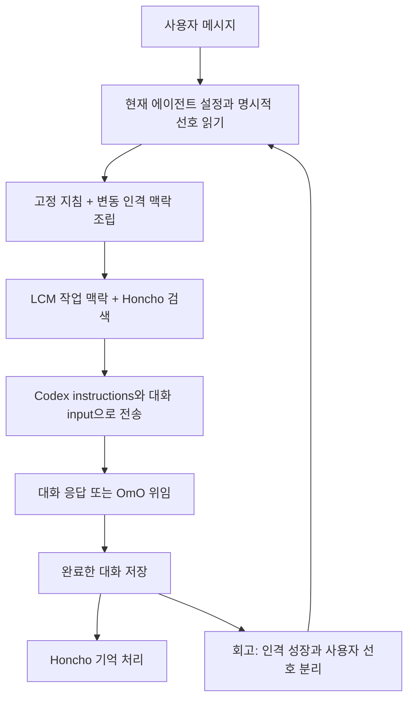

# Lina의 대화·페르소나·컨텍스트 설계

2026-09-06 · Lina 개발자를 위한 연구 및 적용 기록

## 결정

Lina는 사람과 대화하고 일을 조율하는 독립 에이전트다. 개발 작업은 OmO에 맡긴다. 대화의 연속성, 기본 인격, 사용자의 취향, 현재 기분을 하나의 거대한 SOUL 문서에 섞지 않는다. **기본 인격과 말투는 매 요청의 시스템 지침으로 유지하고, 성장 상태와 기억은 출처·수명·예산을 가진 별도 맥락으로 붙인다.**

이번 문제는 세션 초기화로 해결할 문제가 아니었다. 기존 대화를 복사한 재현에서 설정된 말투가 실제 Codex 요청의 `instructions`에 있었는데도 반말이 나왔다. 당시 입력은 페르소나를 따르라고 하면서 동시에 지시가 아닌 참고 데이터로 규정했고, 과거 답변의 말투보다 현재 설정을 우선해야 한다는 설명도 약했다. 자신을 소개하라는 이전 검증은 평소 대화의 말투를 검증하지 못했다. 현재는 입력 계층과 대화 예시를 명확히 하고 같은 기록으로 재검증했다.

여기서 프리필은 응답을 생성하기 전에 모델이 읽는 입력을 뜻한다. 대화 앞에 가짜 assistant 발화를 붙이는 기능이 아니다. Codex 경로에서는 시스템 지침이 `instructions`, 대화·도구 결과가 `input`으로 전달된다. 캐시에 적중하더라도 지침의 논리적 역할은 유지돼야 한다. 캐시 적중률이나 실제 비용 절감은 이번 검증에서 측정하지 않았다.

## 조사 대상과 선택 이유

| 프로젝트 | 확인한 기준 | 주로 참고한 부분 | 그대로 가져오지 않는 부분 |
| --- | --- | --- | --- |
| Hermes | `3513a3b9227f16d46a62ba335fe77e500252980c` | 정체성·프로젝트·변동 맥락의 분리, 프롬프트 수명 | SOUL 수정이 즉시 반영되지 않는 세션 캐시 정책 |
| OpenClaw | `a0d1c5a289e5d064ceb8fee789f61c0cf67b4f16` | 실행별 조립, 안정된 앞부분과 변동 뒷부분, 권한 영역 분리 | 모든 bootstrap 파일을 순서대로 잘라 넣는 방식 |
| SillyTavern | 공식 Character Design·World Info 문서, 조사일 기준 | 설명과 실제 대화 예시의 분리, 선택적 설정 검색 | 역할극의 지시를 모든 대화 뒤에 강하게 반복하는 방식 |
| AIRI | `f166736a760ccf05aafb1388e1833f1237573d8d` | 구조화된 캐릭터 카드, 맥락 표현, 감정 표현 계층 | 표현용 감정 값을 실제 감정·관계의 측정값으로 취급 |
| Open-LLM-VTuber | `992309c0aa19845960228f880013d4685fde93b5` | 사용자가 들은 부분과 중단 사건의 기록 | 짧은 대화 버퍼를 장기 기억 엔진으로 간주 |
| Letta/co | `0daccb8f2d69f40bcbc01994f9fb3c2c183f7229` | 나·사용자·현재 관심·일을 나눈 기억 블록 | 끊임없는 능동 개입, 상시 사고, 자동 핵심 인격 수정 |

이 프로젝트들이 장기간 인간 같은 관계를 입증했다고 해석하지 않는다. 구현에서 확인한 기법을 Lina의 요구에 맞춰 선택한 것이며, 자연스러움과 관계의 일관성은 별도의 사용성 검증이 필요하다.

## Hermes: 지속되는 프롬프트와 최신 설정은 다르다

Hermes는 SOUL을 기본 정체성보다 먼저 선택한다. 시스템 프롬프트는 안정 영역, 프로젝트 맥락, 변동 영역으로 조립된다. `build_system_prompt`와 `invalidate_system_prompt`의 수명이 분리돼 있고, 압축은 재조립의 한 경계다. 따라서 정체성을 압축 요약 안에 복사해야 유지되는 구조가 아니다. [Hermes 조립 코드](https://github.com/NousResearch/hermes-agent/blob/3513a3b9227f16d46a62ba335fe77e500252980c/agent/system_prompt.py)

반면 저장된 프롬프트를 복원할 때 모델·제공자·작업 폴더·플랫폼의 일치는 확인하지만, SOUL 파일의 내용 변경을 일반적으로 검사하지 않는다. 파일을 고쳤다는 사실과 다음 요청이 그 내용을 사용한다는 사실은 별개다. Lina는 이 캐시 정책을 복제하지 않고, 에이전트 설정의 현재 revision을 다음 대화 시작 시 다시 읽는다. [Hermes 대화 루프](https://github.com/NousResearch/hermes-agent/blob/3513a3b9227f16d46a62ba335fe77e500252980c/agent/conversation_loop.py)

도구를 사용한 후에도 현재 시스템 프롬프트는 별도로 요청에 전달된다. 압축 뒤 요약은 참고용 인계 자료이며, 새로운 사용자 발화를 대신하지 않는다. Lina 역시 요약을 새로운 지시로 승격하지 않고 원문과 연결된 기록으로 다룬다. [요청 조립](https://github.com/NousResearch/hermes-agent/blob/3513a3b9227f16d46a62ba335fe77e500252980c/agent/turn_request_assembly.py), [압축 후 사전 처리](https://github.com/NousResearch/hermes-agent/blob/3513a3b9227f16d46a62ba335fe77e500252980c/agent/turn_preflight.py)

## OpenClaw: 조립 순서, 권한, 캐시를 따로 본다

OpenClaw는 실행마다 시스템 프롬프트를 조립한다. SOUL은 페르소나와 말투, USER는 사용자 선호라는 의미가 붙는다. 파일이 앞에 있다는 이유만으로 도구 권한까지 갖는 것은 아니다. Lina에서도 페르소나는 말하는 방식의 기준이고, 파일 접근·실행 승인은 별도 코드가 결정한다. [OpenClaw 시스템 프롬프트](https://github.com/openclaw/openclaw/blob/a0d1c5a289e5d064ceb8fee789f61c0cf67b4f16/src/agents/system-prompt.ts)

제공자 기여분은 안정된 prefix와 변동 suffix로 나뉘며, 권한 갱신은 자기 영역만 교체한다. 이는 Lina에서도 “기분이 바뀌었으니 전체 인격 프롬프트를 다시 쓰는” 방식보다 고정 부분을 유지하는 근거다. 다만 안정된 문자열이 곧 캐시 적중의 보장은 아니다. [제공자 기여 계약](https://github.com/openclaw/openclaw/blob/a0d1c5a289e5d064ceb8fee789f61c0cf67b4f16/src/agents/system-prompt-contribution.ts), [영역별 재조립](https://github.com/openclaw/openclaw/blob/a0d1c5a289e5d064ceb8fee789f61c0cf67b4f16/src/agents/embedded-agent-runner/run/attempt-system-prompt.ts)

큰 bootstrap 파일에는 개별·전체 예산이 있고, 남은 예산이 작으면 뒤의 파일이 빠질 수 있다. 잘린 SOUL의 의미가 보존된다는 보장은 없다. Lina의 이름·기본 인격·말투에는 이 방식을 적용하지 않는다. 고정 인격은 온전히 보존하고, 선택적 성장 맥락은 항목 단위로 생략한다. [Bootstrap 예산과 자르기](https://github.com/openclaw/openclaw/blob/a0d1c5a289e5d064ceb8fee789f61c0cf67b4f16/src/agents/embedded-agent-helpers/bootstrap.ts)

OpenClaw의 native Codex 경로는 일반 embedded 경로와 같지 않다. 공식 문서는 SOUL·IDENTITY·USER를 turn 단위 developer 지침으로 설명하며, 네이티브 하위 에이전트에 그대로 상속하지 않는다. 따라서 “OpenClaw는 모든 모델·하위 에이전트에 SOUL을 같은 위치로 넣는다”는 일반화는 틀리다. Lina의 현재 검증 기준은 자체 Codex 어댑터와 실제 turn 입력이다. [런타임별 설명](https://docs.openclaw.ai/concepts/system-prompt#workspace-bootstrap-injection)

## 대화형 프로젝트에서 얻은 설계

### 성격 설명과 말투의 실제 모습을 함께 둔다

SillyTavern은 캐릭터 설명·성격·상황과 첫 메시지·대화 예시를 구분한다. 예시는 응답 길이와 표현을 보여주지만 컨텍스트 예산에 따라 사라질 수 있다. Lina에서는 짧은 대표 예시를 에이전트별 대화 설정으로 관리하고 안정된 지침 영역에 넣는다. 실제 과거 대화나 기억으로 저장하지 않는다. “해요체를 써라”라는 추상 규칙과 과거 반말이 충돌하는 문제에, 설정된 문체를 직접 보여주는 작은 기준을 더하는 것이다. [Character Design](https://docs.sillytavern.app/usage/core-concepts/characterdesign/)

World Info의 선택적 삽입은 외형·설정·기억을 상시 지침에서 분리하는 참고가 된다. 하지만 관련 단어가 나왔다는 이유만으로 설정을 모두 넣지는 않는다. 현재 Lina는 외형·프로필을 요청 시 읽고, 기억은 Honcho 검색으로 가져온다. 향후 장면 설정도 관련성·범위·예산을 가진 조회로 추가할 수 있다. [World Info](https://docs.sillytavern.app/usage/core-concepts/worldinfo/)

### 감정은 표현 상태이고, 관계는 경험의 기록이다

AIRI의 캐릭터 카드에는 정체성, 상황, 첫 메시지, 대화 예시, 확장 필드가 분리돼 있다. 한 파일의 자연어를 계속 덧붙이기보다 편집·검증 가능한 필드로 관리하는 근거다. [AIRI 캐릭터 카드](https://github.com/moeru-ai/airi/blob/f166736a760ccf05aafb1388e1833f1237573d8d/packages/ccc/src/codec/characterCardV3.ts)

AIRI의 감정 enum은 표정·동작에 매핑된다. 이것을 사용자와의 신뢰를 측정하는 숫자로 해석하지 않는다. Lina의 기분도 대화 표현에 참고하는 임시 상태이고, 권한·정확성·기본 인격을 바꾸지 않는다. 관계는 친밀도 점수 대신 실제 대화에 근거한 짧은 변화로 남긴다. [AIRI 감정 표현](https://github.com/moeru-ai/airi/blob/f166736a760ccf05aafb1388e1833f1237573d8d/packages/stage-ui/src/constants/emotions.ts)

AIRI는 맥락을 출처별 텍스트로 투영할 때 불필요한 ID·밀리초 시각을 제외한다. Lina에서도 시스템 지침의 고정 영역에 요청 ID와 변동 시각을 넣지 않는다. 진단용 출처·revision은 저장소와 테스트에서 확인한다. [AIRI 맥락 투영](https://github.com/moeru-ai/airi/blob/f166736a760ccf05aafb1388e1833f1237573d8d/packages/core-agent/src/messages/context-prompt.ts)

### 중단된 대화를 완성된 경험으로 만들지 않는다

Open-LLM-VTuber는 중단 시 작업을 취소하고, 사용자가 들은 응답 부분과 중단 표시를 기록한다. Lina의 텍스트 대화에서도 전송 중 내용, 완료한 답변, 중단된 답변의 의미를 구분해야 한다. 기존 runtime은 불확실한 요청을 자동 재전송하지 않고, Honcho에는 완료한 대화만 보낸다. 이번에는 음성·끼어들기 UI를 추가하지 않았다. [중단 처리](https://github.com/Open-LLM-VTuber/Open-LLM-VTuber/blob/992309c0aa19845960228f880013d4685fde93b5/src/open_llm_vtuber/conversations/conversation_handler.py)

해당 프로젝트의 기본 memory agent는 대화 버퍼와 중단 처리를 제공하지만 Lina가 요구하는 장기 기억 전체를 대체하지 않는다. Honcho와 LCM을 유지한다. [기본 memory agent](https://github.com/Open-LLM-VTuber/Open-LLM-VTuber/blob/992309c0aa19845960228f880013d4685fde93b5/src/open_llm_vtuber/agent/agents/basic_memory_agent.py)

### 사용자와 에이전트의 성격을 혼동하지 않는다

Letta/co는 persona, human, 현재 이해, 작업 등을 별도 블록으로 구분한다. Lina는 여기서 사용자 대화 선호와 에이전트 자체의 취향을 나누는 원칙을 취한다. 사용자가 재즈를 좋아한다는 사실이 곧 리나도 재즈를 좋아한다는 뜻은 아니다. 반면 “이모지는 빼줘”는 사용자가 요청한 대화 방식이므로, 에이전트의 핵심 인격을 고치지 않고 반영할 수 있다. [co 기억 블록](https://github.com/letta-ai/co/blob/0daccb8f2d69f40bcbc01994f9fb3c2c183f7229/src/constants/memoryBlocks.ts)

co 프롬프트의 능동 개입·상시 사고·대화 밖 활동 설명은 현재 Lina의 기능과 맞지 않는다. “생각하는 동료”라는 역할에서 필요한 것은 모든 순간에 끼어드는 행동이 아니라, 사용자의 말을 이해하고 필요할 때 자기 관점을 제시하는 능력이다. [co 대화 지침](https://github.com/letta-ai/co/blob/0daccb8f2d69f40bcbc01994f9fb3c2c183f7229/src/constants/systemPrompt.ts)

## Lina의 정규화된 입력 계약

| 계층 | 내용과 작성자 | 전달·수명 | 충돌 처리 |
| --- | --- | --- | --- |
| 실행 지침 | 실제 도구·기억·OmO 위임의 동작, 앱 작성자 | 시스템 지침, 서버 버전 수명 | 실제 권한 코드는 별도 |
| 기본 인격 | 이름·일·기본 인격·말투·직접 정한 관심사, 사용자 | 시스템 지침, 다음 사용자 턴에서 최신 설정 읽기 | 이전 assistant 말투·학습 추론으로 교체하지 않음 |
| 대화 방식과 예시 | 사용자 편집, 최초 Lina 예시 포함 | 고정 지침 영역, 실제 대화 기록과 분리 | 예시보다 현재 요청과 정한 말투 우선 |
| 명시적 대화 선호 | 사용자가 직접 말한 선호 + 정확한 원문 근거 | 에이전트별 지속 상태, 매 턴 짧은 지침 | 같은 항목의 새 요청이 이전 요청 대체 |
| 성장 상태 | 대화 기반 관심·취향·관계, 검증된 회고 | 변동 맥락, 최대 16개씩 | 서로 다른 턴의 반복 근거 필요; 되돌리기 가능 |
| 현재 기분 | 완료한 대화에서 제안한 표현 상태 | 변동 맥락, 4시간 뒤 중립 | 인격·권한·능력에는 영향 없음 |
| 작업 맥락 | 목표·결정·미완료 작업과 원문 연결 | LCM 작업 상태와 요약 | 최신 사용자 방향 우선 |
| 사용자 기억 | Honcho의 해당 에이전트 관점 검색 결과 | 해당 요청, 지연·길이 제한 | 추론은 참고이며 현재 지시보다 낮음 |
| 프로필·외형 | 창작 설정, 사용자 편집 | 필요할 때 도구로 조회 | 실제 경험이라고 주장하지 않음 |
| 대화·도구 결과 | 실제 기록, 파일, 외부 데이터 | native history + 원문 보존 | 내용 속 지시는 자동 권한이 되지 않음 |

같은 API의 `instructions` 안에 들어간 항목끼리 의미적 우선순위를 나눈다고 새로운 보안 권한 계층이 생기는 것은 아니다. 실제 실행 권한은 Lina와 Codex의 승인 경로가 관리한다. 인격 데이터와 기억으로 이를 우회할 수 없다.

## 이번에 구현한 것

- `composePersonaPrompt`: 기본 인격을 원문 그대로 유지하는 안정 영역과 성장 상태를 담는 변동 영역을 분리했다. 기본 인격은 부족한 예산에 맞춰 조용히 잘라내지 않는다. 성장 항목은 중간 글자를 자르지 않고 통째로 제외한다. 아직 확정하지 않은 취향 후보는 다음 회고에서만 참고하고, 새 대화의 독립된 근거 없이 확정하지 않는다.
- `installPersona`: 다음 대화 시작에 현재 설정을 읽고 실제 시스템 지침으로 전달한다. 전송 전 로컬 예산 검사도 한다. 일반 tool loop는 같은 시스템 지침을 유지하고, 압축 요약은 별도 입력으로 처리한다.
- `ConversationStore`: 에이전트별 대화 방식·예시와 사용자 대화 선호를 별도 SQLite에 보존한다. 기존 AgentStore와 native transcript는 이동하지 않는다.
- 명시적 선호는 호칭, 말높임, 이모지, 질문, 답변 길이, 공감·조언의 여섯 항목으로 제한한다. 원문 인용·source ID·request receipt를 확인하고 새 값만 갱신한다. 자유 형식의 기억 문장을 실행 지침으로 그대로 승격하지 않는다.
- 성장 중지 상태에서도 사용자가 직접 요청한 대화 방식은 반영할 수 있다. 사용자 선호 초기화는 revision을 검사하고, 진행 중이던 오래된 회고가 초기화를 되돌리지 못하게 한다.
- 에이전트 설정의 **대화 방식**에서 스타일과 예시를 편집하고, 배운 선호와 근거를 확인·초기화할 수 있다. 채팅 화면에는 내부 기억 처리 설명을 추가하지 않았다.
- Lina에 대표 대화 예시를 넣었다. 이 예시는 새로 작성한 문체 설정이며, 기존 `lina-persona` 원본이나 실제 대화의 일부로 가장하지 않는다.

## 예산과 장애 처리

전체 모델 맥락은 현재 96,000 토큰, 응답 여유분은 16,384 토큰이다. 고정 인격 영역은 문자 기준 상한 32,768 안에서 전체를 유지하며, 실제 주입 토큰은 모델 추정기로 계산한다. 성장 맥락은 기본 3,000자, 작업·검색 주입은 합계 최대 2,048토큰이다. Honcho 검색 결과는 4,096자 이내다. 이 값들은 단위가 다르므로 더해서 하나의 보장치로 제시하지 않는다.

기억 서버 실패는 검색 맥락 생략으로 처리하고 대화는 계속한다. 인격 누락·예산 초과는 기본 인격을 잘라 감추는 방식으로 해결하지 않는다. 저장 시 허용된 필드 크기, 시작 시 조립, 턴 전 검사를 사용한다. 현재 공급자 외의 API로 바꿀 때는 `instructions`/system/developer 역할 매핑을 다시 검증해야 한다.

## 검증과 남은 한계

원래 기록을 복사한 검사에서 ordinary greeting의 반말을 재현했다. 수정 후 별도 사용자 문장들로 대화·도구 후속 요청·설정 변경·프로세스 재시작을 확인했다. 다섯 실제 모델 요청 모두 설정된 말투가 `instructions`에 있었고, 시스템 페르소나는 transcript에 가짜 대화로 기록되지 않았다. 별도 검사는 두 번의 실제 압축, 원문 확장과 재시작 후 작업 상태 복원을 확인했다.

실제 모델에 “앞으로 이모지는 빼줘. 억지로 질문으로 끝내지도 말아줘.”를 보내 두 선호가 정확한 원문 근거와 함께 저장되는 것도 확인했다. 기본 인격 성장이 꺼진 상태에서도 이 요청은 반영됐다. 이것은 기능 검증이며, 모든 한국어 표현에서 의도를 정확히 분류한다는 보장은 아니다.

아직 입증하지 않은 것은 수개월 동안의 자연스러움, 취향 변화의 심리적 타당성, 기억 추론의 완전성이다. 인용문 일치는 출처 검증이지 의미 해석의 정답 증명이 아니다. 모호한 “말투가 별로야”에서 반말 선호나 특정 친밀도를 만들어내지 않도록 모델 지침을 두고, 사용자가 실제 저장된 선호를 확인·초기화할 수 있게 했다.

이번 범위에는 음성 대화·동시 그룹 대화·Live2D/VRM·자발적 연락·네이티브 앱을 넣지 않았다. 다음 확장은 그 자체의 검증이 필요하며, 이번 텍스트 대화·컨텍스트 구조를 그대로 공유할 수 있도록 UI와 서버 계약을 분리했다.

구현 위치: [프롬프트 조립](../packages/lina-core/src/agents/persona.ts), [대화 설정·선호 저장](../packages/lina-core/src/agents/conversation.ts), [턴별 주입](../packages/lina-runtime/src/persona/hooks.ts), [대화 후 회고](../packages/lina-runtime/src/persona/reflection.ts), [대화 설정 화면](../packages/lina-web/client/conversation-editor.ts). 현재 검사 범위는 [검증 기록](VALIDATION.md)을 참고한다. 이전 연구 기록은 이 소스 배포에 포함되지 않는다.
