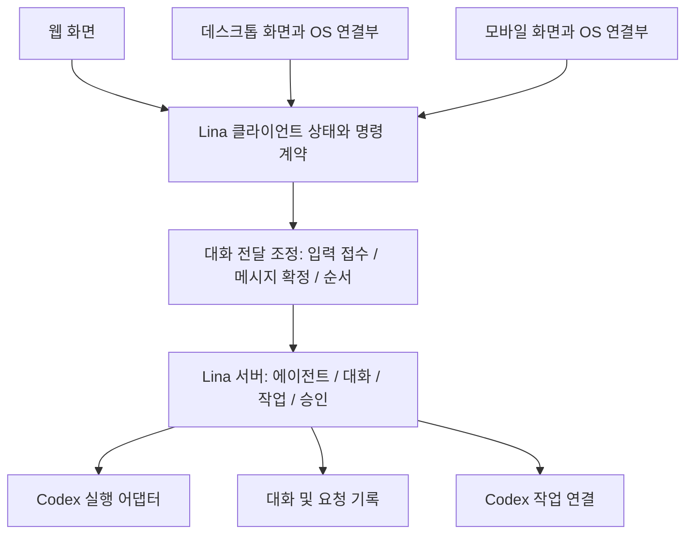

# Lina UI 개편 계획

상태: 제품 설계. Electron·메신저형 목록·연속 발화는 후속 구현이며 현재 기능은 [기획 목록](../../PLANNING.md)을 따른다.

**Codex의 디자인 언어를 전면 채택하고, 에이전트와의 지속 대화를 탐색의 중심에 둡니다.** 화면을 바꿔도 대화·초안·작업이 이어져야 합니다. 근거와 코드 확보 범위는 [조사 문서](000_source_research.md)에 정리했습니다. 데스크톱은 Electron, 웹/PWA는 같은 렌더러를 사용합니다. [스택과 전환 계획](004_electron_stack.md), [디자인 적용 기준](005_codex_design_language.md)이 각각 구현 경계와 시각 검수의 기준입니다.

사용 피드백을 반영해 범위를 대화 전달과 첨부까지 구체화했습니다. 일상 대화는 짧은 메시지로 이어 보내고, 중간 사용자 입력은 미공개 발화를 바꿉니다. 설명·결과물은 필요한 길이와 구조를 유지하며 구성 이유를 짧게 전달합니다. 이 요구는 전체 답변 길이 제한이 아닙니다. 세부 계약은 [대화 전달 계획](002_conversation_delivery.md)과 [붙여넣기 첨부 계획](003_clipboard_attachment.md)을 따릅니다.

## 1. 디자인 방향과 범위

추가 피드백에 따라 에이전트는 [메신저형 목록과 모바일 탐색](006_agent_list_mobile.md)으로 구성하고, Codex 작업은 [사이드바 배치 비교](007_sidebar_comparison.md)에 따라 별도 목록으로 엽니다. 앞선 한 줄 트리·행 안 작업 펼침·모바일 서랍은 이 결정으로 대체합니다.

반복해서 쓰는 에이전트 대화 공간입니다. Codex 디자인 언어의 중립적인 차콜·타이포·메뉴·입력창을 기준으로 삼고, 사진과 최근 대화가 있는 목록을 적용합니다. Lina의 `l.` 로고와 에이전트 아바타는 유지합니다. 디자인 변화 2/10, 움직임 2/10, 에이전트 목록·대화 영역 밀도 D3을 시작점으로 잡습니다.

사용자 선택에 따라 `packages/lina-web/DESIGN.md`의 목표 디자인을 Codex 기준으로 갱신했습니다. 색·타이포·간격·곡률·아이콘·메뉴·상태·전환을 함께 맞춥니다. 대화 본문에 내부 로그·추론·운영 정보를 노출하지 않는 기존 원칙은 유지합니다. 결과 상세는 사용자가 읽을 결과물·작업 요약·필수 질문을 보여주는 영역입니다.

이번 산출물은 조사와 계획입니다. 실행 가능한 화면이나 앱 패키지는 만들지 않았습니다. 기존 유틸리티 UI와 구체적인 참조 화면이 있으므로 이 기획에서 이미지 생성은 사용하지 않았습니다. 이후 첫 화면 검수는 실제 UI 렌더링으로 진행합니다.

## 2. 구현 시 확인할 경계

기존 초안 저장, 영속 대화, 작업 상태, 첨부 검증과 모델·프로필 설정을 재사용한다. 구현 전 현재 `packages/lina-web/client`, `packages/lina-runtime/src/fleet`, `packages/lina-codex`의 호출자를 확인한다. 아래 단계의 파일명과 새 계약은 설계 후보이며 현재 API나 완료 증거가 아니다.

페이지 재로드 없는 전환, 안정된 목록 순서, 전체 에이전트 요약, 과거 기록 위치 복원, 첨부 큐와 공개 메시지별 중간 입력 처리를 각각 검증한다. 기억은 공개한 메시지 전체를 출처로 보존해야 한다.

## 3. 정보 구조

사용자가 선택하는 최상위 대상은 에이전트입니다. 각 에이전트의 기본 대화는 하나로 유지합니다. 개별 작업은 해당 에이전트가 맡은 업무이며, 새 에이전트나 새 기본 대화가 아닙니다. 예약·플러그인 같은 전역 메뉴는 실제 연결된 기능이 있을 때만 별도로 추가합니다.

```text
에이전트 | 작업              검색  추가

[사진] Lina                       14:32
       그럼 저녁에 이어서 얘기하자.    ●

[사진] Research                   13:18
       자료 두 개를 더 확인했어요.

[사진] Writer                      어제
       확인이 필요한 요청               1

사용자                            설정
```

위 이름과 숫자는 구조 설명용 예시입니다. 제품 화면에서는 실제 상태만 표시합니다.

| 조작 | 결과 |
|---|---|
| 에이전트 행 클릭 | 해당 에이전트의 기본 대화와 이전 화면 위치 복원 |
| 작업 목록으로 전환 / 작업 열 열기 | 담당 범위가 명시된 Codex 작업 목록. 기존 대화와 초안 유지 |
| 작업 행 클릭 | 담당 에이전트와 실제 작업을 표시한 상세 열기. 대화 복귀 경로 제공 |
| 확인 요청 클릭 | 정확한 대상과 요청 내용을 보여주고 허용·거절 제공 |
| `⋯` / 키보드 메뉴 | 이름·프로필·대화 방식·기억 등 기존 메뉴 접근 |
| 검색 | 에이전트 찾기와 현재 에이전트 대화 검색부터 제공 |
| 뒤로 가기 | 직전 목록·검색·스크롤·대화·패널 상태 복원. 모바일에서도 동일 |

초기 정렬은 서버의 기존 순서를 안정적으로 유지합니다. 선택·새 메시지·작업 상태로 자동 재정렬하지 않습니다. 수동 정렬과 핀은 후속 개선으로 구분하며 첫 출시의 필수 조건으로 만들지 않습니다.

읽지 않음과 확인 필요는 다른 표시입니다. 결과를 읽었다고 승인된 것으로 처리하지 않습니다. 접힌 사이드바에서도 확인 필요 표시를 유지하고, 아이콘에 이름과 상태를 읽을 수 있는 라벨을 제공합니다.

## 4. 화면 계약

**데스크톱·웹**: 기본은 에이전트 목록 한 열과 대화입니다. 같은 열에서 작업 목록으로 전환할 수 있습니다. 넓은 창에서는 사용자가 작업 목록을 옆 열로 열어 두 목록을 함께 볼 수 있습니다. 작업 상세는 본문에서 열며, 별도 결과 패널이 필요하면 작업 목록 열을 접어 공간을 확보합니다. 에이전트 프로필·기억은 기존 편집 기능을 연결합니다.

**태블릿·좁은 웹**: 가용폭에 따라 목록+본문 또는 전체 화면 전환을 사용합니다. 두 목록을 나란히 열 공간이 없으면 한 열에서 전환합니다. 폭 변경은 선택한 에이전트·작업·초안·읽던 위치를 바꾸지 않습니다.

**모바일**: 기본 목록에서 하단 에이전트·작업·설정으로 이동합니다. 에이전트를 누르면 전체 화면 대화를 열고 하단에는 입력창을 둡니다. 상단 뒤로 가기로 원래 목록과 위치에 돌아갑니다. 모델·첨부 메뉴는 시트, 긴 결과는 전체 화면으로 표시합니다. 직접 링크와 앱 재개는 원래 대화·작업으로 진입합니다.

아래 수치는 검수 전 시작값입니다. Codex 공통 요소는 같은 viewport·배율로 대조하고, 메신저 목록과 작업 열은 추가 사용자 피드백에 맞춰 조정합니다. [디자인 적용 기준](005_codex_design_language.md)과 [목록 규격](006_agent_list_mobile.md)을 따릅니다.

| 항목 | 임시값 | 근거·검수 |
|---|---|---|
| 에이전트 목록 | 기본 304px, 최소 280px, 최대 420px 제안 | 이름·미리보기·시각을 함께 검수. Codex의 275px를 강제하지 않음 |
| 작업 목록 | 280px 시작, 충분한 가용폭에서 옆 열로 열기 | 일반 창에서는 같은 열 전환. 상시 위아래 분할은 기본안에서 제외 |
| 상단 바 | 48px | Codex 번들에는 여러 높이가 있어 Lina 값으로 명시 |
| 에이전트 행 | 데스크톱 64–72px, 모바일 72–80px 시작 | 사진 40/48px, 이름·최근 대화 두 줄, 글자 확대 시 높이 증가 |
| 본문·입력 폭 | 최대 832px, 같은 중심축 | 앞선 820–880px 안을 구체화한 제안값 |
| 본문 | 16px, 줄 간격 1.65 | 한글·긴 답변 가독성 우선 |
| 입력창 곡률 | 22px 시작 | 번들 간격·곡률 선언 참고. 확대 시 검수 |
| 색 | 본문 #181818, 사이드바 #212121, 입력 #292929, 선택 #333333 | 앞 두 색은 번들 팔레트에도 존재. 전체 조합은 Lina 제안 |
| 상세 폭 | 360–440px, 본문 가용폭 560px 미만이면 overlay | 화면 너비보다 가용 콘텐츠 폭으로 판단 |
| 기준 구간 | 모바일 <768px, 중간 768–1199px, 넓은 화면 ≥1200px | 터치 기기·브라우저 확대는 별도로 고려 |
| 전환 | 120–160ms 시작, reduced-motion에서는 생략 | 상태 전달은 애니메이션 없이도 유지 |

색·간격 값은 구현 시 `tokens.css`가 소유하며 공통 UI 패키지 분리 때 원본을 한 번만 이동합니다. 이 문서의 숫자는 측정 전 임시값이며 실제 CSS가 생기면 문서는 역할과 결정 근거만 남겨 중복 관리하지 않습니다. 사용 가능한 글꼴과 한글 fallback으로 Codex의 크기·굵기·줄바꿈을 맞추고, SVG의 선 굵기·크기·정렬도 함께 대조합니다. 작은 화면의 textarea는 16px 이상으로 잡고 iOS 확대 동작을 실기기에서 확인합니다.

## 5. 입력·읽기·작업 상태

입력창의 기본 요소는 첨부, 본문, 모델 선택, 보내기입니다. 첨부는 파일 선택과 복사·붙여넣기를 함께 제공합니다. 아직 연결되지 않은 음성·권한 모드는 장식용으로 추가하지 않습니다. 입력창 위에는 짧은 활동 상태와 필요한 확인 요청만 남깁니다. 여러 작업의 세부 사항은 결과 패널에 둡니다.

| 상태 | 표시와 조작 |
|---|---|
| 첫 대화 | 작은 에이전트 아바타, 한 문장 안내, 입력창 |
| 작성 중 | 초안·첨부·선택 영역 보존. 다른 에이전트 전환 시 분리 저장 |
| 전송 중 / 결과 미확인 | 요청 ID에 연결된 상태 표시. 자동 중복 전송 금지 |
| 대기 / 실행 중 | 실제 상태 표시. 추가 입력을 받으며 이어 말하기·응답 기다리기·작업 실행을 구분 |
| 연속 발화 중 새 입력 | 이미 공개한 말 유지. 미공개 후보 무효화 뒤 최신 입력에서 다음 발화 생성 |
| 사용자 확인 필요 | 대상·입력·현재 유효성을 보여주고 허용·거절. 모바일에서도 접근 가능 |
| 완료 | 사용자용 답변·결과물. `review_ready`는 “검토 가능”이며 무조건 성공으로 치환하지 않음 |
| 사용자 중단 | 중단됐음을 표시하고 보존된 입력에서 후속 요청 가능 |
| 실패 | 원인 요약과 지원되는 재시도. 새 요청은 사용자의 명시적 동작으로 생성 |
| 연결 끊김 | 저장된 화면을 유지하면서 최신 상태가 아님을 표시. 승인·중단은 재연결 뒤 재검증 |

연속 메시지 전달은 이번 피드백의 필수 범위입니다. 총 답변을 미리 만든 뒤 말풍선으로 나눠 지연 표시하는 방식은 채택하지 않습니다. 다음 의미 단위를 생성하고 공개할 때마다 최신 입력을 검증합니다. 토큰 단위 스트리밍은 별도 표현 방식이며, 사용자 발화와 도구 전 commentary를 구분하지 않은 `live-text` 노출은 피합니다.

일상 대화·자세한 설명·결과물의 형식은 요청과 맥락으로 선택합니다. 코드·문서·프롬프트는 복사 가능한 완결된 단위로 유지합니다. 결과물 앞뒤에는 무엇을 반영했고 어떤 가정을 했는지 짧게 설명하되, “결과물만” 요청에서는 생략합니다. 습관적인 보고 양식이나 요청하지 않은 약속·범위 제한을 붙이지 않습니다.

스크롤 복원은 픽셀 값 하나보다 `entryId + 화면 내 상대 위치`를 기준으로 합니다. 대상 항목이 현재 페이지에 없으면 서버의 과거 기록을 불러오고 복원합니다. 끝을 보고 있었던 경우에만 새 답변을 따라가며, 이전 대화를 읽는 중에는 “새 답변” 버튼을 표시합니다.

첨부 업로드 중에는 기존 전환 보호를 유지하거나, 같은 보호 수준의 에이전트별 초안 큐를 사용합니다. 늦은 응답이 다른 초안에 붙지 않아야 합니다. 업로드 중 다시 붙여넣은 파일을 무시하지 않고 순서대로 보관합니다. 저장 실패 때는 입력을 현재 화면에 남기고 원인을 표시합니다. 뒤로 가기와 외부 링크 진입도 같은 전환 보호를 거쳐야 합니다.

## 6. 상태 소유권과 공통 구조



| 저장 위치 | 상태 |
|---|---|
| 서버의 기존 기록 | 에이전트 ID, 실제 sessionId 연결, 대화 entryId, 요청·작업·승인 상태 |
| 서버에 추가할 공개 대화 기록 | 입력 접수·메시지 확정 순번, 원본 참조, 미공개 후보의 버전, 재전송 기록 |
| 서버에 추가할 요약 | 에이전트별 작업 수·확인 요청 수·최근 결과 식별자·갱신 revision |
| 현재 클라이언트 | 화면 종류, 선택한 에이전트·작업, 작업 담당 필터, 열린 패널, 현재 연결 상태, 렌더링한 대화 |
| 기기별 저장 | 목록 폭·열 열림, 초안, 읽던 위치·읽음 커서, 목록별 검색·스크롤 |

기기 간 초안 자동 병합은 첫 범위에 넣지 않습니다. 서버의 대화와 작업 상태는 공유하되 작성 중인 초안은 기기별로 보존합니다. 읽음 상태 역시 첫 범위는 기기별입니다. 기기 간 읽음 동기화가 필요해지면 별도 계약으로 추가합니다.

제안하는 탐색 상태는 `screen`, `agentId`, `panel`, 선택 작업, 담당 필터와 복귀 위치입니다. 기존 `/?agent=...` 링크를 유지하면서 History API로 전환하고 `popstate`도 처리합니다. 모든 에이전트의 대화 소켓을 상시 열기보다 활성 대화 구독 하나와 가벼운 전체 요약 구독을 분리합니다. 전환 시 오래된 소켓·요청·검색 응답이 새 화면에 반영되지 않도록 세대 번호와 식별자를 검증합니다.

서버 요약은 표시 전용 계약부터 만듭니다. 최소 필드는 `agentId`, `sessionId`, `revision`, 마지막 공개 메시지의 ID·순번·시각·미리보기, 상태, 작업 수, 확인 요청 수입니다. Codex 작업은 실제 hostId·threadId와 담당 에이전트의 연결을 사용합니다. 대화 sessionId나 다른 작업 ID를 threadId로 간주하지 않습니다. 자세한 연결 계약은 사이드바 비교 4절을 따릅니다.

알 수 없는 수치는 0으로 꾸미지 않고 “상태 확인 중”으로 표시합니다. 다른 기기에서 이미 처리한 승인은 최신 서버 상태를 반영해 닫고 중복 실행하지 않습니다. 초기 버전에서는 기존 승인 명령의 approvalId·inputDigest 검증을 그대로 사용합니다.

공개 메시지 순서는 사용자 입력 접수와 assistant 공개를 같은 서버 기록 경계에서 정합니다. 엔진의 늦은 소비·브라우저 시간·네트워크 도착순으로 재정렬하지 않습니다. 발화 후보 교체는 작업 전체 취소와 구분하고, 기억에는 실제 공개한 메시지만 대화로 반영합니다. 자세한 경합·복구·마이그레이션 기준은 대화 전달 계획 5–8절에 있습니다.

## 7. 플랫폼별 구현 경계

| 플랫폼 | UI 계획 | 플랫폼 전용 부분 | 완료 증거 |
|---|---|---|---|
| 웹 | 공통 TypeScript/HTML/CSS 렌더러와 디자인 토큰 | URL·History·브라우저 파일 입력·접근성·PWA | 실제 브라우저의 탐색·새로고침·복구 |
| Electron 데스크톱 | 같은 렌더러를 앱에 동봉 | main/preload의 서버 연결, 실제 창 조작, 메뉴, 단축키, 파일 대화상자, 알림, 외부 링크, 자격 보관 | 개발 서버 없이 패키징한 앱에서 대화·OS 조작·재시작 복원 |
| 모바일 웹 | 전체 화면 에이전트·작업 목록, 대화 진입·복귀, 하단 탐색 | visual viewport, safe area, 가상 키보드, 업로드·뒤로 가기 | 모바일 브라우저 실기기 검수 |
| 향후 iOS/Android 앱 | 동일한 에이전트·대화·작업 계약, 앱 프레임워크는 별도 결정 | 파일·사진 선택, 공유, 알림, 깊은 링크, 인증 저장, suspend/resume | 실제 앱의 백그라운드 복귀와 동일 작업 복원 |

데스크톱은 사용자 선택에 따라 Electron으로 확정합니다. 웹은 브라우저에서 공통 렌더러를 실행하며, Electron main/preload가 데스크톱 OS 기능을 담당합니다. 현재 Bun workspace와 브라우저 빌드를 재사용하고, 패키징은 Electron Forge로 계획합니다. Electron 때문에 UI 프레임워크를 다시 고르지는 않습니다. 플랫폼·빌드·연결 경계는 [스택 계획](004_electron_stack.md)을 따릅니다.

웹의 API·WS 주소, 자료 URL, 저장소, PWA 생명주기를 공통 화면에서 분리합니다. 데스크톱 전송 어댑터는 현재 Lina 서버의 인증·Host/Origin 계약을 검증하며 연결합니다. 웹과 Electron 모두 입력·한글 IME·스크롤·접근성·메모리·재시작 복원을 검수합니다. 모바일은 같은 반응형 UI/PWA부터 적용하고, 향후 앱은 OS 기능과 백그라운드 동작을 별도 검증합니다.

Codex의 비공개 relay에 의존하지 않습니다. 기존 Lina 서버 연결을 사용하고, 원격 페어링·인증·푸시 전송을 새로 만드는 일은 독립된 기능으로 계획합니다. 이번 기획만으로 모든 기기 연결이 동작한다고 보지 않습니다.

## 8. 실행 순서와 검수 조건

| 단계 | 작업과 예상 파일 | 선행 조건 | 완료 기준 |
|---|---|---|---|
| A. 화면 규격 | `DESIGN.md`, `tokens.css`, `base.css`, `sidebar.css`, `agents.css`, `chat.css`, `composer.css` | Codex 디자인 지시 반영 완료, 구현은 후속 작업 | 빈 대화·긴 대화·다중 에이전트·승인 대기 화면을 같은 배율로 비교 |
| B. 전환과 복원 | `agents.ts`, `navigation.ts`, `app.ts`, `conversation-app.ts`, `connection.ts`, `render.ts`; 제안 신규 `workspace-state.ts` | A의 행·패널 계약 | 페이지 재로드 없이 A→B→A, 초안·첨부·위치·뒤로 가기 복원 |
| C. 에이전트별 요약 | `lina-core`의 표시 계약, `fleet/manager.ts`, `fleet/server.ts`, `agent-proxy.ts`, `jobs-model.ts`; 제안 신규 `agent-summary-model.ts` | 식별자·갱신·재연결 계약 | 비활성 에이전트의 실제 작업·확인 요청 표시. 재연결 후 중복·누락 없음 |
| D. 작업·결과 패널 | `jobs-view.ts`, `execution-view.ts`, `index.html`, 관련 CSS; 제안 신규 `detail-panel.ts` | B+C | 실제 결과 열기, 명시적 승인·중단, 패널 닫은 뒤 대화 복원 |
| E. 모바일 탐색 | `navigation.ts`, 공통 목록·탐색 상태, `composer-size.ts`, `attachments.ts`, 반응형 CSS | A–B와 함께 목록→대화 흐름부터 검수 | 320/390/430px에서 목록·작업·설정, 대화 복귀, 키보드·첨부·승인 검수 |
| F. Electron 연결부 | 제안 `lina-ui`, `lina-client`, `lina-desktop`, 웹 어댑터·빌드·Forge 설정 | 공통 화면·플랫폼 포트 분리부터 A–E와 병행 | 동봉 UI로 실제 서버 대화·승인·파일 사용, 웹과 동일 기록 복원 |
| G. 향후 모바일 앱 | iOS/Android 앱 프레임워크와 OS 어댑터 | PWA 검수와 필요한 OS 기능 정의 | 실기기의 백그라운드 복귀·공유·알림·동일 작업 복원 |

사용 피드백 반영 후 우선순위는 다음과 같습니다.

| 순서 | 작업 묶음 | 관계 |
|---|---|---|
| 선행 | 공개 순서·중간 입력·기억 계약과 실패 사례 확정, 공통 렌더러·플랫폼 포트 분리 | 대화 엔진과 웹·Electron의 공유 경계를 먼저 고정 |
| 병행 가능 | 붙여넣기 첨부, 결과물의 형식·작성 의도 정책 | 연속 발화 엔진과 별도로 구현·검증 가능 |
| 핵심 | 의미 단위 발화·새 입력 재계획·기록 복구·기억 연계 | 엔진과 저장 계약을 함께 검증 |
| 초기 앱 검증 | F의 Electron 창·동봉 자산·서버 연결 | 빈 창 다음으로 실제 대화·승인·첨부까지 통과, 화면 개편과 병행 |
| 통합 | A–F의 Codex 화면·에이전트 전환·작업 패널·모바일 웹·Electron | 새 메시지 ID·상태·첨부 큐를 공통 UI에 반영 |
| 후속 플랫폼 | G의 iOS/Android 앱 | 현재 PWA·Electron 개선과 별도 검증 |

A+B를 먼저 완료하면 전체 목표가 끝난다는 기존 진행 순서는 이 표로 대체합니다. 화면 규격 작업은 병행할 수 있지만, 연속 대화·중간 입력·붙여넣기를 전체 완료 조건에서 제외하지 않습니다. 새 기록 스키마가 필요한 부분은 마이그레이션 검증을 갖춘 별도 변경으로 진행합니다. 각 동작 변경은 실패하는 회귀 테스트부터 작성하고, 신호를 기다리는 테스트를 사용합니다.

첫 단위의 검수 화면은 데스크톱 1440×900의 빈 대화·긴 대화·에이전트 10개 목록·작업 열, 모바일 390×844의 전체 목록·대화·키보드·작업 복귀입니다. 이후 320/430/768/1024/1280/1920px와 밝은 테마·200% 확대를 확장 검사합니다. 사이드바 대안은 같은 자료로 비교합니다. 개발용 화면의 가상 상태는 fixture로 명시하며 실제 연결 검증과 섞지 않습니다.

UI 정확성의 핵심 시나리오는 다음과 같습니다.

- A에 초안과 첨부를 남기고 B로 전환한 뒤 돌아왔을 때 내용이 그대로입니다.
- 빠른 A→B→A와 늦게 도착한 검색·소켓 응답에서 다른 에이전트의 내용이 섞이지 않습니다.
- 다른 에이전트로 이동하거나 창을 닫아도 기존 서버 작업이 중단되지 않습니다.
- 과거 대화·이미지 로딩·과거 기록 추가 후 읽던 항목이 화면의 같은 위치에 남습니다.
- 모바일 키보드가 열린 상태에서도 보내기·중단·필수 승인에 접근할 수 있습니다.
- 두 클라이언트에서 같은 승인을 열었을 때 한 번만 처리되고 나머지 화면이 최신 상태로 바뀝니다.
- 연결 끊김을 작업 완료·실패로 오인하지 않고, 재연결하면 서버 상태로 복원합니다.
- 프로필·대화 방식·모델 설정·기억·온보딩·검색 등 기존 기능의 접근 경로가 남습니다.
- 연속 발화 사이의 사용자 정정 뒤에는 미공개 이전 후보가 나타나지 않습니다. 이미 보낸 메시지는 유지됩니다.
- 재연결·검색·기억에서도 공개한 모든 메시지와 사용자 입력이 같은 순서로 이어집니다.
- 일상 대화는 짧은 메시지 흐름을 만들고, 긴 설명·코드·문서는 필요한 내용과 완결된 형식을 유지합니다.
- 결과물의 설명은 실제 반영과 가정을 구분하며, “결과물만” 요청에서는 생략합니다.
- 실제 OS에서 복사한 이미지·파일을 붙여넣고 전송할 수 있습니다. 텍스트 붙여넣기와 한글 입력도 유지됩니다.

브라우저 검수에서는 콘솔 오류·실패한 네트워크 요청과 화면 상태를 함께 남깁니다. 구현 시 관련 테스트 뒤 루트 `bun test`, `bun run typecheck`, `bun run lint`를 수행합니다. 네이티브는 패키징과 실기기 검수가 추가로 필요합니다.

## 9. 아직 확정하지 않은 사항

- Codex 작업의 실제 열람·상태·입력·승인 연결과 담당 에이전트 매핑. 한 열 전환·보조 작업 열의 실사용 비교 결과.
- 비교 대상으로 선정할 Codex 버전과 공개 가능한 시각 참고 자료의 viewport·배율·상태.
- 로그인된 Codex 웹 화면 및 iOS/Android 앱의 실제 화면 전환·키보드 동작. 공개 문서로 확인한 흐름과 실기기 측정을 구분합니다.
- 모든 작업의 에이전트 소유권과 승인 상태를 묶는 서버 계약. 기존 sessionId를 근거로 구현 단계에서 확정합니다.
- Electron·Forge의 구현 시점 버전, OS별 서명·업데이트·인증 연결과 푸시. 모바일 앱 프레임워크는 미정입니다.
- Codex 어댑터에서 발화 후보 교체·공개 전 검사·네이티브 컨텍스트 조정에 필요한 seam. `steer` 존재만으로 충족됐다고 판단하지 않습니다.
- 공개 메시지의 추가 기록과 기존 원본·기억 스키마의 마이그레이션, 실제 모델 호출 비용과 입력 반영 지연.
- 클립보드의 환경별 File 노출, 기존 2 MiB 제한과 추가 이미지 형식의 처리. 실제 브라우저·기기별 검증이 필요합니다.

다음 개발 작업은 공개 순서·중간 입력 계약의 실패 테스트와 공통 렌더러·플랫폼 포트 분리입니다. 붙여넣기 첨부·전달 정책·Codex 화면 대조를 병행하고 Electron의 실제 서버 연결을 초기에 검증합니다. 각 단계의 완료는 해당 구현과 검증으로 별도 판정합니다.
