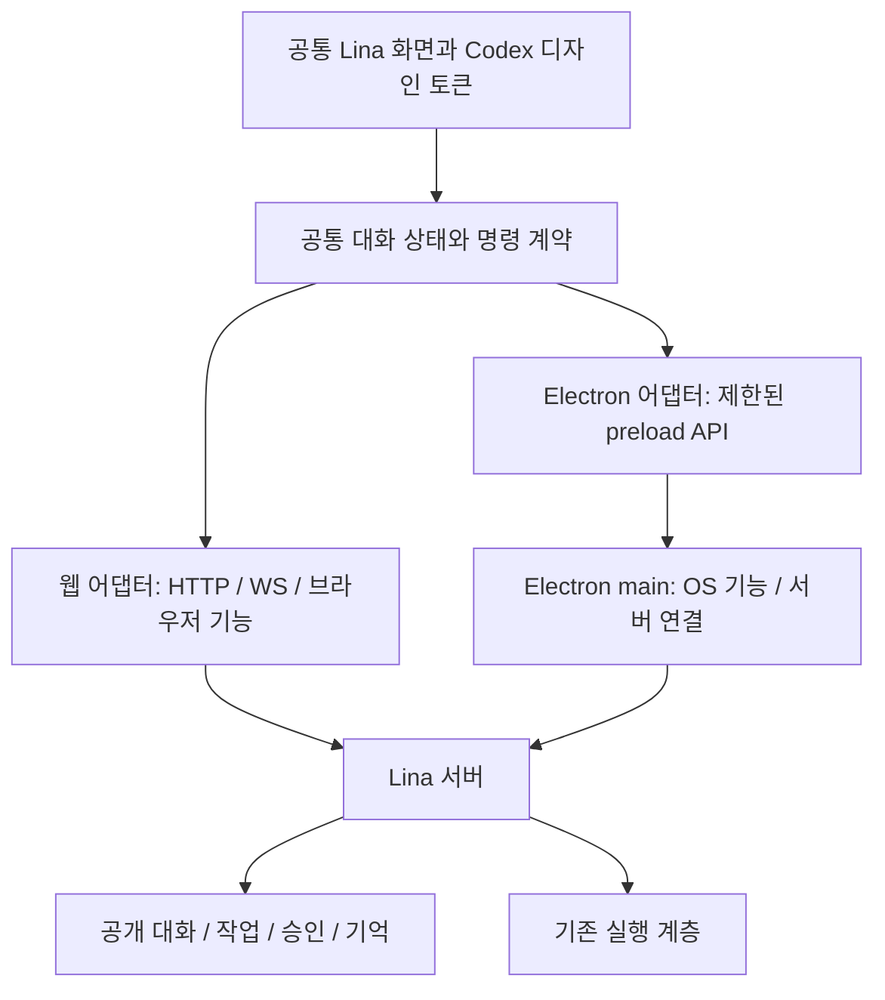

# Electron과 웹 공통 스택

> 구현 전 설계와 당시 코드 조사 기록입니다. 현재 구현·검증·남은 연결은 [구현 기록](010_implementation.md)을 따릅니다.

2026-09-07 사용자 선택 반영. 데스크톱은 Electron으로 정하고, 웹은 동일한 화면 코드를 브라우저에서 실행합니다. 이번 변경은 스택·전환 기획이며 패키지 설치나 앱 구현을 수행한 것은 아닙니다.

## 1. 스택 결정

Electron 방향과 Codex 디자인 채택은 사용자 요청입니다. 공통 패키지 경계, Forge, main의 서버 연결 어댑터는 현재 Lina 코드를 바탕으로 정한 설계안입니다. 모바일은 기존 PWA부터 개선하는 순서를 제안하며, 모바일 앱 자체를 제외한다는 뜻은 아닙니다.

| 영역 | 선택 | 역할 |
|---|---|---|
| 공통 화면 | TypeScript + HTML/CSS | 에이전트 탐색, 대화, 입력창, 첨부, 결과 패널, 설정 |
| 공통 클라이언트 | TypeScript | 메시지 상태, 순서·중복 처리, 재연결, 명령과 플랫폼 기능의 계약 |
| 데스크톱 | Electron | macOS·Windows·Linux의 창, 메뉴, 파일 선택, OS 알림, 앱 생명주기 |
| 웹/PWA | 기존 Bun 서버 + 브라우저 렌더러 | 웹 자산 제공, HTTP/WS 연결, 웹 설치·업데이트 |
| 빌드 | Bun workspace와 현재 브라우저 번들 경로 재사용 | 공통 렌더러의 웹 배포본·앱 동봉본 생성 |
| 데스크톱 패키징 | Electron Forge | 앱 패키징과 OS별 배포 산출물. 서명·업데이트는 별도 검증 |
| 에이전트 실행 | 기존 Lina 서버·실행 계층 | 대화·작업·기억·승인과 영속 기록 |

Electron은 HTML/CSS/JavaScript 화면을 renderer에서 실행하고, main과 preload가 OS 기능을 연결하는 구조입니다. 웹 UI를 공통으로 작성하는 근거는 [Electron Process Model](https://www.electronjs.org/docs/latest/tutorial/process-model)에 있습니다. 공식 지원 대상은 데스크톱 macOS·Windows·Linux입니다. 모바일 웹/PWA를 유지하고, 향후 iOS/Android 앱은 같은 계약을 사용하는 별도 플랫폼 연결부로 다룹니다. [Electron 소개](https://www.electronjs.org/docs/latest)

UI 프레임워크 변경을 Electron 도입의 전제로 삼지 않습니다. 현재 TypeScript/CSS 코드를 공유 가능한 경계로 옮기고 필요한 화면을 개편합니다. Codex의 디자인 언어는 프레임워크와 독립적으로 [디자인 규칙](005_codex_design_language.md)에 고정합니다.

최신 목록·탐색 설계는 [에이전트 목록과 모바일](006_agent_list_mobile.md), [작업 열 비교](007_sidebar_comparison.md)를 따릅니다. 공통 화면 코드를 공유해도 데스크톱의 목록 열과 모바일의 전체 화면 탐색은 각각 알맞게 배치합니다. 실제 Codex 작업 연결은 대화 sessionId와 구분한 실제 Codex 작업 어댑터 계약으로 검증합니다.

## 2. 공유 구조



권장 디렉터리는 다음과 같습니다. 신규 패키지는 아직 생성하지 않았습니다.

```text
packages/
  lina-ui/         공통 화면·스타일·디자인 토큰
  lina-client/     상태 모델·명령 계약·플랫폼 포트
  lina-web/        웹 서버·웹 어댑터·PWA
  lina-desktop/    Electron main·preload·앱 어댑터·패키징
  lina-core/       기존 도메인·영속 기록
  lina-runtime/    제품 런타임과 계약
  lina-codex/      Codex 실행 어댑터
```

분리는 동작 변경과 구분해서 수행합니다. 기존 모듈의 단순 이동부터 검증하고, 웹을 계속 실행 가능한 상태로 유지합니다. `lina-ui`와 `lina-client`에 Electron·Node·Bun 런타임 의존성이 섞이지 않도록 import 경계를 검사합니다.

## 3. 현재 웹에서 먼저 분리할 부분

| 현재 위치 | 결합 | 전환 |
|---|---|---|
| `src/assets.ts` | 서버 시작 시 `Bun.build`로 자산을 메모리에 생성 | 같은 빌드가 디스크 산출물과 manifest도 만들게 정리 |
| `client/conversation-app.ts` | `location.protocol/host`에서 WS 주소 생성 | 연결 주소와 전송을 어댑터가 제공 |
| `attachments.ts`, 관리 API | `/api/...`와 브라우저 fetch·링크에 결합 | 첨부·프로필·모델·온보딩 명령과 자료 URL 해석을 클라이언트 포트로 분리 |
| `navigation.ts`, `agents.ts` | location·History·페이지 생명주기 | 공통 탐색 상태 + 플랫폼별 URL/뒤로 가기 연결 |
| `draft.ts`, 설정 저장 | 브라우저 저장소 | 기기별 저장 포트. agentId·sessionId 분리 보존 |
| `pwa.ts` | 설치 UI·Service Worker 업데이트 | 웹에서만 활성화. 데스크톱은 앱 업데이트 어댑터 사용 |

현재 웹 서버의 Host/Origin 검사와 `connect-src 'self'` CSP는 실제 경계입니다. 동봉 HTML을 여는 것만으로 `/api`·WS·미리보기·다운로드가 그대로 연결된다고 가정하지 않습니다. 웹은 현재 same-origin 경로를 유지하고, 데스크톱은 등록한 서버와 통신하는 main 쪽 전송 어댑터를 둡니다. 인증과 Origin 차이는 명시적인 클라이언트 연결 계약으로 해결하며 웹의 기존 검사를 끄지 않습니다.

제품용 데스크톱은 UI 자산을 앱에 동봉하는 안으로 잡습니다. 앱 전용 자산 origin과 경로 해석을 제공하고, 서버 접속이 끊겨도 연결 복구 화면이 열려야 합니다. 첫 구현에서 API·WS·이미지·파일 다운로드·직접 링크가 모두 이 경계를 통과하는지 검증합니다.

## 4. 플랫폼 기능

공통 UI는 기능별 API를 사용합니다. 제안 포트는 파일 선택, 결과물 저장, 외부 링크 열기, 알림 요청, 앱 업데이트, 기기 설정 저장입니다. 기능 제공 여부를 어댑터가 알려주고 UI는 사용 가능한 동작을 보여줍니다.

Electron은 `contextIsolation: true`, sandboxed renderer, `nodeIntegration: false`를 기본으로 설계합니다. preload는 기능별 호출을 제공하며 임의 IPC 전송·명령 실행·파일 경로 읽기를 공통 화면에 노출하지 않습니다. [Context Isolation](https://www.electronjs.org/docs/latest/tutorial/context-isolation), [IPC 문서](https://www.electronjs.org/docs/latest/tutorial/ipc)

클립보드는 웹과 Electron renderer 모두 사용자의 paste 이벤트를 우선 사용합니다. OS 전용 파일 복사 형식 보강이 필요할 때만 Electron 어댑터를 추가합니다. 두 경로는 같은 첨부 초안·검증·업로드 큐로 들어가며, 같은 paste를 renderer와 main이 각각 처리해 중복 첨부하지 않도록 합니다.

서버의 공개 메시지 ID와 순서를 웹·앱이 공유합니다. 초안·스크롤 위치는 각 클라이언트의 기기 저장소에 남습니다. 데스크톱 창을 닫거나 UI를 업데이트해도 별도 Lina 서버의 작업을 종료하지 않습니다. 앱 main 프로세스에 에이전트 엔진을 이식하는 작업은 이 UI 전환에 포함시키지 않습니다.

## 5. 빌드와 배포 경계

공통 renderer는 브라우저 대상 산출물을 만들고 Electron main/preload는 Electron에 포함된 Node 환경에 맞춰 별도 빌드합니다. 개발 도구인 Bun과 앱 실행 환경을 혼동하지 않습니다. 패키징된 UI를 실행하는 기기에 소스 체크아웃·전역 Bun 설치·개발 서버가 있어야 한다는 전제를 두지 않습니다.

패키징은 공식 Electron 가이드가 사용하는 Forge로 진행할 계획입니다. [공식 패키징 가이드](https://www.electronjs.org/docs/latest/tutorial/tutorial-packaging). 정확한 Electron·Forge 버전은 구현 시 지원되는 조합을 확인해 고정합니다. 공통 디자인 자산은 같은 revision으로 웹과 데스크톱에 빌드하고, 각 배포본의 버전을 기록합니다.

웹은 PWA 업데이트, 앱은 OS별 앱 업데이트를 사용합니다. 양쪽 모두 작성 중 내용과 미확인 전송을 보존한 뒤 화면을 갱신합니다. UI와 서버가 다른 버전일 때는 계약 호환성을 검사하고, 지원하지 않는 명령을 조용히 보내지 않습니다.

## 6. 전환 순서

| 단계 | 산출물 | 검증 |
|---|---|---|
| S1 | 공통 UI·클라이언트·플랫폼 포트 분리 | 기존 웹의 대화·검색·온보딩·모델·첨부 회귀 없음 |
| S2 | 공통 디자인 토큰과 Codex 요소 적용 | 웹과 Codex 참조를 같은 배율로 대조. 앱 대조는 S3에서 추가 |
| S3 | Electron 창·동봉 자산·main/preload·서버 연결 | 개발 서버 없이 실행, 실제 서버 대화·승인·파일 사용, 웹과 같은 fixture 대조 |
| S4 | 창·메뉴·키보드·클립보드·알림·업데이트 | 대상 OS에서 실제 조작, 종료 후 재시작 복원 |
| S5 | 웹·앱 동시 사용과 플랫폼별 패키징 | 같은 에이전트·대화 순서, 중간 입력, 중복 승인 방지 |

공개 메시지·중간 입력·기억 계약은 [대화 전달 계획](002_conversation_delivery.md)을 따릅니다. S1과 그 계약 정리는 함께 진행하고, 붙여넣기는 [첨부 계획](003_clipboard_attachment.md)의 독립 작업으로 병행할 수 있습니다. Electron의 빈 창이 뜬 것을 앱 전환 완료로 보지 않습니다.

완료 증거에는 웹과 패키징된 앱의 동일 시나리오, 한글 IME, 파일·이미지 붙여넣기, 장시간 대화 스크롤, 서버 재연결, 실제 OS별 메모리·시작 시간 측정이 포함됩니다. Electron에 따른 메모리·배포 크기 증가는 측정해 보고하며 확인 전 숫자를 약속하지 않습니다.
