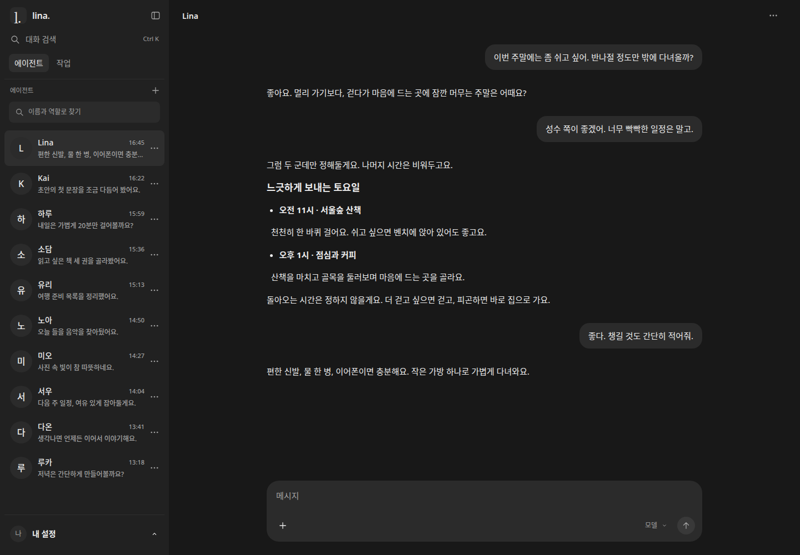
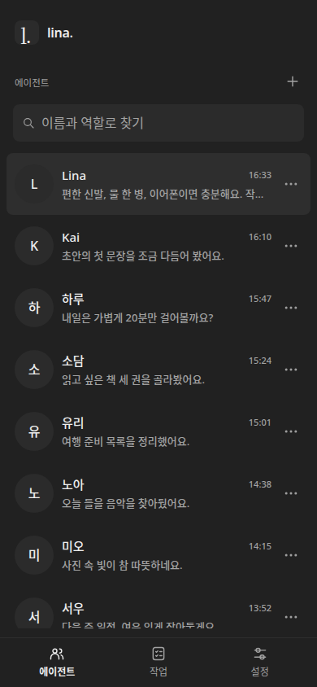
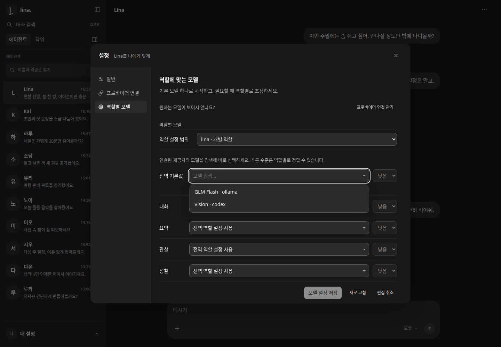
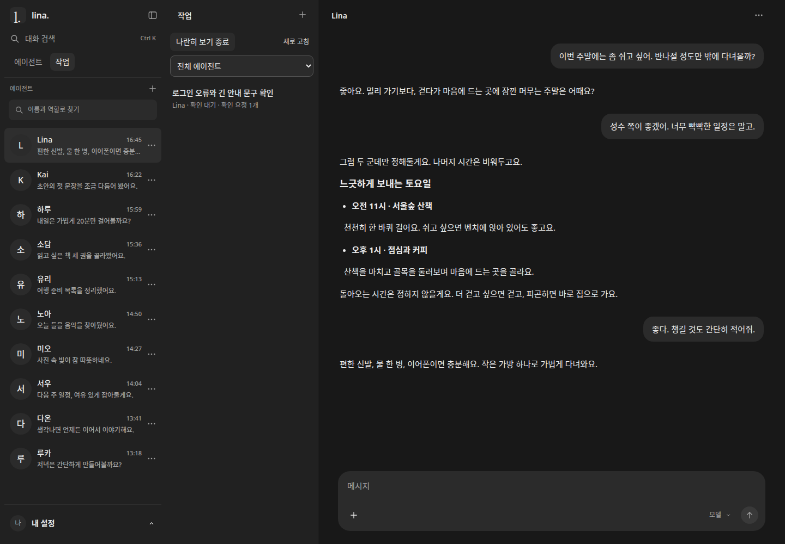

# UI 및 데스크톱 구현·검증

웹과 Electron이 같은 화면을 사용하도록 분리하고, 에이전트 중심 탐색과
Codex 계열 디자인을 적용했다. 기존 대화·설정·온보딩을 유지하면서 모바일
전환, 파일 붙여넣기, 작업 보기와 데스크톱 연결을 구현했다.

## 구현 범위

| 소유 패키지 | 책임 |
| --- | --- |
| `lina-client` | 대화 상태·연결·프로토콜, 에이전트 요약, 초안·읽기 위치, 첨부 큐, 탐색 |
| `lina-ui` | 공통 renderer, 디자인 토큰, React/Base UI 컴포넌트와 기존 컨트롤러 연결 |
| `lina-web` | 동일 출처 게이트웨이, 공통 화면의 production 빌드와 웹/PWA 자산 |
| `lina-desktop` | 동봉 renderer, 제한된 loopback broker, 프로필·세션 격리와 OS 연결 경계 |

에이전트 목록은 이름·최근 대화·시간·읽지 않음·확인 요청·진행 상태를 표시한다.
목록 필터와 순서를 유지하며 대상을 바꿔도 초안·첨부·읽기 위치가 섞이지 않는다.
요약은 저장된 공개 대화에서 읽고, 목록 조회만으로 실행 엔진을 열지 않는다.

화면은 중립 표면·공통 글자·간격·버튼·아이콘 크기를 쓴다. React 19.2.8,
React DOM 19.2.8, Base UI 1.8.0을 추가했다. shadcn base-nova의 Button,
Avatar, DropdownMenu, Tabs, Combobox 구성을 Lina 토큰/CSS로 조정했다.
[소스 출처](../../../packages/lina-ui/SOURCES.md)와
[포함 라이선스](../../../packages/lina-ui/THIRD_PARTY_LICENSES.txt)를 보존한다.
Tailwind나 별도 웹 서버는 추가하지 않았다.

React는 각 view host 안의 컨트롤을 소유한다. 기존 대화·입력기·첨부 큐는
기존 컨트롤러가 계속 소유한다. 목록 알림, 메뉴 동작, 설정 탭, 모델 검색은
명시적 메서드/콜백으로 연결한다. 모델 설정 컨트롤러에는 콤보박스 팩토리를
주입해 서버 테스트에 브라우저 타입이 섞이지 않게 했다.

모바일은 에이전트 목록 → 대화 → 뒤로가기 흐름을 제공한다. 상단 사이드바
아이콘은 접기만 담당한다. 작업 탭 안의 이름 있는 `나란히 보기` 버튼이 별도
작업 열을 열고, 같은 버튼이 `나란히 보기 종료`로 바뀐다. 실제 남는 폭이
부족하면 이 선택지를 숨긴다. 목록·필터·초안과 키보드 포커스를 보존한다.

파일 선택과 붙여넣기는 같은 큐를 쓴다. PNG의 clipboard items/files가 다른
메타데이터를 내놓아도 중복 업로드하지 않는다. 실패 시 명시적으로 재시도하며,
준비되지 않은 첨부를 빼고 전송하거나 붙여넣기만으로 자동 전송하지 않는다.

## 데스크톱

Electron 44.2.0, Forge CLI/ZIP maker 8.0.0-alpha.10을 추가했다. 선택한 Forge
버전은 설치된 중첩 의존성까지 감사했다. 앱은 실행 엔진을 시작하지 않고
독립적으로 실행 중인 Lina 웹 게이트웨이에 연결한다.

같은 production renderer를 ASAR에 동봉한다. main의 loopback broker는 임시
HttpOnly 인증, 정확한 Host/Origin, 메서드·경로 허용 목록과 프로필의 서버
바인딩을 확인한다. renderer에는 Node 권한을 주지 않고 preload도 제한한다.
프로필과 세션 경로를 별도로 지정할 수 있다. 인증 실패 중 TCP reset과 창 닫기
취소의 연결 유지도 회귀 검사했다. [실행·패키징 안내](../../../packages/lina-desktop/README.md).

## 화면 증거

아래 PNG는 합성 데이터로 실제 웹 UI를 실행해 캡처한 결과다. 개인 대화,
실모델 출력이나 Electron GUI 실행 증거가 아니다. 화면 안의 로고·아이콘은
저장소의 기존 UI 자산이며, 모의 대화·프로필은 QA fixture가 제공한다.









## 검증

구현 후보에서 전체 테스트 1,353개, 타입 검사, lint와 CI build가 통과했다.
이후 작업 보기 UX 변경은 관련 테스트 32개와 실제 Chromium 회귀 10개로
재검증했다. PR 후보의 최신 dev 통합과 CI 결과는 PR의 Verification 기록을 따른다.

| 실제 UI 검사 | 증명한 범위 |
| --- | --- |
| `ui-desktop.mjs` | A→B→A 초안·첨부·읽기 위치, PNG 붙여넣기→업로드→명시적 전송→재조회, 한글 Undo, 작업 복원, 모바일·실패 복구 |
| `ui-navigation-regressions.mjs` | 모바일 뒤로가기·검색, 늦은 선택 취소, 저장소 차단·연결 단절 중 읽기 위치 |
| `ui-agent-list.mjs` | 목록 노드/포커스, 터치 취소, 표시 우선순위, 아바타 실패, 오류 알림 복구 |
| `ui-settings-islands.mjs` | 탭 방향·키보드·패널 유지, 테마 저장/시스템 변경과 저장소 실패 |
| `ui-model-combobox.mjs` | 검색·선택·disabled, Escape, dialog 내부 표시, 폭/스크롤/하단 배치, 실제 설정 저장 계약 |
| `ui-components.mjs` | 메뉴 키보드 진입, 이동, Tab/Shift+Tab, Escape, 반복 클릭, 바깥 클릭과 dialog 포커스 |
| `ui-task-layout.mjs` | 작업 탭의 보기 선택, 상태 이름, 실제 가용 폭, 모바일, 재배치와 복원 |
| `ui-design.mjs` | 320/390/768/1024/1440px, 버튼 정렬, 설정 탭과 다크/라이트 표면·잘림 |

메뉴 Tab 종료와 PNG 중복 첨부처럼 브라우저에서 발견한 오류는 실패를 먼저
기록하고 고쳤다. Bun의 minify만으로 React 개발 코드가 포함되는 오류도
production 정의와 자산 테스트로 막았다. 의존성/소스 라이선스는 JS에 포함해
웹과 Electron 양쪽 결과물에 보존한다.

## 격리와 재현

Bun과 별도로 Playwright/Chromium이 준비된 개발 환경에서 저장소 루트 기준으로
실행한다. 실제 사용자 서버 대신 합성 fixture를 사용한다.

```sh
# 별도 터미널: 루트/DB/첨부를 새 임시 디렉터리에 만드는 검증 서버
LINA_QA_WEB_PORT=18140 LINA_QA_UPSTREAM_PORT=18142 \
  bun packages/lina-web/test/fixtures/ui-desktop.ts

LINA_QA_URL=http://127.0.0.1:18140 node scripts/qa/ui-desktop.mjs
LINA_QA_URL=http://127.0.0.1:18140 node scripts/qa/ui-navigation-regressions.mjs
LINA_QA_URL=http://127.0.0.1:18140 node scripts/qa/ui-components.mjs
LINA_QA_URL=http://127.0.0.1:18140 node scripts/qa/ui-task-layout.mjs
bun scripts/qa/ui-agent-list.mjs
bun scripts/qa/ui-settings-islands.mjs
bun scripts/qa/ui-model-combobox.mjs
```

Playwright 모듈과 실행 파일은 `LINA_QA_PLAYWRIGHT_MODULE`, `LINA_QA_CHROMIUM`,
결과 디렉터리는 `LINA_QA_OUTPUT`으로 지정한다. `LINA_QA_FIRST_USER=1` fixture와
`LINA_QA_INTRO_URL`로 처음 시작 화면을 검증할 수 있다. 화면 캡처용 모의 대화는
`LINA_QA_PRESENTATION=1`로 선택한다. 작업이 시작한 검증 서버는 종료했다.

## 남은 검증과 연결

- Electron GUI는 호스트 sandbox 조건 때문에 미검증이다. 정상 sandbox 환경의
  GUI·재시작·OS 파일 대화상자·알림·프로토콜 실행을 확인해야 한다.
- macOS/Windows 패키징·서명, 업데이트 배포, 물리 모바일 IME/OS 파일 복사는
  별도 검증 범위다. Linux ZIP 생성은 출시/설치 검증을 뜻하지 않는다.
- 실모델과 외부 이미지 서비스의 생성·편집 품질은 모의 서버 결과로 주장하지
  않는다. 새 이미지/세계관 엔진은 해당 작업이 소유하며 기존 공개 계약을 쓴다.
- 연속 발화·중간 입력의 엔진 정책은 [별도 설계](002_conversation_delivery.md)다.
- 기존 `render.ts ↔ attachments.ts` 참조는 남아 있다. 새 컴포넌트 경로는
  순환하지 않으며, 기존 첨부 렌더링의 추가 분리는 이번 범위에 포함하지 않았다.

PR 공개와 dev/main 머지, 배포는 별도 작업이다. 이 변경은 사용자 데이터나
실행 중 서비스를 변경하지 않는다.
