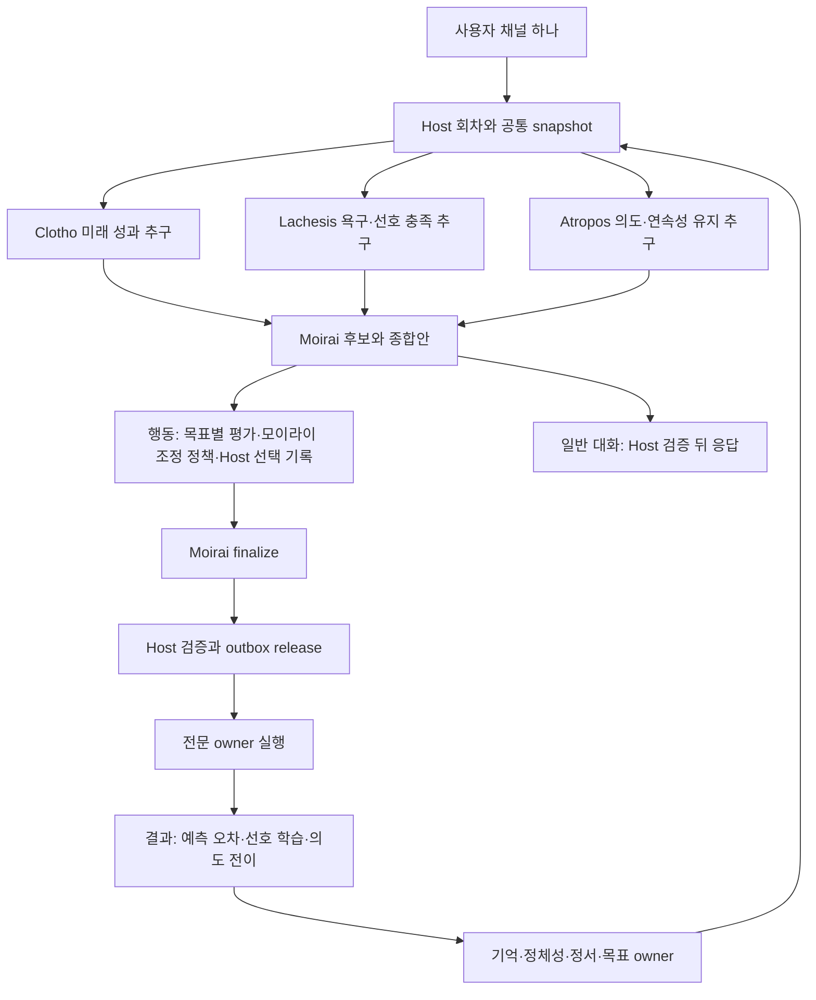

# 모이라이 시스템 리팩토링 계획

상태: 2026-09-12. 모이라이 엔진의 사용자 경험 경계, 채널·세션 계약, 도메인 통폐합, 모델 프리셋 운영, 검증 게이트를 소유한다. 엔진 정의·세 판단 모듈·조정 정책·회차 순서는 정본 [MOIRAI_ENGINE](../../MOIRAI_ENGINE.md)이, 계약은 [016](../platform/016_neural_preference_contract.md)이, 로드맵은 [017](../platform/017_moirai_module_composition.md)이, 근거는 [015](../platform/015_neural_preference_engine_research.md)가 소유한다. 선택된 LLM 백엔드는 Senpi다. [R0의 Codex 실행 증거](031_moirai_r0_evidence.md)는 이전 QA 기록이며 현재 목표의 제품 통합·판단 성능·qualification 증거가 아니다.

## 최상위 어젠다

**모이라이는 경험으로 자기 관점을 형성하고, 그 관점에 따라 행동하는 AI 개인을 유지하는 에이전트 코어다.** LINA는 이 엔진을 사용하는 제품이다. 세 모듈의 고유 목표, 모이라이의 종합, Host의 경계는 [정본](../../MOIRAI_ENGINE.md#한눈에-보기)이 정의한다. 저장량·자연스러운 답변·여러 모델의 합의만으로 이 기능이나 추가 효용을 입증했다고 보지 않는다. 구체적인 외부 창작 설정의 서사나 출처 설명은 저장소에 도입하지 않는다.

## 사용자 경험: 엔진은 대화 뒤에서 동작한다

에이전트는 사용자의 말에 답하고 필요한 일을 한다. 평소 답변에서 채택·기억 저장·인지 코어의 합의·모델 라우팅·JSON 액션 같은 내부 절차를 설명하지 않는다. 세 판단 주체의 발언이나 종합 원문도 사용자 채널로 그대로 전달하지 않는다. 최종 응답의 말투는 해당 에이전트와 현재 사용자의 의도를 따른다.

예를 들어 “말은 짧게 해”에는 “알겠어. 짧게 할게.”라고 답하고 실제 다음 답변을 짧게 한다. “선호를 채택해서 페르소나 모듈에 저장했다”는 식으로 내부 동작을 중계하지 않는다. 사용자가 진행 상황을 확인할 때는 실제 작업 상태를 알려 준다. 사용자 선택이나 결과에 영향을 주는 실패·권한·기억 한계는 쉬운 말로 설명하며, 저장되지 않은 내용을 기억했다고 주장하지 않는다. 구조를 직접 질문하면 검증된 범위에서 설명한다.

실제 입력·선택·결과·비용 기록은 개발·진단 경로에서 확인한다. 일반 대화에 기록을 감추는 것은 검증 기록을 없애거나 실패를 성공으로 표현하라는 뜻이 아니다. 기존 공통 대화 지침의 결과 중심 표현을 유지하고 Moirai의 최종 응답 경계에도 적용한다.

## 기존 작업과 관계

- [PR #7](https://github.com/thisisjun786/lina/pull/7): 병합된 기억·문맥·페르소나·자원·World/LIFE 구현 기반.
- [PR #8](https://github.com/thisisjun786/lina/pull/8): 미병합 종료된 독립 채택 커널과 평가 하네스. 경험 적용 실패와 실행·복구 계약을 판별하는 실험 기반이며 제품 통합 완료가 아니다.
- [PR #10](https://github.com/thisisjun786/lina/pull/10): 고정 리비전의 Senpi QA와 역할 프롬프트 실증. [016 연결 지점](../platform/016_neural_preference_contract.md#결정과-현재-연결-지점)의 자료를 기준으로 제품 계약을 구현한다.
- 이 계획: 기존 도메인 소유권과 한 채널의 내부 판단 수명을 정한다. PR #8의 코드를 복사하거나 qualification을 대체하지 않는다.

제품 코드 연결 지점의 기준은 `522101ff99e356b0ea6d27b4ea03ec7e599ee4b3`, 별도 채택 커널의 기준은 PR #8의 `ab9f1f073eca80ecef8dda0b0f7d338f4d6cb35c`다. 기존 `packages/lina-codex/src/moirai-probe*.ts`는 이전 Codex QA 증거로 보존하고 새 Senpi 제품 조정기로 복제하지 않는다. 설치/checkpoint 소유자는 재사용하며 코어·신경 상태의 일관된 snapshot 계약을 확장한다. 아래 신규 계약은 현재 구현된 공통 API로 간주하지 않는다.

## 판단 계층

세 판단 모듈의 정의, `personal.v1` 조정 정책, 회차 실행 순서는 [정본](../../MOIRAI_ENGINE.md#세-판단-모듈)이 소유한다. 이 문서에서 유지하는 운영 원칙은 다음과 같다. 합의는 증거를 대신하지 않는다. 의견 불일치 자체는 보류 사유가 아니다. 일반 대화의 기본 LLM 수명은 3+1, 명시적 행동은 3+2에 공통 후보 평가가 붙는다. 필요한 추가 LLM 호출·도구·신경 계산 비용을 모두 기록한다. 판단 모듈은 허용된 읽기/계산 포트를 사용하고 저장·외부 효과·사용자 발송은 Host와 기존 owner가 수행한다.

## 한 채널, 내부 판단 세션과 공통 상태

채널은 사용자 대화 식별자다. Senpi의 내부 역할 세션은 채널·인격·OS 프로세스와 일대일이 아니다. LLM은 모듈의 의미 해석과 계획 생성에 쓰며 각 모듈의 코드·기억 조회·수치 계산을 대체하지 않는다. 원문과 현재 채택 상태는 LINA가 소유한다.

| 회차 계약 | 내용 |
| --- | --- |
| ChannelBinding | channelId, agentId, 역할별 backendSessionId, bindingGeneration, presetId/revision, 실제 모델·provider와 설정 revision |
| CognitiveRound | roundId, requestId, source snapshot, 목적/정책/의도 revision, backend run 참조, 시도·usage·실패 |
| Assessment | snapshotId·objectiveRef·mechanismRevision·자기 목표의 완결된 의견·추천·전문 근거; 세부 타입은 016 소유 |
| AssessmentSet·Decision | 공통 후보별 평가 coverage와 해시·기준 정책·선호·선택 receipt·finalize/실행 상태 |
| ResolutionRecord·SelectionSpec | ResolutionRecord는 dialogue/action 구분과 당시 목표·세 판단·종합 이유를 보존. action에만 공통 후보 AssessmentSet·선택 전 SelectionSpec 추가; Host의 별도 우선순위 없음 |
| DialogueJudgmentRef | 수락한 응답이 참조하는 당시 회차·목표 프로필·세 Assessment·dialogue ResolutionRecord. 응답/request/trace 결합과 중복 키에 포함 |
| RoundOutcome | 실제 결과와 이전 예측/선택 참조, 소비자별 해석·학습·의도 전이 완료 여부 |

세 역할의 필수 결과가 모두 유효해야 종합한다. 공통 후보 평가의 누락은 016의 명시적 가용성 정책을 따르며 다른 snapshot을 섞지 않는다. 유효 결과는 재사용하고 부족분만 보완한다. 재시도나 모델 교체로 새 인격을 만들지 않는다.

개인·scope별 회차 lease와 큐가 순서를 정하고 회차 내부의 독립 계산은 병렬로 수행한다. 정정·권한 회수는 큐를 기다리지 않고 진행 중 회차를 무효화한다. lease가 끝난 이전 실행의 결과는 fencing token으로 거부한다. 외부 효과 완료를 기다리는 동안 회차 lease를 점유하지 않는다.

재시작 시 Host의 회차 ledger와 Senpi가 제공하는 세션/run 상태를 대조한다. 응답 미수신만으로 같은 효과나 선택을 다시 시작하지 않는다. binding과 모델 변경은 generation을 올리고 이전 이력을 보존한다. Senpi의 지원 범위는 제품 어댑터에서 검증하며 Codex thread 제약이나 nativeEpoch를 그대로 이식하지 않는다.

세션 자체 이력이나 compaction만으로 필수 입력을 전달했다고 가정하지 않는다. 원문·정정·현재 의도·이전 결과의 snapshot과 실제 전송을 남긴다. 배치·프로세스 수는 이 수명과 관측 계약을 충족하는 배포 방식으로 선택한다. 수치 계산은 SDK 밖의 독립 포트다.

## 실코드에 따른 2차 모듈 통폐합

| 경계 | 통폐합 결정 | 보존할 기술 |
| --- | --- | --- |
| Context | 현재 입력·요약·원문 확장을 하나의 전문 경계로 유지 | backend compaction 확인, 출처 연결, 예산과 복원 |
| Memory | 관찰·통합·회상·질의 추론을 내부 기능으로 묶음 | EngineStore 출처·CAS·reasoning job·정정·철회 |
| Persona | 정체성·소통 선호·성향 성장을 묶되 내부 writer 구분 | 원본 settled request, ConversationStore 선호 receipt, AgentStore 성장·작성자 설정 |
| Resource | 자료·산출물·검색·자료 파생 기억을 묶음 | operationId/payload hash/CAS, scope·source version·prepared claim |
| World | 공동 상태·주체별 공개·세계 투영을 별도 유지 | binding/recipient/disclosure/currentness |
| LIFE | World의 상황·참여 기회와 개인별 활동 연결 | 기회/행동 분리·legacy 재현·Ensemble 규칙·prepare/reconcile |
| Host | 회차·판단·선택 기록과 기존 실행 owner로 인계 | 개인/scope lease·현재성·held/released outbox·실제 효과 참조 |

구체적인 정리 대상:

1. `CompanionMemory.run`은 현재 기억뿐 아니라 선호 receipt와 personaGrowth를 함께 조정한다. Memory 처리와 공통 후처리 수명 조정을 분리하되 기존 queue·재시도·receipt 관계를 보존한다.
2. `ContextServices`에 모인 Memory/Persona/Resource callback 타입을 도메인 포트로 분리한다. 공통 모델 호출·라우팅·예산·비용 관측은 공유하고 beforeDispatch 검증은 유지한다.
3. 별도 `PersonaReflection`은 비테스트 TS 참조 검색에서 정의만 확인됐다. 기존 반례 테스트를 nativePreferences/NativePersonaGrowth 경로에 대응시킨 뒤 폐기 여부를 확정한다. 지금 삭제하지 않는다.
4. 대화 기억과 Resource 파생 기억은 출처와 복구 수명이 다르므로 DB를 합치지 않는다. 개인 기억으로 반영하려면 출처가 있는 별도 채택을 거친다.
5. NativePersonaGrowth의 LifeDefinition 의존을 PersonaSchema 공급 계약으로 분리하는 가안을 선택한다. 017 D10의 AgentStore 소유와 World 축 매핑을 후속 설계에서 구체화한다. World 없이 현재 성장 코드가 동작한다고 가정하지 않는다. 작성된 축·허용 범위·World 투영을 보존한다.

현재 지시·정정·권한 회수·필수 문맥 전달은 전문 모듈의 필수 연결이다. MoA가 추가 조회나 추론을 선택할 수 있어도 필수 경로를 끌 수는 없다. 모든 domain writer를 Moirai DB에 흡수하지 않는다.

## 모델 운영: 검증한 프리셋으로 제한

2026-09-10 결정: 사용자가 백엔드 엔진과 여덟 모델 슬롯을 자유롭게 지정하는 안은 취소한다. LINA 유지보수자가 필요한 모델과 역할별 최적화 설정을 정하고 검증한 프리셋만 지원한다. 인증과 필요한 연결 설정은 제공하되 임의 모델 ID·역할 배치·추론 수준·fallback 편집을 일반 설정에 노출하지 않는다.

내부에는 Moirai, Clotho, Lachesis, Atropos의 네 판단 역할과 `quick`, `standard`, `deep`, `intensive` 네 처리 티어를 유지한다. 역할/티어는 여덟 개의 서로 다른 모델을 요구하지 않는다. 하나의 모델을 여러 역할에 배치할 수 있으며 전문 작업은 필요한 티어만 실행한다.

프리셋은 `presetId`, 불변 `revision`, 역할·티어별 정확한 model/provider, 역할별 `PromptAsset` revision과 모델별 조정 층, 추론·입출력·동시 실행 설정, 호환 SDK/API 버전, 검증 증거를 가진다. 프롬프트 자산의 변경은 [정본 D20](../../MOIRAI_ENGINE.md#역할-프롬프트와-개선-루프)의 개선 루프를 거쳐 새 프리셋 revision으로만 들어온다. 개발 단계의 후보와 제품에서 지원하는 프리셋을 구분한다. 현재 GLM Flash는 R0 개발 후보이며 인지 품질이 검증된 제품 기본값으로 확정하지 않았다.

실행 시 UI뿐 아니라 설정 API·저장된 설정·실제 송신 직전에도 프리셋과 모델을 확인한다. 지원 밖 모델, 사용 불가능한 필수 모델, 달라진 설정은 실행 전에 거부한다. 프리셋 내부에 검증된 대체 경로가 없다면 다른 모델로 조용히 전환하지 않는다. 프리셋 변경은 진행 회차의 모델을 바꾸지 않고 새 binding generation에 적용한다. 기존 사용자 모델 설정과 이력은 보존하고 지원 프리셋 전환이 필요한 상태로 처리한다. 자동 삭제·자동 원격 호출은 하지 않는다.

프로바이더 관리는 [정본 D21](../../MOIRAI_ENGINE.md#확정된-결정-목록)에 따라 Senpi native다. 계정 로그인·failover·pin·제거, 모델 목록, rate limit·사용량 조회는 app-server의 `account/*`·`model/list`·`config/read`를 사용하고, 자격 증명은 Senpi의 agent dir(`auth.json`/`oauth.json`)에 남는다. Lina는 개별 프로바이더 자격 증명을 저장하지 않으며 검증된 프리셋과 역할·티어 배치만 소유한다. OpenCodex Hub의 카탈로그·관리 GUI·환경 변수(`LINA_OPENCODEX_*`)는 전환 완료 후 제거한다.

이는 후속 제품 계약이다. 현재 제품의 자유 profile/tier 설정 API와 OpenCodex 연결이 제거됐다는 뜻은 아니다. F2에서 역할·전송 계약을 적용하고 F4의 운영 전환에서 현재 `models/types.ts`, `validation.ts`, `settings.ts`, `selection.ts`, 설정 HTTP/UI와 Senpi 송신 소비자, `lina-opencodex` 소비자를 함께 전환한다. 이전 모델 온보딩 문서의 자유 선택 제안보다 이 계약을 우선한다.

## 판단·효과·의미 복구

이전 방법·예상을 실제 결과와 연결해 다음 판단 입력에 전달한다. 영수증 저장과 결과 해석 완료는 별도 상태다. `pending → proposed → awaiting_owner → completed_changed/completed_no_change`를 기본 의미 수명으로 두고 deferred/failed_retryable은 미완료로 남긴다. 예상이 필요 없는 대화에는 none을 명시하고 매 대화에 반성을 강요하지 않는다.

코어 상태와 outbox는 로컬 원자 기록, 전문 저장·도구·발송은 owner별 idempotency/CAS로 처리한다. 다중 DB 원자성을 주장하지 않는다. 의존 효과는 선행 성공 후 실행한다. 저장 성공을 알리는 답변은 실제 저장 receipt에 의존한다. unknown 실행은 reconcile하고, 결과가 저장됐지만 해석 전 중단됐다면 해석만 복원한다.

새 지시는 장기 선호 저장 여부와 무관하게 현재 응답에 적용한다. 장기 선호 학습은 기존 원본 사용자 request와 단일 처리 경로를 유지한다. MoA 내부 발언을 사용자 발언이나 독립 경험으로 저장하지 않는다.

## 구현 순서와 중단 조건

구현 의존 순서는 [017의 F1–F4 지도](../platform/017_moirai_module_composition.md#후속-설계와-구현의-의존-순서)를 정본으로 삼는다. 이전 R1–R5의 계약·메커니즘·도메인·프리셋·평가 책임을 그 지도에 통합하며 별도 단계표를 운영하지 않는다. R0는 이전 Codex QA의 생성·병렬 판단·종합·재개·늦은 결과 분리 기록으로 보존한다.

이번 PR의 완료는 기존 소스와 연구를 근거로 한 설계 초안의 갱신이다. 실제 behavior 변경은 후속 구현에서 실패 테스트부터 시작하며 QA 성공을 제품 통합으로 표시하지 않는다. 아래 제품 게이트는 후속 구현의 검증 기준이며 이번 문서 검토 통과로 충족되지 않는다.

## 검증 게이트

- **G1 인지 역할:** 각자의 고유 목표에 따른 완결된 추천을 확인하고, 목표 충돌·일치 사례에서 종합과 선택 이유를 추적한다. 해석→적용→결과→정정을 실제 입력·선택·결과로 추적한다. 정확한 이해가 공급됐는데 실패한 B11을 저장량 부족으로만 설명하지 않는다.
- **G2 불변조건:** 원본 현재성, 권한, 단일 writer, 회차 격리, 효과 중복 방지, 부분 실패, 실제 프로세스 중단 후 실행/의미 복구를 검증한다.
- **G3 기존 qualification:** PR #8의 기준 리비전 `ab9f1f073eca80ecef8dda0b0f7d338f4d6cb35c`에서 출발한 30개 기준, 중요 H 조건 전부, 전체 90점 이상·카테고리별 80점 이상, 고정 후보의 새 전체 배치 3회 연속을 유지한다. 새 표현과 기존 채점 계약의 호환이 안 되면 미충족으로 기록하며 기준을 약화하지 않는다. 후속 실행 전에 시나리오·scorer·실행 후보의 정확한 리비전과 변경점을 함께 고정하고, 로컬 후속 후보를 암묵적으로 같은 채점기로 취급하지 않는다.
- **G4 추가 효용:** baseline/kernel/이해 제거군의 자원을 맞추고, 동일 전문 지원과 총자원의 단일 판단·재검토 경로와 MoA도 별도로 비교한다. 동점이면 추가 효용 미입증이다. 정답 누출·사례별 답 하드코딩을 금지한다.
- **G5 비용:** 예전 하네스의 episode 6회·출력 4096토큰·120초는 해당 고정 실험의 조건이며 제품 출력 제한으로 복사하지 않는다. 대화 3+1·행동 3+2에 추가 평가·조회·재시도·신경 계산을 합산한다. 제품 원문을 잘라 예산을 맞추지 않으며 동일 총자원에서 실제 품질·지연을 비교한다.
- **G6 문서·호환:** 구현 전후, 로컬/원격 CI/실모델 증거를 구분한다. 실제 구현 시 AGENTS와 README의 해당 계약을 반영하며, PR #8과 이 계획의 완료 상태를 혼동하지 않는다.
- **G7 자연스러운 대화:** 단순 지시·정정·감정 대화에서 내부 코어·저장 절차를 중계하지 않고 해당 의도를 행동에 반영하는지 실모델로 확인한다. 실패·기억 한계는 사실대로 말하고, 구조를 직접 묻는 질문에는 검증된 설명을 제공한다. 단어 금지 검사만으로 통과시키지 않는다.
- **G8 프리셋 경계:** UI를 거치지 않는 API 입력, 구형 저장 설정, 지원 모델 누락, 실행 중 설정 변경, native/provider의 임의 fallback을 포함해 지원 조합 밖 송신이 0회인지 검증한다. 새 프리셋 revision은 자체 호환·인지 평가를 통과해야 제품에 추가한다.
- **G9 프롬프트 개선 루프:** 프롬프트 자산 변경은 D20의 8단계(실패 고정·A/B/C 분류·가설·최소 후보·구조/전송 확인·짝 비교·고정 검증·기록)를 거친 증거가 있어야 프리셋 revision에 들어간다. 판정은 후보 작성과 분리된 judge 또는 사람 검토가 외부 근거로 수행하고, 개발군·검증군 오염, 기준군에 남은 처치, 실험 목적의 입력 누출, 세 모듈 합의를 정답으로 쓰는 누출이 0건이어야 한다. 완전한 쌍의 품질 차이와 전체 실행의 완료·장애 현황을 분리해 보고하며, 좋은 평균으로 필수 불변조건 위반을 상쇄하지 않는다.

R0는 합성 입력을 사용하는 QA 경로로 구현됐다. GLM 실제 호출, 세 판단의 동시 실행, 종합 순서, 같은 네 thread의 재개와 완료 회차 뒤 native 프로세스 강제 종료·복구를 확인했다. 실행 중 회차 복구, 인지 성능, 새 인지 계약과 모듈 분리, qualification은 미완료다. R0의 세 회차는 qualification의 새 전체 배치 3회가 아니다. 병합·배포는 이 계획의 범위가 아니다.

## 채널·실행 엔진 전환의 연결 지점

전환 대상은 Codex CLI → `omo app-server`(작업 실행), OpenCodex Hub → Senpi native(프로바이더·모델)다. `lina-codex`가 현재 호출하는 app-server 메서드(`thread/start|read|resume|compact/start|name/set|turns/list`, `turn/start|steer|interrupt`, `item/tool/call`, `item/commandExecution|fileChange|permissions/requestApproval`, `model/list`, `skills/list|extraRoots/set`)는 Senpi app-server에 동일 이름으로 존재한다. 이름 일치는 F2의 실전송 검사 대상이며 의미 일치의 증거가 아니다. 저장소 루트 기준:

- `packages/lina-codex/src/tasks/protocol.ts` — thread start/read/resume와 turn 식별.
- `packages/lina-codex/src/tasks/native.ts` — thread별 이벤트 식별.
- `packages/lina-codex/src/session.ts` — 현재 단일 대화 thread 연결과 turn 수명.
- `packages/lina-codex/src/model.ts` — provider 변경 제한과 모델 선택.
- `packages/lina-codex/src/life-model-native.ts` — 별도 native 모델 요청의 실제 구현. 현재 ephemeral 경로 자체는 지속 4스레드 실증이 아님.
- `packages/lina-runtime/src/session-app.ts` — 전문 모듈 실제 설치 경로.
- `packages/lina-runtime/src/context/companion.ts`, `memory-consolidation.ts`, `port.ts`, `coordinator.ts` — 후처리·전문 추론·모델 포트·compaction.
- `packages/lina-runtime/src/persona/native-preferences.ts`, `native-growth.ts`, `reflection.ts` — 선호/성장/별도 반영 경로.
- `packages/lina-runtime/src/resources/memory-worker.ts` — 자원 파생 기억 소유권.
- `packages/lina-runtime/src/world.ts`, `life/model-port.ts`, `life/runner.ts` — 세계 현재성과 배경 실행 수명.
- `packages/lina-runtime/src/models/types.ts` — 기존 네 모델 티어.
