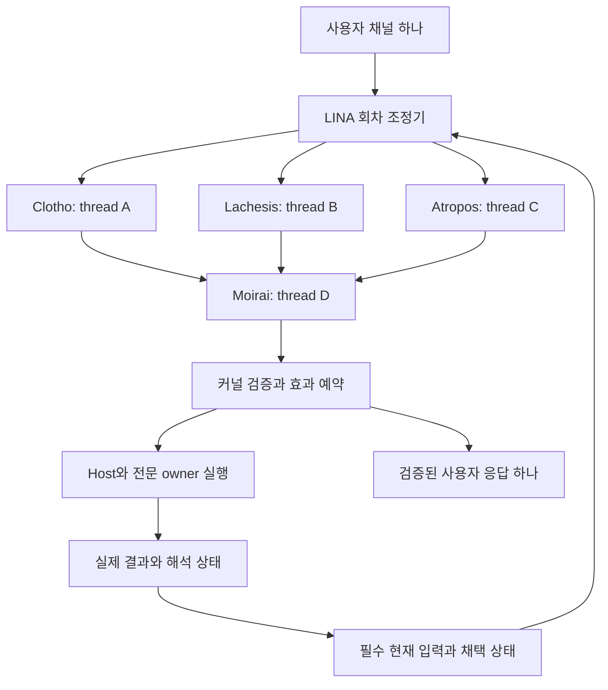

# 모이라이 시스템 리팩토링 계획

상태: 구현 전 설계 초안. 이 PR은 문서만 추가한다. 제품 통합·실모델 검증·기준 통과를 주장하지 않는다.

## 최상위 어젠다

**모이라이 시스템의 중심은 목적과 근거를 해석하고, 이해를 행동에 적용하며, 실제 결과와 정정으로 다음 판단을 이어 가는 인지 엔진이다.** 모듈 통폐합과 백엔드 선택은 이 목적을 지원해야 한다. 저장량, 자연스러운 답변, 여러 모델의 합의만으로 인지 역할이나 추가 효용을 입증했다고 보지 않는다.

LINA는 이 엔진을 사용하는 제품이다. 전체 엔진은 모이라이 시스템, 세 판단을 종합하는 주체는 모이라이(Moirai)다. 클로토·라케시스·아트로포스의 이름과 설계자·분석가·결정자 구도를 유지한다. 구체적인 외부 창작 설정의 서사나 출처 설명은 저장소에 도입하지 않는다.

## 기존 작업과 관계

- [PR #7](https://github.com/thisisjun786/lina/pull/7): 병합된 기억·문맥·페르소나·자원·World/LIFE 구현 기반.
- [PR #8](https://github.com/thisisjun786/lina/pull/8): 독립 채택 커널과 평가 하네스. 경험 적용 실패와 실행·복구 계약을 판별하는 실험 기반이며 제품 통합 완료가 아니다.
- 이 계획: 기존 기술을 보존하는 모듈 경계와 네 Codex 스레드의 판단 구조, 이후 구현 순서를 정의한다. PR #8의 코드를 이 PR에 복사하거나 qualification을 대체하지 않는다.

소스 대조 기준은 `d59a1b618998346c0586d5fab4660b395b61a2db`의 제품 코드와 PR #8의 `ab9f1f073eca80ecef8dda0b0f7d338f4d6cb35c`다. 아래 신규 계약은 현재 구현된 공통 API로 간주하지 않는다.

## 판단 계층: 모이라이와 세 판단 주체

| 주체 | 우선 관점 | 기술 역할 |
| --- | --- | --- |
| 클로토 / Clotho — 설계자 | 목적 달성·가능성·대안 | 독립 판단 에이전트 |
| 라케시스 / Lachesis — 분석가 | 근거·실제 결과·불확실성 | 독립 판단 에이전트 |
| 아트로포스 / Atropos — 결정자 | 현재 의도·약속·제약·실행 가능성 | 독립 판단 에이전트 |
| 모이라이 / Moirai — 종합 주체 | 세 판단과 반론을 종합 | 어그리게이터 |

세 주체 모두 전체 행동 후보를 제안한다. 필수 현재 입력은 같게 제공하고 첫 판단은 서로의 출력을 보지 않고 병렬 생성한다. 추가 근거에는 출처를 붙인다. 모이라이가 최종 Decision과 상태 변경을 제안하고 커널이 현재성·권한·효과 조건을 검증한다. 아트로포스에 단독 최종 권한을 주지 않는다.

합의는 증거를 대신하지 않는다. 미해결 충돌은 추가 확인·작은 검증 행동·질문·보류로 처리한다. 기본 실행은 독립 판단 3회와 종합 1회이며 반박 라운드는 추가 비용이다. 판단 에이전트가 직접 저장·도구 실행·사용자 발송을 하지 않도록 능력을 제한한다.

## 한 채널, 네 개의 지속 Codex 스레드

채널은 사용자 대화의 식별자이며 native thread와 일대일일 필요가 없다. 네 스레드는 내부 실행 상태다. 사용자에게 네 대화방을 만들지 않는다. 내부 이력은 보존하되 공통 원본과 현재 채택 상태는 LINA가 소유한다.

| 신규 계약 | 내용 |
| --- | --- |
| ChannelBinding | channelId, agentId, 역할별 threadId, bindingGeneration, modelProfileId, provider, 설정 revision |
| CognitiveRound | roundId, 사용자 requestId, source snapshot, 목적/정책/채택 revision, 역할별 native turnId, 시도와 결과 |
| Proposal | 선택, 근거 참조, 예상, 불확실성, 반론, 실제 소비한 snapshotId |
| Aggregation | 동일 회차의 유효한 결과 집합, 누락·실패 역할, 최종 Decision, 미해결 쟁점 |
| RoundOutcome | 실행 영수증과 품질, 이전 판단 연결, 의미 해석 pending/completed/deferred |

초기 모드는 세 역할 결과가 모두 유효해야 종합을 시작한다. 실패·시간 초과는 회차에 기록하고 남은 예산 안에서 재시도하거나 보류한다. 누락을 숨긴 2인 합의를 정상 3인 결과로 처리하지 않는다. 완료된 유효 결과는 재사용하며 재시도 비용을 센다.

한 채널의 인지 회차는 우선 순서대로 처리하고 회차 안의 세 판단만 병렬화한다. 다음 사용자 입력이 오면 대기열에 원본 순서를 보존한다. 정정·권한 회수는 진행 회차에도 즉시 무효화 신호로 전달하며, 효과 확정 전 source/policy revision을 다시 검사한다. 늦게 도착한 이전 회차 결과는 다음 회차에 섞지 않는다.

재시작 시 역할별 스레드를 resume하고 native turn 상태를 reconcile한다. 결과를 받지 못했다는 이유만으로 동일 실행을 다시 시작하지 않는다. binding 변경과 모델 교체는 generation을 올리고 이전 스레드 이력을 보존한다. 같은 thread에서 provider 교체가 불가능한 현재 어댑터 조건을 따른다.

각 스레드의 compaction과 오래된 자체 이력에만 의존하지 않는다. 필수 입력·정정·채택 변경·이전 결과를 회차 snapshot으로 공급하고 실제 입력을 기록한다. 이 입력을 네 역할에 확실히 반영할 native 계약이 있는지는 첫 실증에서 확인한다.

Codex 프로세스 하나의 네 thread와 별도 프로세스의 thread 네 개 중 배치 방식은 미확정이다. 스레드 수와 프로세스 수를 동일시하지 않는다. 실제 설치 버전의 동시 실행·이벤트 분리·격리·비용으로 선택한다. Codex를 백엔드로 유지하며 별도 provider 직접 호출 백엔드는 이번 범위에 넣지 않는다.

## 실코드에 따른 2차 모듈 통폐합

| 경계 | 통폐합 결정 | 보존할 기술 |
| --- | --- | --- |
| Context | 현재 입력·요약·원문 확장을 하나의 전문 경계로 유지 | native compaction receipt 확인, 출처 연결, 예산과 복원 |
| Memory | 관찰·통합·회상·질의 추론을 내부 기능으로 묶음 | EngineStore 출처·CAS·reasoning job·정정·철회 |
| Persona | 정체성·소통 선호·성향 성장을 묶되 내부 writer 구분 | 원본 settled request, ConversationStore 선호 receipt, AgentStore 성장·작성자 설정 |
| Resource | 자료·산출물·검색·자료 파생 기억을 묶음 | operationId/payload hash/CAS, scope·source version·prepared claim |
| World | 공동 상태·주체별 공개·세계 투영을 별도 유지 | binding/recipient/disclosure/currentness |
| LIFE / Host | 전문 저장 모듈과 구분되는 실행 기반 | lease·foreground 제외·prepare/reconcile·실제 효과 소유권 |

구체적인 정리 대상:

1. `CompanionMemory.run`은 현재 기억뿐 아니라 선호 receipt와 personaGrowth를 함께 조정한다. Memory 처리와 공통 후처리 수명 조정을 분리하되 기존 queue·재시도·receipt 관계를 보존한다.
2. `ContextServices`에 모인 Memory/Persona/Resource callback 타입을 도메인 포트로 분리한다. 공통 모델 호출·라우팅·예산·비용 관측은 공유하고 beforeDispatch 검증은 유지한다.
3. 별도 `PersonaReflection`은 비테스트 TS 참조 검색에서 정의만 확인됐다. 기존 반례 테스트를 nativePreferences/NativePersonaGrowth 경로에 대응시킨 뒤 폐기 여부를 확정한다. 지금 삭제하지 않는다.
4. 대화 기억과 Resource 파생 기억은 출처와 복구 수명이 다르므로 DB를 합치지 않는다. 개인 기억으로 반영하려면 출처가 있는 별도 채택을 거친다.
5. NativePersonaGrowth의 LifeDefinition 의존을 PersonaSchema 공급 계약으로 분리하는 안을 검토한다. World 없이 현재 성장 코드가 동작한다고 가정하지 않는다. 작성된 축·허용 범위·World 투영을 보존한다.

현재 지시·정정·권한 회수·필수 문맥 전달은 전문 모듈의 필수 연결이다. MoA가 추가 조회나 추론을 선택할 수 있어도 필수 경로를 끌 수는 없다. 모든 domain writer를 Moirai DB에 흡수하지 않는다.

## 모델 설정: 여덟 슬롯

상위는 Moirai, Clotho, Lachesis, Atropos 네 슬롯이다. 하위는 현존하는 `quick`, `standard`, `deep`, `intensive` 네 티어를 공유한다. 티어는 각 작업의 라우팅 선택이며 네 단계를 차례로 모두 실행한다는 뜻이 아니다.

기본 모델 하나를 상속해 시작하고 고급 설정에서 여덟 슬롯과 지원되는 추론 수준을 개별 지정하는 안이다. 같은 프로필을 여러 슬롯에 사용한다. 실제 적용 모델과 설정 revision을 기록한다. 기존 인증·프로필을 재사용하며 provider fallback이나 전역 설정 변경을 암묵적으로 도입하지 않는다. 작업별 티어 매핑·승급 조건과 기존 설정 마이그레이션은 후속 설계 항목이다.

## 판단·효과·의미 복구

이전 방법·예상을 실제 결과와 연결해 다음 판단 입력에 전달한다. 영수증 저장과 결과 해석 완료는 별도 상태다. `pending → proposed → awaiting_owner → completed_changed/completed_no_change`를 기본 의미 수명으로 두고 deferred/failed_retryable은 미완료로 남긴다. 예상이 필요 없는 대화에는 none을 명시하고 매 대화에 반성을 강요하지 않는다.

코어 상태와 outbox는 로컬 원자 기록, 전문 저장·도구·발송은 owner별 idempotency/CAS로 처리한다. 다중 DB 원자성을 주장하지 않는다. 의존 효과는 선행 성공 후 실행한다. 저장 성공을 알리는 답변은 실제 저장 receipt에 의존한다. unknown 실행은 reconcile하고, 결과가 저장됐지만 해석 전 중단됐다면 해석만 복원한다.

새 지시는 장기 선호 저장 여부와 무관하게 현재 응답에 적용한다. 장기 선호 학습은 기존 원본 사용자 request와 단일 처리 경로를 유지한다. MoA 내부 발언을 사용자 발언이나 독립 경험으로 저장하지 않는다.

## 구현 순서와 중단 조건

| 단계 | 작업 | 완료 증거 |
| --- | --- | --- |
| R0 | Codex 네 지속 스레드의 최소 실증 | 생성/병렬 3판단/종합/재개/늦은 결과 분리, 실제 모델·사용량·설치 버전 |
| R1 | 채널 binding과 회차 ledger | 정정 중 회차, 중복 응답, 부분 실패, 재시작, 모델 교체를 재현하는 테스트 |
| R2 | 판단·결과·해석 연결 | 이전 Judgment가 실제 다음 입력에 포함되고 해석 pending이 복원되는 trace |
| R3 | 도메인 포트와 후처리 분리 | 기존 source/receipt/CAS 회귀 테스트, 단일 writer, 원본 데이터 보존 |
| R4 | MoA와 여덟 설정 슬롯 연결 | 동일 snapshot, 설정 revision, 비용 합산, 기본값 상속·override 검증 |
| R5 | 실모델 개발 비교와 고정 후보 검증 | 아래 세 판정을 분리한 결과와 실패·비용 원본 |

R0는 제품 통합 없이 임시 상태·합성 입력으로 수행한다. 현재 입력 통제나 네 스레드 복구가 성립하지 않으면 해당 adapter 계약을 먼저 재설계하고 다음 단계에 진입하지 않는다. 모든 behavior 변경은 실패 테스트부터 시작한다. 전체 LINA 통합은 독립 인지 진단과 필요한 지원 기능 확인 이후의 별도 단계다.

## 검증 게이트

- **G1 인지 역할:** 해석→적용→결과→정정을 실제 입력·선택·결과로 추적한다. 정확한 이해가 공급됐는데 실패한 B11을 저장량 부족으로만 설명하지 않는다.
- **G2 불변조건:** 원본 현재성, 권한, 단일 writer, 회차 격리, 효과 중복 방지, 부분 실패, 실제 프로세스 중단 후 실행/의미 복구를 검증한다.
- **G3 기존 qualification:** PR #8의 30개 기준, 중요 H 조건 전부, 전체 90점 이상·카테고리별 80점 이상, 고정 후보의 새 전체 배치 3회 연속을 유지한다. 새 표현과 기존 채점 계약의 호환이 안 되면 미충족으로 기록하며 기준을 약화하지 않는다.
- **G4 추가 효용:** baseline/kernel/이해 제거군의 자원을 맞추고, 동일 전문 지원과 총자원의 단일 판단·재검토 경로와 MoA도 별도로 비교한다. 동점이면 추가 효용 미입증이다. 정답 누출·사례별 답 하드코딩을 금지한다.
- **G5 비용:** 전체 실험 예산 상한은 두지 않되 기존 episode 6회·요청 출력 4096토큰·120초를 보존한다. 내부 전문 호출·재시도도 합산한다. 3+1 뒤 남은 예산으로 도구 결과 처리·복구가 가능한지 검증한다. 병렬 실행은 적응형으로 조정하고 실패를 버리지 않는다.
- **G6 문서·호환:** 구현 전후, 로컬/원격 CI/실모델 증거를 구분한다. 실제 구현 시 AGENTS와 README의 해당 계약을 반영하며, PR #8과 이 계획의 완료 상태를 혼동하지 않는다.

현재 증거는 소스 대조와 계획 문서 검사다. 네 지속 스레드의 실제 MoA 실행·성능·복구, 새 인지 계약과 모듈 분리의 회귀 검증, 이 설계 전체의 독립 리뷰는 미완료다. 병합·배포는 이 계획의 범위가 아니다.

## 소스 지도

저장소 루트 기준:

- `packages/lina-codex/src/tasks/protocol.ts` — thread start/read/resume와 turn 식별.
- `packages/lina-codex/src/tasks/native.ts` — thread별 이벤트 식별.
- `packages/lina-codex/src/session.ts` — 현재 단일 대화 thread 연결과 turn 수명.
- `packages/lina-codex/src/model.ts` — provider 변경 제한과 모델 선택.
- `packages/lina-codex/src/life-model-native.ts` — 별도 native 모델 요청의 실제 구현. 현재 ephemeral 경로 자체는 지속 4스레드 실증이 아님.
- `packages/lina-runtime/src/session-app.ts` — 전문 모듈 실제 설치 경로.
- `packages/lina-runtime/src/context/companion.ts`, `memory-consolidation.ts`, `port.ts`, `coordinator.ts` — 후처리·전문 추론·모델 포트·compaction.
- `packages/lina-runtime/src/persona/native-preferences.ts`, `native-growth.ts`, `reflection.ts` — 선호/성장/별도 반영 경로.
- `packages/lina-runtime/src/resources/memory-worker.ts` — 자원 파생 기억 소유권.
- `packages/lina-runtime/src/world.ts`, `life/model-port.ts`, `life/runner.ts` — 세계 현재성과 배경 실행 수명.
- `packages/lina-runtime/src/models/types.ts` — 기존 네 모델 티어.
