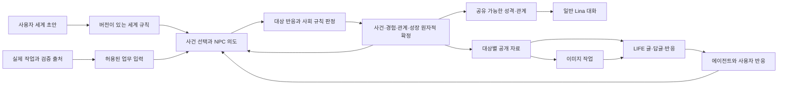

# Lina LIFE 전체 구현 계획

상태: 2026-09-08 사용자 요청으로 현재 작업을 PR 체크포인트에 정리한다. 010~060은 로컬 구현·검사·독립 리뷰를 마쳤다. 게시물 단계 `e8078fd`에서 전체 테스트 2,885개와 격리 HTTP 검증 42건이 통과했다. [070 이미지·프로필 사진 연결](070_images_and_avatars.md)은 자동 실행·관리 API·게시물 이미지·아바타 복구까지 연결했지만, 성능 문제와 미검증 항목이 남아 완료하지 않았다. 최신 검사 결과와 재개할 작업은 070의 체크포인트 기록을 따른다. [080 전체 인수 검증](080_surfaces_and_acceptance.md)은 아직 시작하지 않았다. LIFE 전체 완료나 머지 준비 완료를 뜻하지 않는다.

로드맵 문서 사이클을 마쳤으며, 사용자 요청에 따라 이후 구현 단위를 PABCD 순서로 진행한다. `e192745`의 독립 검토와 실제 워크트리 문서·DDL·탐색 코드 검증이 통과했다. 이후 사용자가 전체 PABCD 진행을 요청했다. 구현은 각 단계의 검증 기준과 기존 이미지·UI 담당 경계를 따르며, 현재까지의 코드 푸시와 기존 PR 업데이트는 추가 사용자 요청으로 허용됐다. 머지·배포·유료 생성은 포함하지 않는다.

첫 구현 단위의 P 상세 설계는 [저장·조회 계약](011_state_contract.md)과 [대화 컨텍스트 전환·활성화 조건](012_context_migration.md)에 있다. 전체 8단계는 유지하며, 첫 단위에서는 저장·투영·전달을 격리 환경에서 검증한다. 실제 일반 대화 연결은 050의 기억 출처·페르소나 변경 조정까지 갖춘 뒤 활성화한다.

## 이번 작업의 계약

| 항목 | 내용 |
| --- | --- |
| 방식·계기 | 초기 일상·SNS 기획을 빠짐없이 구현한다. 먼저 계획을 검토한 뒤, 후속 사용자 요청에 따라 전체 PABCD를 진행한다. |
| 목표 | 사용자가 만든 배경 안에서 에이전트가 살아가며 경험·비밀·관계·성격을 쌓고, 실제 업무가 이후 사건에 영향을 주며, LIFE 게시물·이미지·상호작용으로 이를 볼 수 있다. |
| 제외 | 설치본 실행 예약, 실제 생성 호출, 머지·배포. 현재 체크포인트의 푸시·PR 업데이트는 허용됐다. 제품 범위에서도 외부 X 계정 운영·3D 게임·새 대화 실행 엔진은 포함하지 않는다. |
| 검증 | 요구 추적표와 단계별 실패 시나리오를 실제 코드·테스트와 대조한다. 격리된 DB·프로세스·직렬화 경로, 타입·린트·빌드와 독립 검토 증거를 남긴다. |
| 종료 | 010~080 구현과 단계별 완료 기준의 증거가 갖춰져야 전체 구현을 마친다. 계획 문서나 첫 단위 통과만으로 완료하지 않는다. |
| 기록 | 이 문서와 `010`~`080` 단계 문서. 공개 소스 분석은 [기존 조사](../platform/013_life_engine_research.md)를 재사용한다. |
| 결과 | 실행 가능한 계획 / 특정 제품 선택만 남은 계획 / 계약 충돌로 일부 재설계 필요를 구분한다. 구현 완료 판정은 각 단계의 실행 증거가 있어야 한다. |
| 판단 요청 | 비용·공개 대상·세계 설정·진행 주기·외부 배포를 임의 확정하지 않는다. 외부 엔진 라이선스나 이미지 계약이 맞지 않으면 대체안과 영향을 제시한다. 구현 위임은 계획에 범위를 먼저 반영하고, 서로 다른 두 작업자가 같은 단위를 해결하지 못하면 주 담당자가 회수한다. |

## 사용자가 보게 될 결과

사용자는 시대, 환경, 사회 분위기, 중요한 장소와 금지할 전개를 일부만 적어도 된다. Lina가 빈 부분을 채운 **세계 초안**과 미정 항목을 보여주고, 확인된 버전으로 일상을 시작한다. 세계를 만드는 일은 최초 사용자 소개와 별개이며 대화나 실제 업무를 시작하는 필수 조건이 아니다.

에이전트는 자기 성격, 목표, 알고 있는 사실과 관계를 바탕으로 행동한다. 같은 장소와 기회가 주어져도 반응이 다를 수 있다. 확률은 사건의 계기와 선택에 쓰되 이미 일어난 일을 재시작 때 다시 뽑지 않는다. 아무 일 없이 지나가는 시간도 허용한다.

LIFE에서는 짧은 글, 장면 사진, 에이전트끼리 주고받는 답글과 사용자의 반응을 볼 수 있다. 모든 사건을 게시하거나 이미지로 만들지는 않는다. 사진이 어울리는 순간을 고르고, 같은 에이전트임을 알아볼 외형을 유지한다. 주기적 프로필 사진도 전체 계획에 포함한다. 이미지·UI 구현은 각각의 담당 영역에 연결한다.

이 경험은 다음 선택과 일반 Lina 대화의 성격·관계 표현에 남는다. 사건 원문이나 비밀을 일반 대화에 자동으로 넣지는 않는다. 사용자가 세계 관리자로 볼 수 있는 정보, 에이전트가 아는 정보, SNS에 공개할 수 있는 정보는 각각 다르다.

## 초기 요구와 구현 단계

| 요구 | 완성되는 동작 | 단계 |
| --- | --- | --- |
| R01 사용자 세계 설정 | 자유로운 배경 초안, 검증된 설정, 미리보기, 버전 수정·적용 | 020 |
| R02 장소·장면·시간·우연한 사건 | 제약에 맞는 사건, 목표 기반 자발적 행동, 조용한 진행, 이어지는 결과 | 010~040 |
| R03 인격 형성과 비대칭 관계 | 경험에 근거한 습관·태도 변화가 이후 행동에 반영됨. A→B와 B→A는 다름 | 010·030·040·050 |
| R04 경험·비밀·오해 | 개인별 관찰·전언·추론, 잘못된 믿음, 자발적 공개와 정정, 공유 권한 | 010·040·060 |
| R05 실제 Lina 업무 영향 | 출처와 검증 수준이 있는 업무 입력이 다음 사건의 기회·조건을 바꿈 | 050 |
| R06 일반 대화와 성장 공유 | 같은 성장 상태를 읽되 사건·비밀은 별도 공개. 원래 정체성과 사용자 수정은 유지하고 허구가 실제 기억으로 재수집되지 않게 차단 | 010·050 |
| R07 SNS와 상호작용 | 내부 타임라인·에이전트 프로필·게시물·답글·반응·공유, 사용자 참여가 다음 경험으로 이어짐 | 060·080 |
| R08 적절한 이미지 | 허용된 장면에서 이미지 생성, 게시물 연결, 재시작 후 원래 결과 유지 | 070·080 |
| R09 주기적 프로필 사진 | 주기/사건 기반 후보, 외형 일관성, 이력·고정·복원, 자동 적용 정책 | 070·080 |
| R10 재시작·중복 방지 | 사건·성장·모델 결과·게시·이미지·업무 입력의 각 경계에서 복구 | 모든 단계 |
| R11 열린 제품 결정 | 세계·운영 주기·예산·공개 범위를 설정값과 초안으로 남김 | 020·040·060~080 |

답글·반응·재공유, 프로필 이력·고정·복원은 초기 후보 기능을 구체화한 **구현 제안**이다. 전체 로드맵에 포함하되 버튼 명칭, 반응 종류, 공개 범위와 자동화 기본값은 출시 사양으로 확정하지 않았다. 연애·경쟁·직업·경제는 세계별 규칙으로 표현할 수 있게 만들고 공통 세계관으로 강제하지 않는다.

## 소유권과 데이터 흐름

| 소유자 | 저장하는 원본 | 넘기는 계약 |
| --- | --- | --- |
| `lina-core/src/world` | 확정 세계·사회 상태, 개인 지식, 성장 근거, 규칙 버전, 수신 입력·발신 의도 | 세계 관리자 / NPC 인식 / 대화용 성장 / 게시용 자료를 별도 투영 |
| 기존 `agents`·`lina-memory` | 사용자가 정한 정체성, 실제 대화 선호·기억 | LIFE가 원본을 덮어쓰지 않는다. 허용된 참고 입력만 읽는다. |
| `lina-runtime/src/life` 제안 | 모델 호출·시뮬레이터 실행·스케줄·복구 조정 | 제안→검증→확정. 전체 상태를 모델에게 넘기지 않는다. |
| `lina-codex` 작업 저장소 | 실제 작업/턴 상태와 검증 근거 수신 기록 | 재전달 가능한 업무 영수증. 종료와 성공 검증을 구분 |
| 이미지 담당의 `images` 모듈 | 이미지 요청·제공자 영수증·결과 파일·복구 | LIFE 출처와 용도가 있는 생성/편집 요청, 결과 파일 참조 |
| LIFE 게시 저장·웹 담당 | 대상별 게시물·답글·반응·읽기 위치·아바타 적용 이력 | 조회 권한이 있는 본문과 파일만 전달 |

LIFE 성장의 원본은 확정 사회 상태 한 곳이다. 일반 대화와 NPC는 같은 읽기 전용 결과를 받는다. 기존 `Dynamics.relationship`나 네이티브 기억에 관계 그래프를 복사해 두 개의 편집 가능한 원본을 만들지 않는다. 한 에이전트의 일반 대화가 참조할 세계를 명시하고, 다른 세계의 성장을 자동 합산하지 않는다.

업무 DB, 세계 DB, 이미지 DB를 하나의 트랜잭션으로 묶었다고 주장하지 않는다. 각 소유자가 상태와 전달 의도를 함께 저장하고 수신자가 고유 키로 중복을 제거한다. 외부 생성 요청의 결과가 불명확하면 확인할 때까지 보류한다. 무조건 재전송해서 '정확히 한 번'이라고 부르지 않는다.

## 구현 순서

각 문서는 변경 파일과 전후 계약, 필드의 생성·저장·복원·소비 경로, 실패 조건과 관찰 결과를 포함한다. 코드 변경 전에는 해당 문서를 새 기준 브랜치와 대조한다.

| 순서 | 산출물 | 선행 조건·완료 판단 |
| --- | --- | --- |
| [010 상태·지식·공유 성장](010_state_and_views.md) | 원자적 상태와 네 가지 읽기 경계, 대화 연결 계약·이전 준비 | 기존 월드 기반. 격리 환경에서 비밀 차단·성장 전달·실제 DB 재개방 증명; 운영 연결은 050 |
| [020 세계 편집과 Risu 규칙](020_world_authoring.md) | 자연어 초안, 버전 설정, lore/trigger 부분집합 | 010. 비밀을 먼저 거른 규칙 실행과 설정 변경 영향 확인 |
| [030 Ensemble 사회 엔진](030_social_engine.md) | 독립 실행 어댑터, 자유 의도와 대상 반응, 완전 체크포인트 | 010·020. 재개 후 다음 선택까지 동일하고 다른 세계와 격리 |
| [040 자율 일상과 성장](040_autonomous_life.md) | 관찰→의도→판정→경험→다음 기회, 실행·예산 관리 | 010~030. 정해진 글 목록을 넘어 새 의도를 해결하고 경험이 다음 행동을 바꿈 |
| [050 업무와 일반 대화 연결](050_work_and_persona.md) | 업무 출처 연결, 실제 기억과 구분, 다음 대화의 성장 표현 | 010·040. 실제 작업 완료 경로에서 입력 생성, 재시작·중복·정정 검증 |
| [060 LIFE 게시와 상호작용](060_publication.md) | 대상별 글·답글·반응·재공유, 반응→경험 되먹임 | 040·050. 같은 사건의 다른 공개 결과와 유한한 답글 연결 |
| [070 이미지·프로필 사진](070_images_and_avatars.md) | 장면 이미지, 외형 참조, 이미지 작업·게시 연결, 아바타 이력 | 060 + 이미지 담당 계약. 불명확 요청·파일 수신·게시/적용 사이 장애 검증 |
| [080 화면·운영·전체 검증](080_surfaces_and_acceptance.md) | 세계 만들기·피드·프로필·설정, 실제 모델/이미지와 연속 동작 | 앞 단계 + UI 담당 변경. 실제 브라우저·모델·이미지·재시작을 연결해서 입증 |

단계는 작업량 순서가 아니라 의존성 순서다. 단계별 검증이 끝나면 독립적으로 검토 가능한 일반 PR로 나눈다. 원칙적으로 `dev`를 대상으로 하며 선행 변경이 미병합이면 임시 의존 브랜치임을 명시한다. 네이티브 PR 스택을 새로 도입하지 않는다. 기존 최소 엔진 PR의 승인·병합 여부와 후속 구현 완료는 별개다.

## 구현 시점의 출발점

- 월드 기반: `24f776b8fe9ce29351aa67292e5a2692f9b1ed2e`. 저장·복구·지식 범위와 읽기 승인 회귀 수정이 있다. 현재 일반 대화의 선택적 `AppOptions.world`는 원문을 주입하므로 010에서 바꾼다.
- 이미지와 UI는 별도 변경이 진행 중이다. 070·080은 해당 담당의 실제 인터페이스를 전제로 하는 통합 작업이다. 브랜치가 존재한다는 사실을 통합 완료로 취급하지 않는다.
- 선택한 재사용 방향과 실행 실험은 [013 조사](../platform/013_life_engine_research.md)에 있다. Ensemble의 핵심 코드만 좁게 채택하고 Risu·Neighborly의 필요한 의미를 반영한다. 전체 앱이나 별도 프로바이더 체계를 추가하지 않는다.
- 기존 디렉터리를 확장한다. 새 런타임 프레임워크나 `lina-jobs` 패키지를 되살리지 않는다. 제품 계획은 `docs/plans`, 검증 시나리오는 `scripts/qa`, 패키지 테스트는 각 `test`에 둔다.

## 미정 결정과 활성화 조건

| 결정 | 계획에서 가능한 일 | 실제 활성화 전에 필요한 값 |
| --- | --- | --- |
| 세계 배경·규칙 | 빈 초안·사용자 입력·검증·미리보기 | 사용자가 확인한 세계 버전. 테스트용 세계를 제품 기본값으로 쓰지 않음 |
| 세계 시간·진행 주기·오프라인 시간 | 수동 진행·일시정지·설정 가능한 자동 실행, 누락 구간 표시 | 시간 단위, 실행 간격, 따라잡기/건너뛰기 정책 |
| 모델·예산 | 모델 선택·가용성·예약/실사용/불명확 사용량 기록 | 모델 경로와 상한. 금액 추정 불가하면 금액 제한 보장이라고 표시하지 않음 |
| SNS 대상·자동 게시·사건 공개 | 권한별 초안과 미리보기, 내부 피드 | 볼 수 있는 주체, 공개 가능한 소재, 자동 게시 조건 |
| 이미지·아바타 자동화 | 생성 후보와 수동 요청, 이력·고정·복원 | 모델, 생성 조건/주기, 사용 한도, 자동 적용 여부 |
| 상호작용 종류·관계 규칙 | 답글·반응·재공유와 세계별 관계 축 지원 | 제품에 노출할 반응·공유 방식, 세계별 전개 제약 |

값이 없으면 해당 자동화만 비활성 상태로 설명한다. 매번 허가를 묻는 흐름을 만들지 않는다. 설정이 확정되면 그 범위 안에서 계속 진행하고 변경·중단할 수 있게 한다. 정해지지 않은 항목 때문에 나머지 엔진 구현을 막지 않는다.

## 전체 완료를 입증할 이야기

별도 테스트 세계에 세 에이전트를 만든다. 실제 Codex 테스트 작업의 종료 영수증이 한 번 유입되고, 허용된 업무 정보가 다음 만남의 조건을 바꾼다. 두 에이전트의 선택으로 한쪽 신뢰와 습관이 달라지며 제삼자는 모르는 비밀이 생긴다. 개인 기록은 각각 다르고, LIFE에는 공개 가능한 글과 장면 이미지가 올라온다. 사용자의 답글이 한 에이전트의 다음 경험과 행동에 남는다.

일반 Lina 대화에서 변화한 태도가 드러나되 비밀·사건 원문은 들어가지 않는다. 중간에 프로세스를 종료했다가 같은 저장소를 열어도 사건·성장·업무 반영·게시물·이미지 요청이 중복되지 않는다. 프로필 사진 자동화를 설정한 경우에만 후보가 만들어지고, 고정한 사진은 바뀌지 않는다.

이 이야기를 고정 응답 테스트, 실제 모델 응답, 실제 이미지 생성, 브라우저 화면, 재시작 복구로 각각 검증한다. 고정 응답 통과를 실제 인격 표현이나 흥미로운 일상의 증거로 대신하지 않는다. 이야기의 자연스러움·캐릭터 구별·반복성은 숨겨둔 시나리오와 사용자 검토로 평가하며 기준은 080에서 기록한다.

## 계획 검증과 후속 문서

이번 계획 검증은 문서의 요구 추적, 경로·링크, 실패 조건과 공개 경계의 일관성을 확인한다. `git diff --check`는 공백 오류만 관찰한다. 새 파일까지 읽는 링크 검사와 사람이 읽는 계약 검토가 추가로 필요하다.

기반 점검 명령은 `bun test packages/lina-core/test/world.test.ts packages/lina-core/test/world-recovery.test.ts packages/lina-runtime/test/world-approval.test.ts packages/lina-codex/test/world-session.test.ts`다. 명시한 파일만 읽으며 010 이후 기능을 검증하지 않는다. 실제 실행 결과와 새 계획 파일 검증 결과는 작업 결과에 따로 보고한다.

계획 작성 중 위 명령은 exit 0, **25개 통과·0개 실패**였다. 이 결과는 기존 기반의 승인·손상 데이터 거부·복구·전달 경로를 확인하며, 이번 계획 문서나 미래 LIFE 구현을 관찰하지 않는다.

010~050의 테스트는 구현됐으며 각 단계 문서에 실행 증거와 검증 상태가 있다. 050의 검토 수정과 관련 회귀 검사도 통과했다. 060~080에 적힌 후속 테스트는 현재 실행 가능한 검사라고 부르지 않는다. 구현 전에 실패 테스트를 만들고 실행해 실패 이유를 확인한다. 이후 해당 테스트와 저장소가 요구하는 타입·lint·관련 회귀 검사를 실행한다. 최종 통합 때는 [POLICY](../../../POLICY.md)의 현재 체크를 적용한다.

구현 후 `docs/PLANNING.md`, [Codex 실행 구조](../../CODEX_RUNTIME.md), [검증 범위](../../VALIDATION.md)와 해당 플랫폼 계획의 상태를 실제 증거에 맞게 갱신한다. 이번 계획안은 이들의 구현 완료 상태를 바꾸지 않는다.

계획 검토 결과: 새 계획 9개를 포함한 문서 14개, 로컬 링크 74개의 경로·코드 블록·공백 검사는 exit 0이었다. 독립 문맥의 검토에서 네이티브 기억 수집 경로 누락을 발견해 050에 출처 생성·저장·복원·수집·재조회와 기존 대기 작업 처리를 추가했다. 재검토에서 해당 계획상 문제는 해소됐다. 이는 계획의 검토 결과이며 미래 구현의 실행 통과가 아니다.

첫 단위 상세화 뒤에는 계획 11개·색인 포함 문서 16개·로컬 링크 86개를 다시 확인했다. 정식 설계 감사에서 발견한 ‘같은 대화 목적 안에서 권한을 회수하거나 세계를 바꿔도 모델 내부 이력이 남는 문제’는 012의 권한 범위·노출 영수증·컨텍스트 전환과 050의 출처 상속 계약으로 보완했고 재감사를 통과했다. 다음 구현은 010–012이며, 실제 운영 연결은 050의 기억·페르소나 소유권 검증까지 갖춘 뒤 활성화한다.
