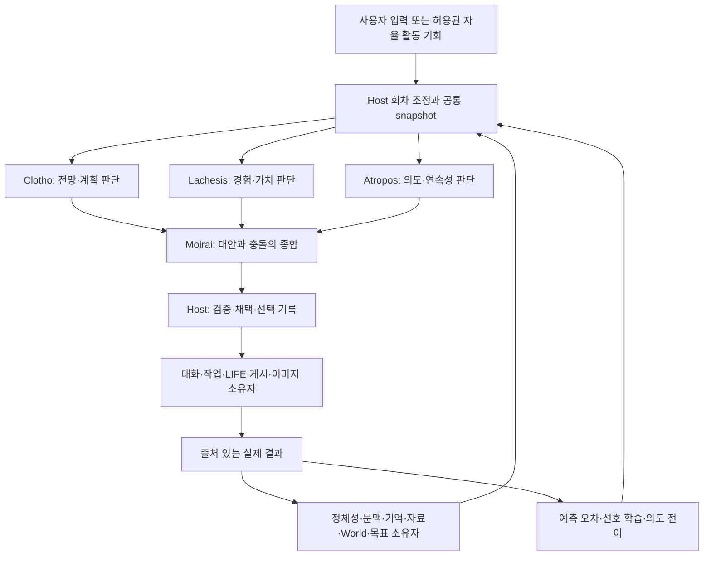

# 모이라이 세 관점과 기존 모듈의 구성 초안

상태: 2026-09-12 후속 설계용 가안. **한 LINA 에이전트가 같은 상황을 전망·계획, 경험·가치, 의도·연속성의 세 관점으로 판단하고, 그 판단을 종합해 행동한다.** 기존 기억·성향·World·LIFE·작업 모듈은 이 판단을 뒷받침하는 공통 기반으로 배치한다. 세 관점이 각각 완결된 대안을 내는 최초 구상을 유지하면서, 판단의 배경을 지속 상태와 계산·학습 규칙으로 구체화한다.

이 문서는 구성·재사용·전환 순서의 정본이다. [015](015_neural_preference_engine_research.md)는 제품 정의와 회로 근거, [016](016_neural_preference_contract.md)은 판단·선택·학습·저장 계약, [030](../context-engines/030_moirai_refactor_plan.md)은 채널·도메인·모델 운영 경계를 소유한다. 아래 경로와 타입은 후속 구현 후보이며 이번 PR은 문서만 변경한다.

| 이번 계획 작업 | 범위와 종료 기준 |
| --- | --- |
| 계기·목표 | 혼재한 기존 모듈을 세 관점 중심으로 배치하고 다른 설계 작업이 이어받을 PR 초안 작성 |
| 방식 | 요구 충족형 계획: 코드·원문 조사 → 구성안 선택 → 문서 정합성 검토 → PR 갱신 |
| 제외 | 제품 코드·런타임 프롬프트·의존성·저장 스키마 변경, 회로 추출·학습 실행, 실모델 실험, 병합·배포 |
| 검증 | 변경 Markdown의 링크·참조·책임·실행 흐름 대조, `git diff --check`, 저장소 CI. `bun run ci:validate`는 CI 설정과 기여 문서 링크만 검사하며 이 설계의 의미를 검증하지 않음 |
| 기록·종료 | 이 문서와 015/016/030·계획 색인의 일치, 검토 결과 반영, PR의 새 head 확인에서 종료. 미래 구현 단계는 이번 실행 범위가 아님 |
| 결과·재판단 | 성공은 검토 가능한 가안 전달. 근거가 부족한 수치·선정은 미정으로 남김. 별도 구현·설치 권한이 필요하거나 선행 소스가 바뀌면 해당 범위를 재판단. |

## 세 관점이 설계의 중심이다

| 모듈 | 판단하는 질문 | 판단을 만드는 메커니즘 |
| --- | --- | --- |
| 클로토 | 이 행동을 하면 앞으로 무엇이 달라질까? | LLM이 전체 행동 대안·후속 단계를 만들고, 코드가 조건·의존 관계를 검사하며 예상 결과·비용·불확실성을 비교 |
| 라케시스 | 내 경험과 현재 상태에서 무엇이 끌리고, 무엇을 피하고 싶은가? | 근거 있는 경험·욕구·성향을 읽고, MaleCNS 부분회로의 학습된 단서 반응과 현재 상태를 사용해 대안을 평가·제안 |
| 아트로포스 | 내 목표와 약속을 생각하면 지금 무엇을 선택해야 할까? | 채택된 의도·기한·완료/중단 조건과 대안의 충돌을 계산하고, LLM이 애매한 의미와 재계획을 해석 |

각 모듈은 `judge(snapshot)`으로 완결된 의견·근거·전체 대안을 낸다. 이후 `evaluateOptions(snapshot, candidates)`로 공통 후보를 평가한다. 라케시스를 숫자만 반환하는 보조 함수로, 아트로포스를 모든 제안을 차단하는 승인자로 축소하지 않는다. 메커니즘에서 나온 결과를 LLM이 해석해 자신의 관점으로 판단한다. 셋 모두 계획·대안·보류를 제안할 수 있다.

모이라이(Moirai)는 세 판단을 받아 누락된 대안과 충돌을 해석하고 하나의 응답·계획을 제안하는 종합 단계다. Host는 회차·현재성·정해진 선택 정책·저장·실행 인계를 담당하는 코드다. **세 판단 관점, 하나의 종합 기능, 하나의 확정 책임**이며 네 인격이나 네 개의 별도 기억을 만들지 않는다. 동일 LLM을 세 관점과 종합에 재사용할 수 있고, 모델 제품명이 역할을 정의하지 않는다.

세 제품 목표는 세 모듈에 하나씩 배정하지 않는다.

| 제품 목표 | 클로토에 남는 변화 | 라케시스에 남는 변화 | 아트로포스에 남는 변화 |
| --- | --- | --- | --- |
| 경험과 성장 | 이전 예상과 실제 결과의 오차, 방법의 조건별 성과 | 학습된 취향·반응, 수정·소거할 경험 | 목표 유지·중단·재협의의 결과와 재고 근거 |
| 가치와 선택 | 가능한 대안과 결과의 차이 | 관심·동기·개인적 끌림의 차이 | 목표·약속·정체성 기준의 충돌과 우선순위 |
| 개인의 연속성 | 같은 목적의 계획 이력과 갱신 이유 | 상태·가중치·출처를 가진 취향 유지 | 수락 근거·완료 조건을 가진 의도 유지 |

## 현재 구현에서 확인한 재료

기준 제품 소스는 `522101ff99e356b0ea6d27b4ea03ec7e599ee4b3`다. 표의 구현은 이 소스의 호출 경로를 뜻하며 운영 설치본의 활성화나 실모델 효용을 뜻하지 않는다. LIFE는 작성된 pack·설정·공개 범위가 있어야 동작한다.

| 기존 모듈과 근거 | 실제 기능 | 목표 구조의 위치 |
| --- | --- | --- |
| [AgentStore·페르소나](../../../packages/lina-core/src/agents/persona.ts#L56), [온보딩](../../../packages/lina-core/src/onboarding/types.ts#L3) | 작성 정체성·가치관·관심·대화 선호와 변경 가능한 성향 | 공통 자기모델. 어떤 판단도 정체성·명시적 지시의 별도 원본을 만들지 않음 |
| [ContextStore·WorkingState](../../../packages/lina-core/src/context/types.ts#L56) | 현재 목표·결정·미해결 항목·다음 단계, 출처 있는 요약·원문 확장 | 공통 현재 문맥. 목표 메모와 수락된 장기 의도는 구분 |
| [EngineStore](../../../packages/lina-memory/src/engine/store.ts#L57), [기억 추론](../../../packages/lina-runtime/src/context/memory-consolidation.ts#L63) | 기억·출처·정정·철회, LLM 연역/귀납 제안과 전제 이력 검증 | 세 관점의 공통 경험·근거 조회. 개인 기억의 기본 검색은 문자열 기반이며 추론 이력은 논리적 참을 자동 증명하지 않음 |
| [ResourceSearch](../../../packages/lina-runtime/src/resources/search.ts#L58) | 자료 추출·요약·검색·자료 파생 기억·활동 기록 | 공통 지식 조회. 자료에서 읽은 사실과 개인이 겪은 경험의 출처를 유지 |
| [World 규칙](../../../packages/lina-core/src/world/rules.ts#L115), [공개된 세계 읽기](../../../packages/lina-runtime/src/world.ts#L81) | 장소·사건·조건·효과와 참여자별 접근 범위 | 도메인 상태·규칙의 소유자. 클로토의 허용된 예측에 활용 |
| [LIFE 욕구·목표](../../../packages/lina-core/src/world/autonomy-types.ts#L16), [사건 선택](../../../packages/lina-core/src/world/events.ts#L25) | 욕구 drift, 목표 우선순위·진행률, 성향·습관·반복 패널티를 반영한 사건/참여자 선택 | 욕구·목표 원본은 재사용. 기존 개인 선택 부분은 아래 LIFE 전환 계약으로 분리 |
| [Ensemble 어댑터](../../../packages/lina-runtime/src/life/social/execution.ts#L104) | 규칙 기반 사회적 의향, 작성된 행동 그래프 탐색, 상대 반응·효과 계산 | 공통 사회 도메인 서비스. 라케시스는 의향 근거, 클로토는 허용된 결과 가정에 활용 |
| [NativePersonaGrowth](../../../packages/lina-runtime/src/persona/native-growth.ts#L25), [BehaviorStore](../../../packages/lina-core/src/agents/behavior-store.ts#L75) | 유효한 기억을 성향·습관으로 해석하고 대화·LIFE에 투영 | 공통 성향 소유자. reflection/neural 생성자를 dimension별로 지정 |
| [TaskManager](../../../packages/lina-codex/src/tasks.ts#L139), [작업 도구](../../../packages/lina-runtime/src/tools/codex-tasks.ts#L25) | 지속되는 개발 작업, 지시·중단·인계·결과 통지 | 실행 소유자. 작업 상태는 계획·의도의 근거이며 프로세스 종료를 목표 달성으로 간주하지 않음 |
| [이미지 작업](../../../packages/lina-runtime/src/images/jobs.ts#L39), [LIFE 게시](../../../packages/lina-runtime/src/life/publication.ts#L302) | 생성·편집·취소·복구, 게시·답글·아바타 연결 | 표현·실행 소유자. 무엇을 표현할지의 개인 판단은 모이라이에 요청 |
| [AgentFleet](../../../packages/lina-runtime/src/fleet/manager.ts#L39), [세션 조립](../../../packages/lina-runtime/src/session-app.ts#L173) | 개인별 세션·저장소, 문맥·기억·성장·도구 연결 | 공통 구성점. 모이라이 회차 조정기와 Senpi 역할 세션을 설치 |
| [실행 통제](../../../packages/lina-runtime/src/execution.ts#L50), [DurableRuntime](../../../packages/lina-runtime/src/runtime.ts#L20) | 요청·응답 기록, 실행 권한·취소·복구 | 확정된 판단을 실제 효과로 넘기는 Host. 판단 저장과 효과 저장 책임 구분 |
| [웹](../../../packages/lina-web/src/server.ts#L53), [Discord](../../../packages/lina-channels/src/discord-bridge.ts#L24) | 외부 입력·최종 응답 전달 | 채널. 내부 세 의견을 세 사용자 메시지로 전송하지 않음. Telegram은 현재 stub |
| [모델 서비스](../../../packages/lina-opencodex/src/services.ts#L323), [체크포인트](../../../packages/lina-runtime/src/checkpoint-cli.ts#L18) | 모델 라우팅과 전문 호출, 오프라인 상태 캡처·새 경로 복원 | 공통 인프라. Senpi 전환·추가 상태도 기존 설치/복구 책임 아래 편입 |

현재 대화의 기본 경로는 `입력 → 개인 세션 → 문맥·페르소나·기억 조회 → LLM/도구 → 응답 정착 → 기억·성향 후처리`다. LIFE는 `사건/참여자 선택 → director → actor → 필요 시 target → Ensemble → reflection → 상태 확정`이다. 두 경로 모두 근거와 상태를 보존하지만, 세 관점이 공통 후보를 판단하는 제품 회차는 아직 없다.

별도 구현은 섞어 쓰지 않고 다음 기준으로 참조한다.

| 코드 기준 | 상태와 재사용 범위 |
| --- | --- |
| [현재 MoiraiProbe](../../../packages/lina-codex/src/moirai-probe.ts#L67) | Codex QA 전용 3판단+종합·이력 대조. 제품 채널·도메인 포트는 연결되지 않음 |
| [PR #10 Senpi](https://github.com/thisisjun786/lina/blob/5b22aee53f9f7c01cc508289099f662aed613140/scripts/qa/senpi-sdk/README.md) | 다른 브랜치의 SDK QA. 일반 SDK 도구·복구 시험과 도구 없는 Moirai 3+1 시험은 별도 시나리오. 현재 PR12에 SDK 소스가 들어 있다는 뜻이 아님 |
| [PR #8 채택 커널](https://github.com/thisisjun786/lina/blob/ab9f1f073eca80ecef8dda0b0f7d338f4d6cb35c/scripts/qa/adoption-kernel/types.ts#L24) | PR은 미병합 종료. Purpose·이해/계획/의도 채택·방법/예상·효과 결과의 계약을 참고. 독립 평가 통과나 제품 사용을 전제하지 않음 |
| PR #8 이후 로컬 검증 후보 `0cdfd43` | 프로세스 복구·실패 결과 검증을 추가한 별도 후보. 제품 의존성으로 채택하지 않고 후속 설계 때 공개 가능한 리비전과 결과를 다시 확인 |
| [PR #5 UI](https://github.com/thisisjun786/lina/pull/5) | 별도 UI·공통 client·Electron 구현. 인지 원본을 UI 패키지로 옮기지 않음 |

## 선택한 구성과 대안

**D01: 기존 소유자 옆에 세 관점의 판단 계층을 둔다.** `lina-core`에는 판단·채택의 도메인 타입과 저장 책임, `lina-runtime`에는 회차 조정·세 판단 메커니즘·종합·어댑터를 둔다. Memory/Persona/Resource/World는 자기 원본을 계속 소유한다. 기술적으로는 한 프로세스 안에서 시작할 수 있으며 신경 수치 계산만 별도 Python 포트로 분리한다.

| 구성 후보 | 판단 |
| --- | --- |
| 역할 프롬프트 셋과 종합만 추가 | 비교군으로 유지. 목표·경험·예측이 무엇을 바꾸는지 명시적으로 연결하기 어려움 |
| 각 관점이 전용 기억·World·실행기를 소유 | 제외. 같은 개인의 정정·약속·실행 권한이 세 원본으로 갈라짐 |
| 기존 공통 소유자 + 세 판단 메커니즘 + 종합·확정 | 가안으로 선택. 기존 출처·복구를 유지하면서 판단 원인을 구분할 수 있음. 포트와 상태 버전의 전환 비용이 듦 |

**D02: 공통 snapshot은 원본 참조와 읽기 결과의 묶음이다.** 현재 사용자 원문·정정·권한은 셋 모두 받는다. `workingRevision`, 원문/request의 `instructionRevision`, `identityRevision`, 도메인 revision, `intentionRevision`을 구분한다. WorkingState의 revision을 사용자 지시 revision으로 대신하지 않는다. 개인별 공개 범위에서 읽고, 읽기 전후 버전 벡터와 확정 직전 현재성을 대조한다. 여러 DB를 동시에 원자적으로 읽었다고 가정하지 않는다.

**D03: 세 관점 모두 전체 대안을 제안한다.** 공통 후보 후속 평가도 이유·불확실성·대안을 보존한다. 주관적 반대나 새 대안만으로 무제한 회차를 열거나 단독 veto를 행사하지 않는다. 현재 권한 위반·필수 근거 누락 같은 객관적 중단 조건은 Host가 적용하고, 취향·약속 간 우선순위 충돌은 종합 판단의 자료로 남긴다. 후보 목록을 닫는 규칙은 016을 따른다.

## 메커니즘별 연결

**D04: 클로토는 한정된 전망 계산과 결과 비교로 시작한다.** LLM이 제안한 행동·후속 단계에 전제조건, 예상 효과, 비용·기한, 근거, 확인 방법을 붙인다. 작성된 World 규칙으로 계산할 수 있는 효과와 현실에서 아직 확인하지 못한 예상은 구분한다. 도메인 소유자가 공개한 상태만 사용하는 읽기 전용 `projectConsequences`를 제안한다. 실제 World의 비밀이나 미래 결과를 복사해 예측 근거로 노출하지 않는다. 모르는 값은 모른다고 반환한다.

예측에는 `forecastId`, `optionKey`, 예상한 관측 항목·시점, 가정과 `predictionMethodRevision`을 둔다. 실제 결과가 오면 같은 항목끼리 비교하고 조건별 오차를 다음 회차에 제공한다. 숫자 차이를 낼 수 없는 결과는 충족/미충족/판정 불가와 근거로 남긴다. 현재 Ensemble 실행 함수를 호출해 실제 세계를 진행시키는 방식으로 예측하지 않는다. 초안은 별도 HTN 라이브러리를 필수로 선택하지 않는다.

**D05: 라케시스는 상태·경험·선호의 근거를 결합해 판단한다.** 기존 욕구·성향·사회적 의향을 읽고 어떤 활동이 왜 끌리는지 대안을 낸다. LLM은 사건·활동의 의미를 단서로 바꾸고 반응을 해석한다. MaleCNS 계산기는 같은 신경 snapshot에서 단서별 반응과 학습 흔적을 계산한다. 빠른 뉴런 상태 `h`, 느린 조절 상태 `m`, 개인 가중치 `ΔW`, 학습 흔적 `trace`는 서로 다른 데이터다. 최종 선택에 신경 잡음이 반드시 있어야 하는 것은 아니며, Host의 선택 난수와 분리한다.

`W0`는 공유하고 개인·scope별 `ΔW`와 상태는 분리한다. 연결 자료, 뉴런 동역학, 학습 규칙, 의미 encoder, readout은 별도 버전으로 남긴다. 실제 연결이 의미 해석이나 인간 취향의 정답을 제공하지 않는다. 입력과 readout만 바꿔 얻은 효과를 회로 내부 학습으로 보고하지 않는다. 정확한 회로·학습·재생 계약은 016에 있다.

**D06: 아트로포스는 의도의 유지와 재고를 계산한다.** 기본 정책은 채택된 목표를 지속하되 완료·불가능·원래 목적의 철회·중요한 전제 변경·기한/자원 충돌이 생기면 재고하는 것이다. 새 관심이 생겼다는 이유만으로 약속을 취소하지 않으며, 기존 약속도 영구 고정하지 않는다. 사용자와 수락한 약속의 변경은 원래 수락 근거와 권한을 따른다. 허용된 자율 목표는 Host가 채택할 수 있다.

`Purpose`는 달성하려는 목적, `Understanding`은 근거를 가진 지속적 해석, `Plan`은 방법과 단계, `Intention`은 실제로 계속 수행하기로 채택한 상태다. 서로 대체하지 않는다. WorkingState는 현재 대화의 요약이고, LIFE GoalState는 세계 안의 목표이며, TaskManager는 실행 상태다. 아트로포스는 원본을 연결해서 읽고 유지·보류·재개·변경안을 낸다. 완료는 대응하는 결과가 있어야 확정된다.

## 종합과 실행의 경계

**D07: 대화와 행동이 같은 세 관점에서 출발한다.** 일반 대화는 독립 판단 셋과 종합 한 번이 기본이다. 순수 대화에서는 취향·동기 정보를 판단 입력으로 사용하고 문장 토큰을 확률식으로 재추첨하지 않는다. 약속 수락·취소, 도구·게시·세계 변경 등 지속 상태나 외부 효과를 만드는 제안은 행동 계약으로 승격한다. LLM이 `answer`라고 표시했다는 이유만으로 실행·채택 검증을 건너뛰지 않는다.

행동은 `독립 판단 → 종합 후보 준비 → 정규화 → 같은 후보의 세 평가 → 후보 집합 확정 → Host 선택 → 종합 계획 구체화 → Host 검증·인계` 순서다. 처음 의견과 공통 후보 평가를 모두 보존한다. 추가 평가·반론·의미 변환 호출도 원래 요청의 비용에 포함한다. 합의 횟수로 사실의 신뢰도를 올리지 않는다. 같은 LLM의 다른 샘플은 외부의 독립 관측이 아니다.

**D08: 채택 기록은 QA 커널의 계약을 발전시켜 한 곳에서 소유한다.** 제안 이름은 `JudgmentStore`다. 기존 초안의 `AgentCoreStore`와 QA의 `KernelStore`를 제품에서 나란히 운영하지 않는다. QA 코드의 Purpose·Understanding/Plan/Intention·Judgment·effect 연결을 제품 도메인으로 옮기되, QA의 Frame·DB를 통째로 복사하지 않는다. 이해·계획·의도의 기록과 원본 연결은 유지하고, 대화 원문·도구 실행 로그·World 원본을 재소유하지 않는다.

`JudgmentStore`는 회차·판단·예측·채택·선택 RNG·실행 요청 outbox를 소유한다. `ControlStore`·TaskManager·WorldStore·이미지/게시 owner는 실제 실행 상태·결과의 원본을 소유한다. outbox는 이들에게 보낼 요청이며 두 번째 도구 실행 이력이 아니다. `decisionId → effectId → owner receipt → outcomeId`로 연결하고, 실행 결과가 불명확하면 owner의 reconcile을 기다린다. 신경 저장소는 수치 상태·학습만 소유한다. 이 설계는 QA 커널이 제품 적합성을 통과했다는 의미가 아니다.

| QA 계약 | 제품에서 보존할 의미 |
| --- | --- |
| Purpose | 목적·대상·성공 조건·정책 참조 |
| Adoption: understanding | 근거·적용 조건·철회 이력이 있는 지속적 이해 |
| Adoption: plan / intention | 방법/단계와 수락된 수행 의도를 각각 유지 |
| Judgment: method / expectation | 방법·예상·명시적 예상 없음과 결과 비교 |
| ToolReceipt / kernel_effects | 기존 실행 owner의 결과 참조와 실행 요청 중복 방지 |

## LIFE와 기존 성향 계산의 전환

**D09: 사건 발생과 개인의 행동 선택을 분리한다.** 현재 `selectLifeEvent`는 욕구·목표·성향까지 반영해 사건/참여자를 뽑는다. 목표 구조에서는 World/LIFE가 시간·인과·장소·공개 범위·활동 가능 조건에서 상황과 참여 기회를 제공하고, 개인의 자발적 선택은 세 관점과 Host 선택 정책이 담당한다. 기존 함수를 그대로 호출한 뒤 같은 성향으로 두 번째 선택을 하는 안은 목표 구조로 채택하지 않는다.

후속 pack/step 버전에 `decisionMode: legacy | moirai`를 제안한다. legacy 기록은 원래 알고리즘과 난수로 재현한다. moirai 모드의 기회 선택은 환경·인과·quiet·참여 일정 규칙을 사용하고, 기존 개인 욕구·목표·성향·습관 가중치는 개인 판단의 입력으로 옮긴다. 어느 사건이 외부에서 발생하고 어느 활동이 개인이 고르는 대상인지는 pack의 기회/행동 구분으로 선언한다. 같은 step에서 두 모드를 혼합하지 않는다. 전환 후 분포가 달라지는 것은 명시적인 정책 변경이며 과거 결과를 다시 추첨하지 않는다.

| 현재 LIFE 경로 | 목표 경로 |
| --- | --- |
| 사건/참여자 선택 | World의 기회 제시. 개인 선호로 행동을 확정하는 부분은 분리 |
| director | 상황 설명·공개 가능한 맥락 구성. 개인 의도 선택 권한 없음 |
| actor | 해당 개인의 모이라이 행동 회차로 교체 |
| target | 상대 개인의 별도 모이라이 수락/거절 회차. 원래 개인의 하위 투표로 처리하지 않음 |
| Ensemble | 작성 규칙의 가능 조건·사회적 의향·결과 서비스 유지. 의향 계산과 최종 행동/효과 적용 포트를 분리 |
| reflection | 세계 경험·믿음·허용 성장 해석 유지. 실제 결과를 공통 outcome 계약으로 전달 |
| publication·image | 게시 여부·내용 의도의 개인 선택은 모이라이, 공개 검사·렌더링·전송은 기존 owner |

Ensemble의 행동 그래프가 개인이 통제하는 서로 다른 행동을 선택한다면 그 terminal/binding을 공통 후보에 올리고 확정된 선택을 실행한다. 세계의 반응·상대의 결정·확률적 결과는 별도 결과로 기록한다. 최종 선택 뒤 Ensemble이 다른 개인 행동으로 바꿔 실행하는 경로는 허용하지 않는다. 전체 비공개 World 상태로 계산한 의향·예측값을 개인 판단에 넘기지 않으며, 숨은 조건은 공개 가능한 실패/불확실성 계약으로 처리한다.

**D10: 같은 선호 원인은 정량 선택에 한 번 반영한다.** `p0`는 목표·검증된 조건·예상 비용·명시적 선호·수락된 의도 등 선언한 비신경 입력에서 만든 기준 정책이고, 신경 선호는 016의 `p ∝ p0 × exp(λb)`에서 한 번 반영한다. 서로 다른 단위의 LLM 점수를 평균내지 않는다. `λ`와 기준 비교 규칙은 catalog별 버전 있는 선택 정책이 소유하고, LIFE pack은 그 정책 참조를 기록한다.

`dimensionSource`는 기존 reflection과 neural 중 생성자를 하나 고른다. 신경에서 투영된 성향을 다시 LIFE 가중치·Ensemble 의향·`p0`에 넣어 `b`와 합산하지 않는다. 원본 사건과 dimension의 기여 경로를 추적하고, 명시적 선호·작성 성격·학습된 선호를 구분한다. 같은 경험을 기억에 보관하면서 신경 학습에 쓰는 것 자체는 중복 오류가 아니다. 같은 선택에서 같은 학습 효과를 여러 점수로 재가산하는 것이 금지 대상이다.

현재 NativePersonaGrowth는 LifeDefinition의 축에 의존한다. World 없는 개인 대화도 목표 범위이므로 작성 성향 축·lock·생성자 설정의 `PersonaSchema` 공급 책임을 AgentStore 쪽에 마련하고 World는 자기 축을 매핑한다. 기존 값·범위·출처를 유지하는 전환이 선행해야 하며 숨은 기본 세계를 만들어 의존성을 감추지 않는다.

## 결과와 여러 개인의 지속성

**D11: 한 결과를 세 학습 소비자에게 전달한다.** 실제 실행 owner의 결과, 명시적 사용자 피드백, 세계 경험을 원본 종류와 scope를 유지해 전달한다. 클로토는 예측 오차, 라케시스는 허용된 선호 학습, 아트로포스는 의도 전이를 제안한다. 각 소유자가 자기 변경과 처리 receipt를 함께 저장한다. 모듈 의견 셋을 경험 셋으로 세거나, 자기 감정 설명·답변 생성·피드백 부재를 보상으로 사용하지 않는다.

정정은 새 사건과 원본 참조로 전달하고, 철회된 근거에 의존한 이해·예측·성향·신경 투영을 함께 식별한다. 수치 학습은 정확히 역산해 지운다고 가정하지 않고 재생 또는 epoch 격리를 사용한다. 결과 수신과 결과 해석 완료를 따로 보존한다.

**D12: 개인의 연속성은 역할 세션 밖의 원본과 기록으로 유지한다.** 개인·scope별 큐와 lease로 회차 순서를 정한다. World의 공동 상태는 기존 world revision과 확정 경계를 사용하고, 긴 LLM 호출 동안 전체 World 쓰기를 막는 전역 잠금은 새로 도입하지 않는다. 전제가 바뀌면 재검증·새 회차로 처리한다. 권한 회수·정정은 큐를 기다리지 않고 진행 회차를 무효화한다.

8명은 개인 정체성 8개다. 내부 LLM 역할 세션 수나 비공개 scope 수와 같지 않다. 그래프 공유와 개인 상태 분리, 공통 호출 큐의 공정성, 다른 개인의 결과 유실·지연, checkpoint의 저장소·blob 일치까지 검증한다. Senpi는 선택한 LLM 실행 어댑터이고, 기존 Codex 개발 작업 관리는 별도 실행 서비스로 유지할 수 있다. Senpi 교체가 모든 작업을 동일 SDK로 옮기라는 요구는 아니다.

## 후속 설계와 구현의 의존 순서

아래는 이후 작업의 지도다. 이번 PR에서 단계를 실행하거나 모든 파일 이름·수치·기한을 확정하지 않는다. core/runtime 접두사는 각각 `packages/lina-core/src/`, `packages/lina-runtime/src/`다.

| 단계 | 변경 후보와 전후 차이 | 해당 단계에서 확인할 결과 |
| --- | --- | --- |
| F1 공통 계약·소유권 | NEW core `agents/judgment.ts`, `judgment-store.ts`; MODIFY core `context/types.ts`의 읽기 투영 계약·`agents/behavior-types.ts`; QA 의미 계약을 제품 참조 구조로 설계 | 원문·이해·목적·계획·의도가 구분되고 세 판단에 같은 필수 입력 전달. 지시 revision과 WorkingState revision을 혼동하지 않음 |
| F2 세 메커니즘·Senpi 연결 | NEW runtime `cognition/install.ts`, `conversation.ts`, `prospect.ts`, `value.ts`, `continuity.ts`, `option-assessments.ts`, `baseline-policy.ts`, `senpi/session.ts`, `neural-preference/{port,client,store}.ts`; MODIFY `session-app.ts`, `session-engine.ts`, `sdk-port.ts`, `runtime.ts`, core `store.ts`, PersonaSchema 공급 계약; 별도 Python 계산 artifact | World 없는 한 개인에서도 세 판단+종합·MaleCNS 단서 학습·의도 유지·실제 결과 환류·재시작 연결. 대화 중 채택·약속 변경에 필요한 유한 후보와 행동 확정 계약도 포함. QA runner만 성공한 상태로 완료 처리하지 않음 |
| F3 World/LIFE 행동 확장 | NEW 도메인 투영 포트; EXTEND F2의 공통 후보·선택 정책을 LIFE catalog에 적용; MODIFY core `world/events.ts`, pack/step types·codecs·`autonomy-persistence.ts`, runtime `life/director.ts`, 사회 계산/실행 포트·게시/이미지 연결 | 사건 기회와 개인 선택 분리, legacy 재현, 세 후보 평가·단일 선택·상대의 독립 결정·실제 owner 효과의 일치 |
| F4 성장·공개 범위·운영 | MODIFY 기존 BehaviorStore/Persona 투영, Fleet·후처리·모델 프리셋·scheduler·설치/checkpoint 소비자 | 성향 중복 가산과 비밀 scope 유출 없음, 8명 비동기·실제 RAM/VRAM/지연·다중 저장소 복원 |

F1에서 의미·정체성·공개 범위와 중복 반영 방지를 먼저 정한다. F2에서 별도 `agentState`로 신경 반응을 제공하더라도 기존 성향과 겹치는 dimension은 제외하거나 생성자 전환을 함께 수행한다. F4까지 근거·격리 검사를 미루지 않는다. 프리셋의 역할·티어·입력/출력 계약도 F2의 실제 Senpi 전송에 적용하고 F4에서 운영 전환을 검증한다. 기존 신경 초안의 독립적인 단위 번호와 030의 R 번호는 이 지도에 대응시키며 별도 개발 루프로 실행하지 않는다.

새 필드의 후속 구현은 생성 → 직렬화 → 역직렬화/이전 값 → 모든 소비자를 함께 명시한다. 예를 들어 `decisionMode`는 pack/설정 입력·builder, 저장 schema/step digest, codec·legacy decoder, 사건 선택·director·재생·UI 상태 소비자까지 포함한다. `NeuralProjectionRef`는 생성·DB/manifest·복원·Persona/LIFE 소비자 전부를, Senpi 식별자는 생성·binding 저장·재개·취소·usage 소비자를 대조해야 한다. 이번 문서의 경로는 현재 코드와 연결하기 위한 후보이며 존재하지 않는 테스트를 통과했다고 쓰지 않는다.

## 다음 설계 작업이 먼저 결정할 것

| 미정 항목 | 현재 가안 | 고도화할 때 필요한 근거 |
| --- | --- | --- |
| 개인의 첫 행동 catalog | 대화 방식·개인 활동·작업 전환을 구분하고 유한한 행동 계약부터 연결 | 각 행동의 전제·효과·확인 방법과 실제 사용자 시나리오 |
| 기회/행동 분류 | 환경은 상황 제공, 개인은 자발적 행동 선택 | 기존 LIFE pack 전체에서 family·actor·terminal 의미 분류 및 분포 변화 |
| 의도의 최소 schema | 목적·이해·방법·수락된 의도 구분, 기한·중단/완료 조건·근거 | 약속과 자율 목표의 충돌·완료·철회 예시, QA 커널과 제품 기록 대응 |
| 성향 축의 소유권 | AgentStore의 PersonaSchema와 World별 축 매핑 | 기존 Behavior receipt·projection의 데이터 이전과 World 없는 대화 |
| 회로/의미 인터페이스 | MaleCNS 부분회로·제한 가소성·고정 encoder/readout 버전 | 실제 body 목록·전달 부호·동역학·대상별 학습·입력/readout 기여 분리 |
| 선택 정책 | catalog별 기준 비교 + 허용된 재량의 신경 편향 한 번 | 근거 없는 숫자 없이 목적·비용·약속을 비교할 규칙과 실패 시 처리 |
| 제품 세션·저장 경계 | Host 조정기 + JudgmentStore + 기존 owner + Senpi 어댑터 | 사용자 정정·늦은 응답·unknown 실행·재시작·QA/제품 계약의 차이 |

다음 작업은 015 → 이 문서 → 016 → 030 순서로 읽고, 소스/PR 리비전을 갱신한 뒤 위 가안의 충돌부터 해결한다. 판단을 바꿀 때는 D 번호와 이유를 남기고 연관 계약도 함께 갱신한다. 실제 구현 착수는 별도 요청에서 결정한다.

## 검증할 가설과 반례

| 가설 | 개입과 관찰 | 실패하면 다시 볼 설계 |
| --- | --- | --- |
| 세 관점이 서로 다른 원인에 반응 | 공통 원문을 고정하고 외부 근거·개인 경험·수락한 약속을 각각 변경. 예측·가치·연속성 판단과 최종 선택 추적 | 같은 프롬프트의 표현 차이만 남는다면 메커니즘 입력/소비 연결 재설계 |
| 경험이 이후 판단을 개선 | 예측과 실제 결과, 같은 활동의 상반된 경험, 완료·불가능한 목표를 다음 회차에 공급 | 저장은 됐지만 잘못된 방법 반복 시 기억 조회·적용 조건·결과 귀속 점검 |
| 선택이 개인 상태를 반영 | 동일 후보·기준 정책에서 개인 가중치 교환/차단, 후보 순서·동의어·중복 변화 | encoder/readout·후보 수만 효과를 설명하면 회로 기여 주장 철회 |
| 지속성이 상황 적응과 공존 | 재시작·새 모델에서도 약속 유지, 원래 전제 철회 시 재고 | 고착 또는 무근거 취소가 반복되면 의도 전이·수락 규칙 수정 |
| 통합이 선택을 중복하지 않음 | 동일 event/dimension을 성장·LIFE·Ensemble·신경 경로로 추적하고 selected/finalized/executed 비교 | 다른 행동 재선택·중복 편향·가짜 성공 피드백은 통합 결함 |
| 실패에도 결과를 정직하게 유지 | 신경 장애는 명시적 무변조, 필수 판단 누락은 보류, source 철회는 무효화, unknown 효과는 reconcile | 누락을 중립/성공으로 대체하거나 재추첨하면 해당 경계 수정 |

구조화된 세 메커니즘, 역할 프롬프트 3+1, 같은 총자원의 단일 에이전트 재검토를 비교한다. 회로의 추가 기여는 일반 순환망·문맥 밴딧·재배선 조건과 별도로 비교한다. 외부 결과·목표 지속·선호 수정·총비용을 평가하고 모델의 자기보고나 합의율만으로 성공을 정하지 않는다. 비교는 제품 방향을 개선할 근거이며 제품 개발의 유일한 산출물로 한정하지 않는다.
